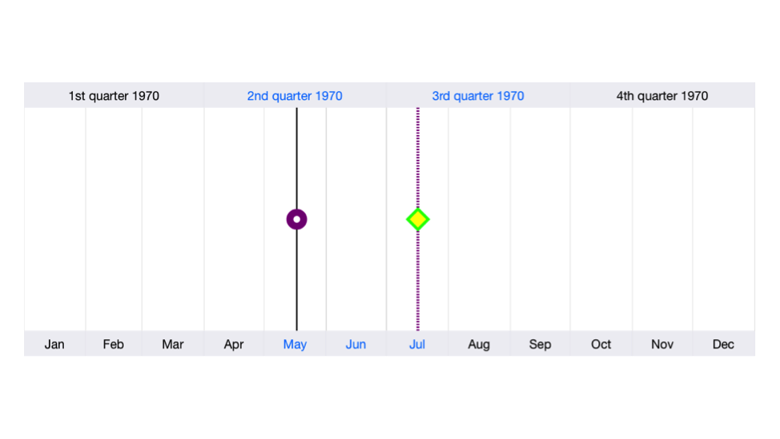

# Thumbs

The [`LeftThumbStyle`](https://help.syncfusion.com/cr/cref_files/xamarin-ios/Syncfusion.SFChart.iOS~Syncfusion.SfChart.iOS.SFDateTimeRangeNavigator~LeftThumbStyle.html) and [`RightThumbStyle`](https://help.syncfusion.com/cr/cref_files/xamarin-ios/Syncfusion.SFChart.iOS~Syncfusion.SfChart.iOS.SFDateTimeRangeNavigator~RightThumbStyle.html) properties are used to configure the left and right thumbs of the [`SFDateTimeRangeNavigator`](https://help.syncfusion.com/cr/cref_files/xamarin-ios/Syncfusion.SFChart.iOS~Syncfusion.SfChart.iOS.SFDateTimeRangeNavigator.html). Following properties are available in thumb style to configure left and right thumbs individually. 

* [`BorderColor`](https://help.syncfusion.com/cr/cref_files/xamarin-ios/Syncfusion.SFChart.iOS~Syncfusion.SfChart.iOS.SFRangeNavigatorThumbStyle~BorderColor.html) – used to change the stroke color of the thumb
* [`BackgroundColor`](https://help.syncfusion.com/cr/cref_files/xamarin-ios/Syncfusion.SFChart.iOS~Syncfusion.SfChart.iOS.SFRangeNavigatorThumbStyle~BackgroundColor.html) – used to change the background color of the thumb
* [`BorderWidth`](https://help.syncfusion.com/cr/cref_files/xamarin-ios/Syncfusion.SFChart.iOS~Syncfusion.SfChart.iOS.SFRangeNavigatorThumbStyle~BorderWidth.html) – used to change the stroke width of the thumb
* [`Width`](https://help.syncfusion.com/cr/cref_files/xamarin-ios/Syncfusion.SFChart.iOS~Syncfusion.SfChart.iOS.SFRangeNavigatorThumbStyle~Width.html) – used to change the width of the thumb
* [`Height`](https://help.syncfusion.com/cr/cref_files/xamarin-ios/Syncfusion.SFChart.iOS~Syncfusion.SfChart.iOS.SFRangeNavigatorThumbStyle~Height.html)  – used to change the height of the thumb
* [`LineColor`](https://help.syncfusion.com/cr/cref_files/xamarin-ios/Syncfusion.SFChart.iOS~Syncfusion.SfChart.iOS.SFRangeNavigatorThumbStyle~LineColor.html) – used to change the line color of the thumb
* [`LineWidth`](https://help.syncfusion.com/cr/cref_files/xamarin-ios/Syncfusion.SFChart.iOS~Syncfusion.SfChart.iOS.SFRangeNavigatorThumbStyle~LineWidth.html) – used to change the line width of the thumb
* [`LineDashes`](https://help.syncfusion.com/cr/cref_files/xamarin-ios/Syncfusion.SFChart.iOS~Syncfusion.SfChart.iOS.SFRangeNavigatorThumbStyle~LineDashes.html) – used to change the dash array of the thumb line
* [`Shape`](https://help.syncfusion.com/cr/cref_files/xamarin-ios/Syncfusion.SFChart.iOS~Syncfusion.SfChart.iOS.SFRangeNavigatorThumbStyle~Shape.html) – used to set one of the predefined shapes for thumb like Default, Circle, Square, Diamond, LeftArrow, RightArrow



SFDateTimeRangeNavigator rangeNavigator = new SFDateTimeRangeNavigator ();

rangeNavigator.LeftThumbStyle.LineColor = UIColor.Black;
rangeNavigator.LeftThumbStyle.LineWidth = 1;
rangeNavigator.LeftThumbStyle.BackgroundColor = UIColor.White;
rangeNavigator.LeftThumbStyle.BorderColor = UIColor.Purple;
rangeNavigator.LeftThumbStyle.BorderWidth = 5;
rangeNavigator.LeftThumbStyle.Height = 10;
rangeNavigator.LeftThumbStyle.Width = 10;
rangeNavigator.LeftThumbStyle.Shape = SFRangeNavigatorThumbShape.Circle;

rangeNavigator.RightThumbStyle.LineColor = UIColor.Purple;
NSNumber obj1 = new NSNumber (1);
NSNumber obj2 = new NSNumber (1);
rangeNavigator.RightThumbStyle.LineDashes = NSArray.FromObject (obj1, obj2);
rangeNavigator.RightThumbStyle.LineWidth = 2;
rangeNavigator.RightThumbStyle.BackgroundColor = UIColor.Yellow;
rangeNavigator.RightThumbStyle.BorderColor = UIColor.Green;
rangeNavigator.RightThumbStyle.BorderWidth = 2;
rangeNavigator.RightThumbStyle.Height = 15;
rangeNavigator.RightThumbStyle.Width = 15;
rangeNavigator.RightThumbStyle.Shape = SFRangeNavigatorThumbShape.Diamond;

this.View.AddSubview(rangeNavigator);



## Customization

User defined thumb layer can be created with SFDateTimeRangeNavigator. We can achieve this by creating a class that extends [`SFRangeNavigatorThumbLayer`](https://help.syncfusion.com/cr/cref_files/xamarin-ios/Syncfusion.SFChart.iOS~Syncfusion.SfChart.iOS.SFRangeNavigatorThumbLayer.html) and overriding the drawing methods of left and right thumbs.



public partial class ViewController : UIViewController
    {
        public ViewController (IntPtr handle) : base (handle)
        {
        }

        public override void ViewDidLoad ()
        {
            base.ViewDidLoad ();
            // Perform any additional setup after loading the view, typically from a nib.

            SFDateTimeRangeNavigator rangeNavigator = new SFDateTimeRangeNavigator ();

            CustomThumb thumbLayer = new CustomThumb ();
            rangeNavigator.ThumbLayer = thumbLayer;

            rangeNavigator.LeftThumbStyle.Width = 20;
            rangeNavigator.RightThumbStyle.Width = 20;

            this.View.AddSubview (rangeNavigator);
        }
    }

    public class CustomThumb : SFRangeNavigatorThumbLayer
    {
        public override void DrawLeftThumbInContext (CGContext context, CGPoint startPoint, CGPoint endPoint)
        {
            CGRect thumbRect = new CGRect (endPoint.X - 10, endPoint.Y, 20, 20);

            this.SetLeftThumbFrame (thumbRect);

            UIGraphics.PushContext (context);
            context.SetFillColor (UIColor.Red.CGColor);
            context.FillRect (thumbRect);
            UIGraphics.PopContext ();
        }

        public override void DrawRightThumbInContext (CGContext context, CGPoint startPoint, CGPoint endPoint)
        {
            CGRect thumbRect = new CGRect (endPoint.X - 10, endPoint.Y, 20, 20);

            this.SetRightThumbFrame (thumbRect);

            UIGraphics.PushContext (context);
            context.SetFillColor (UIColor.Red.CGColor);
            context.FillRect (thumbRect);
            UIGraphics.PopContext ();
        }

    }



