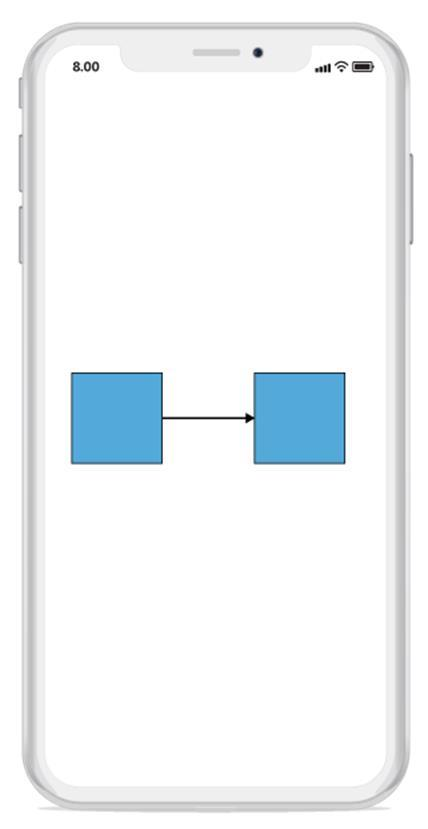
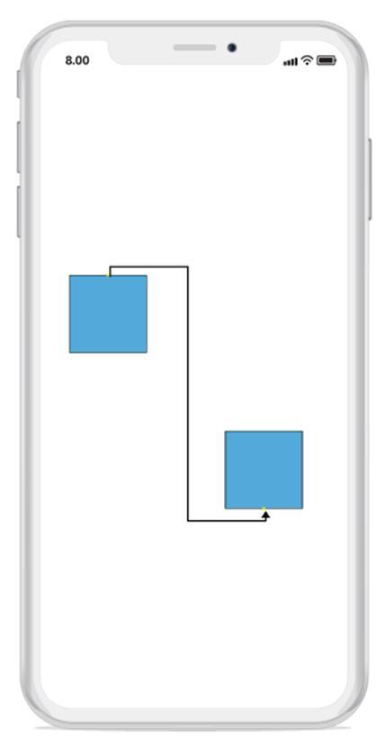

# Connector
The connectors are objects used to create link between two points. Nodes or ports are used to represent the relationship between them.

## Create Connector
The connector can be created by defining the start and end points.


// creating connector instance
var connector1 = new Connector()
{
SourcePoint=new CGPoint(100,100),
TargetPoint=new CGPoint(300,300)
};
diagram.AddConnector(connector1);



## Connections with Nodes
The SourceNode and TargetNode properties allows to define the nodes to be connected. The following code example illustrates how to connect two nodes:


// creating node  instance
var node1 = new Node(100, 300, 100, 100);
diagram.AddNode(node1);
var node2 = new Node(300, 300, 100, 100);
diagram.AddNode(node2);
// creating connector instance and connecting nodes with it
var connector1 = new Connector()
{
SourceNode = node1,
TargetNode = node2
};
diagram.AddConnector(connector1);



## Connections with Ports
The SourcePort and TargetPort properties allows to create connections between some specific points of source or target nodes. 

## Using Port
The following code example illustrates how to create and connect the ports: 


// creating node  instance
var node1 = new Node(100, 100, 100, 100);
//adding port instance to the node
node1.Ports.Add(new Port() { NodeOffsetX = 0.5, NodeOffsetY = 0 });
//adding node to the diagram
diagram.AddNode(node1);
// creating node  instance
var node2 = new Node(300, 300, 100, 100);
//adding port instance to the node
node2.Ports.Add(new Port() { NodeOffsetX = 0.5, NodeOffsetY = 1 });

//adding node to the diagram
diagram.AddNode(node2);
//creating and connecting the ports with connector
var connector1 = new Connector()
{
SourceNode = node1,
TargetNode = node2,
SourcePort=node1.Ports[0],
TargetPort=node2.Ports[0],
SegmentType = SegmentType.OrthoSegment
};
diagram.AddConnector(connector1);



## Segments
The path of the connector is defined with a collection of segments.

## Straight
The straight segment allows to create a straight line. To create a straight line, you should specify the segment as StraightSegment. The following code example illustrates how to create a default straight segment:


// creating connector instance with define its segment type
var connector1 = new Connector()
{
SourcePoint=new CGPoint(100,100),
TargetPoint=new CGPoint(300,300),
SegmentType= SegmentType.StraightSegment
};
diagram.AddConnector(connector1);



## Orthogonal
The orthogonal segments are used to create segments that are perpendicular to each other.
Set the segment as OrthogonalSegment to create the default orthogonal segment. The following code example illustrates how to create a default orthogonal segment:


// creating connector instance with define its segment type
var connector1 = new Connector()
{
SourcePoint=new CGPoint(100,100),
TargetPoint=new CGPoint(300,300),
SegmentType= SegmentType.OrthoSegment
};
diagram.AddConnector(connector1);



## Decorator
The start and end points of a connector can be decorated with some customizable shapes like arrow, circle, diamond, and square. You can decorate the connection end points with the SourceDecorator and TargetDecorator properties of connector.
The SourceDecoratorStyle and TargetDecoratorStyle properties define the shape of the decorators. The following code example illustrates how to create decorators of various shapes:


//creating connector instance with decorator-->
var connector1 = new Connector()
{
SourcePoint = new CGPoint(100,100),
TargetPoint = new CGPoint(300,300),
SourceDecoratorType = DecoratorType.Circle,
TargetDecoratorType = DecoratorType.Diamond,
SegmentType= SegmentType.StraightSegment
};
diagram.AddConnector(connector1);



## Remove Connector
There are two ways to remove connector from the connection, they are the following:
1.Passing the connector as parameter to remove connector method in the diagram.
The following code example illustrates how to remove a connector from the connection:


//creating connector instance
var connector1 = new Connector()
{
SourcePoint=new CGPoint(100,100),
TargetPoint=new CGPoint(300,300)
};
//adding connector to the diagram
diagram.AddConnector(connector1);
//removing connector from the diagram using object
diagram.RemoveConnector(connector1);


2.Passing the index value of the connector to remove connector method in the diagram (using RemoveAt method).
The following code example illustrates how to remove a connector from connection:


//creating connector instance
var connector1 = new Connector()
{
SourcePoint=new CGPoint(100,100),
TargetPoint=new CGPoint(300,300)
};
//adding connector to the diagram
diagram.AddConnector(connector1);
//removing connector from the diagram using index
diagram.Connectors.RemoveAt(0);



## Appearance
The StrokeThickness, Stroke are the set of properties. The style of line connectors and decorators can be customized with that properties.

## Connector Appearance
The following code example illustrates how to customize the connector appearance:


// creating connector instance
var connector1 = new Connector()
{
SourcePoint=new CGPoint(100,100),
TargetPoint= new CGPoint(300,300),
SegmentType= SegmentType.StraightSegment
};
//defining connector styles
connector1.Style = new Style()
{
StrokeBrush = new SolidBrush(UIColor.Gray),
StrokeStyle = StrokeStyle.Dashed,
StrokeWidth = 4
};
diagram.AddConnector(connector1);



## Decorator Appearance
The following code example illustrates how to customize the appearance of the decorator:


// creating connector instance with decorator
var connector1 = new Connector()
{
SourcePoint=new CGPoint(100,100),
TargetPoint= new CGPoint(300,300),
SegmentType= SegmentType.StraightSegment,
SourceDecoratorType = DecoratorType.Circle,
TargetDecoratorType = DecoratorType.Diamond
};
//defining decorator style for a connector
connector1.TargetDecoratorStyle = new DecoratorStyle()
{
Fill = UIColor.Yellow,
StrokeColor = UIColor.Brown,
StrokeWidth = 4,
Size = 12
};
// defining decorator style for a connector
connector1.SourceDecoratorStyle = new DecoratorStyle()
{
Fill = UIColor.Green,
StrokeColor = UIColor.Gray,
StrokeWidth = 5,
Size = 12
};
diagram.AddConnector(connector1);



