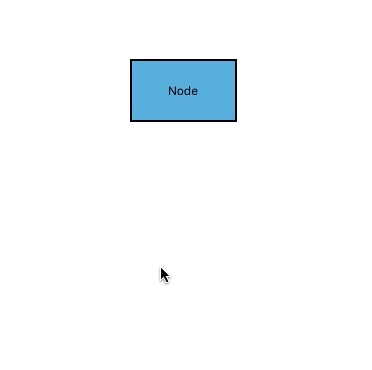

# Drawing mode
Drawing mode is used to draw continuously on the diagram area for selected mode dynamically.

## Text node
This node has default annotation. TextNode mode will add continuous text node. The following code example illustrates how to enable TextNode mode.


diagram.DrawingMode = DrawingMode.TextNode;



## Connector
Connector mode adds continuous orthogonal connectors on the diagram area. In this mode, you can connect connectors in between Points, Nodes, or Ports. The following code example illustrates how to enable Connector mode.


diagram.DrawingMode = DrawingMode.Connector;



