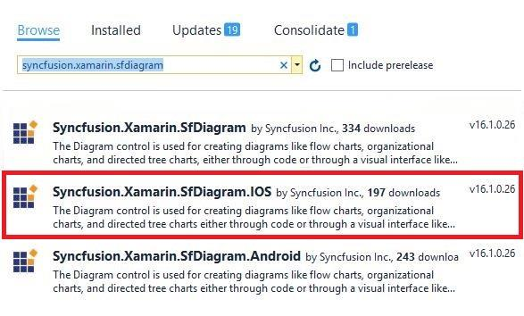
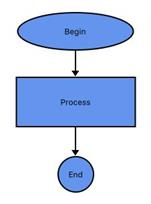

# Getting started
This section provides a quick overview for working with Diagram for Xamarin.iOS. This walkthrough demonstrates that, how to create a simple flow chart and an organization chart.

## Adding diagram reference 
Syncfusion Xamarin components are available in [nuget.org](https://www.nuget.org/). To add diagram to your project, open the NuGet package manager in Visual Studio, and search for [“Syncfusion.Xamarin.SfDiagram.IOS”](https://www.nuget.org/packages/Syncfusion.Xamarin.SfDiagram.IOS), and then install it.

I>Starting with v16.2.0.x, if you reference Syncfusion assemblies from trial setup or from the NuGet feed, you also have to include a license key in your projects. Please refer to this [link](https://help.syncfusion.com/common/essential-studio/licensing/license-key) to know about registering Syncfusion license key in your Xamarin application to use our components.

## Basic building blocks of Diagram
• **Diagram-**It represents the drawing surface where all the graphical elements like nodes and connectors resides, can be used to display various types of diagrams and it is the root instance of the diagram control. A Diagram instance contains a collection of nodes and  connectors to represent the  graphical diagram.
• **Nodes-**This represents the geometric shapes such as flowchart elements, network diagram elements, use case elements, etc.
• **Connectors-**These are the objects used to create link between two nodes, to represent the relationships between them in the diagram.
• **Ports-**It represents a point in the node, where the connectors can be connected. A Node can contain any number of ports.
• **Annotation-**It is a block of the text that can be displayed over a Node or Connector. Annotation is used to textually represent an object with a string that can be edited at run time.

## Creating a simple flow chart
Create a new iOS app (Xamarin.iOS) with iOS class library in the Visual Studio and name the project as “GettingStarted” and refer to the above mentioned assembly to the respective projects.
**Adding SfDiagram in Xamarin.iOS**
1.Import SfDiagram control namespace as Using Syncfusion.SfDiagram.iOS in ViewController.cs Page.
2. Set the SfDiagram control as Subview of the View.


using System;
using System.Collections.ObjectModel;
using Syncfusion.SfDiagram.iOS;
using UIKit;
namespace GettingStarted
{
    public partial class ViewController : UIViewController
    {
        protected ViewController(IntPtr handle) : base(handle)
        {
		
        }
        public override void ViewDidLoad()
        {
            base.ViewDidLoad();
            SfDiagram diagram = new SfDiagram();
            View.AddSubview(diagram);       
         }    
        public override void DidReceiveMemoryWarning()
        {
            base.DidReceiveMemoryWarning();
        }
    }
}


The following code snippet illustrates the creation of Nodes and Connectors in the diagram.


public override void ViewDidLoad()
{
	base.ViewDidLoad();
	SfDiagram diagram = new SfDiagram();
	Node begin = AddNode("Begin", 150, 60, 120, 40, "Begin", ShapeType.Ellipse);
	Node process = AddNode("Process", 150, 140, 120, 60, "Process", ShapeType.Rectangle);
	Node end = AddNode("End", 190, 225, 40, 40, "End", ShapeType.Ellipse);
	//Add nodes to the SfDiagram
	diagram.AddNode(begin);
	diagram.AddNode(process);
	diagram.AddNode(end);
	Connector connector1 = new Connector()
	{
		SourceNode = begin,
		TargetNode = process,
	};
	Connector connector2 = new Connector()
	{
		SourceNode = process,
		TargetNode = end,
	};
	//Add connectors to the SfDiagram
	diagram.AddConnector(connector1);
	diagram.AddConnector(connector2);
	View.AddSubview(diagram)	                  	           
}
//CreateNode
public Node AddNode(string id, float offsetX, float offsetY, float width, float height, string text, ShapeType shape)
{
    Node node = new Node();
    node.OffsetX = offsetX;
    node.OffsetY = offsetY;
    node.Height = height;
    node.Width = width;
    node.ShapeType = shape;
    node.Style.Brush = new SolidBrush(UIColor.FromRGB(100, 149, 237));
    node.Annotations.Add(new Annotation() { Content = text });
    return node;
 }


The flow chart will get displayed in the SfDiagram as follows

This demo project can be downloaded from the following link.
[GettingStarted_Demo](http://files2.syncfusion.com/Xamarin.iOS/Samples/GettingStarted_iOS_SfDiagram.zip)

## Create a simple organizational chart
SfDiagram provides support to auto-arrange the nodes based on hierarchical relation. Organization chart is an example of displaying hierarchical information.
Now, you have to create a class named “Employee” to store the employee’s information like name, designation, ID, reporting person ID, etc. Also, create a collection class that stores a collection of the employees.


//Employee Business Object
public class Employee
{
    public string ParentId { get; set; }
    public string Name { get; set; }
    public string Designation { get; set; }
    public string Employee_Id { get; set; }
}
//Employee Collection
public class Employees : ObservableCollection<Employee>  
{
}


Initialize Employee data
Define Employee Information as a Collection. The below code example shows an employee array whose,
•Name is used as a unique identifier and
•ParentId is used to identify the person to whom an employee report to, in the organization.


//Initializes the employee collection
ObservableCollection<Employee> employees = new ObservableCollection<Employee>();            
employees.Add(new Employee() { Name = "Elizabeth", Employee_Id = "1", ParentId = "", Designation = "CEO" });
employees.Add(new Employee() { Name = "Christina", Employee_Id = "2", ParentId = "1", Designation = "Manager" });
employees.Add(new Employee() { Name = "Yang", Employee_Id = "3", ParentId = "1", Designation = "Manager" });
employees.Add(new Employee() { Name = "Yoshi", Employee_Id = "4", ParentId = "2", Designation = "Team Lead" });
employees.Add(new Employee() { Name = "Philip", Employee_Id = "5", ParentId = "2", Designation = "S/w Developer" });
employees.Add(new Employee() { Name = "Roland", Employee_Id = "6", ParentId = "3", Designation = "TeamLead" });
employees.Add(new Employee() { Name = "Yvonne", Employee_Id = "7", ParentId = "3", Designation = "Testing Engineer" });
//Initializes the DataSourceSettings
diagram.DataSourceSettings = new DataSourceSettings() { DataSource = employees, Id = "Employee_Id", ParentId = "ParentId" };
//Initializes the Layout
DirectedTreeLayout treeLayout = new DirectedTreeLayout() { HorizontalSpacing = 80, VerticalSpacing = 50, TreeOrientation = TreeOrientation.TopToBottom 
};
diagram.BeginNodeRender+=Diagram_BeginNodeRender;
diagram.LayoutManager = new LayoutManager() { Layout = treeLayout };
//BeginNodeRender
private void Diagram_BeginNodeRender(object sender, BeginNodeRenderEventArgs args)
{
    Node node = (args.Item as Node);
    node.ShapeType = ShapeType.RoundedRectangle;
    node.Width = 90;
    node.Height = 50;
    node.Annotations.Add(new Annotation(){Content=((args.Item as Node).Content as Employee).Name});
}


The Employee data is displayed in the SfDiagram as follows

This demo project can be downloaded from the following link.
[OrganizationalChart_Demo](http://files2.syncfusion.com/Xamarin.iOS/Samples/OrganizationalChart_iOS_SfDiagram.zip)
