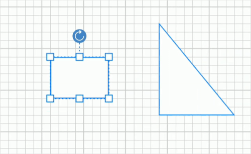

# Gridlines
Gridlines are the pattern of lines drawn behind the diagram elements. It provides a visual guidance while dragging or arranging the node on the diagram surface.

## Gridlines visibility
The “ShowGrid” property in PageSettings enable you to show/hide the gridlines. The following code example illustrates how to enable grid visibility.


diagram.PageSettings.ShowGrid = true;



## Customizing gridlines
Grid cell size and grid line color can modified using “GridSize” and “GridColor” property respectively. The following code example illustrates how to customize the grid.


diagram.PageSettings.GridColor = Color.Pink;
diagram.PageSettings.GridSize = 14;



## Snapping Gridlines
Nodes can be aligned and resize easily using grid lines by enabling snap to grid. The following code example illustrates how to enable the snap to grid.


diagram.PageSettings.SnapToGrid = true;



