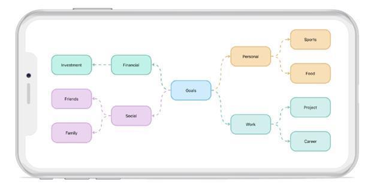
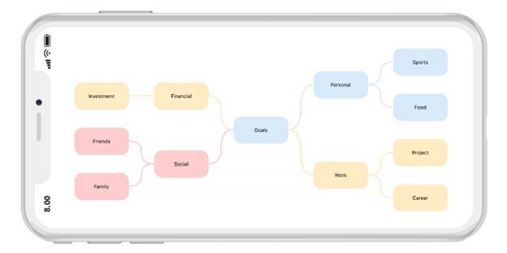
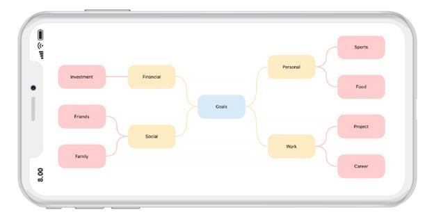

# Mind map layout
A mind map is a diagram used to visually organize the information. It is hierarchical and shows relationship of the whole idea. It consists of a central ideas, related ideas, and lines connecting them together.  It is used for brainstorming, planning, and information gathering etc. The following code example illustrates how to create and mind map layout:


List<UIColor> FColor = new List<UIColor>();
List<UIColor > SColor = new List<UIColor>();
Random random = new Random();
int index;
int width = 150; int height = 75;
//Add root node
var node = AddNode(300, 400, width, height, "Goals");
AddNodeStyle(node, UIColor.Blue, UIColor.Black);
diagram.AddNode(node);

SColor.Add(UIColor.Blue);
SColor.Add(UIColor.Brown);
SColor.Add(UIColor.Cyan);
SColor.Add(UIColor.Gray);
SColor.Add(UIColor.Green);
SColor.Add(UIColor.Magenta);
FColor.Add(UIColor.LightTextColor);
FColor.Add(UIColor.Orange);
FColor.Add(UIColor.Purple);
FColor.Add(UIColor.Orange);
FColor.Add(UIColor.Yellow);
FColor.Add(UIColor.Red);

//Add child nodes for root node
var ch1node = AddNode(100, 100, width, height, "Financial");
index = random.Next(5);
AddNodeStyle(ch1node, FColor[index], SColor[index]);
diagram.AddNode(ch1node);

var ch1childnode = AddNode(100, 100, width, height, "Investment");
AddNodeStyle(ch1childnode, (ch1node.Style.Brush as SolidBrush).FillColor, (ch1node.Style.StrokeBrush as SolidBrush).FillColor);
diagram.AddNode(ch1childnode);

var ch2node = AddNode(100, 600, width, height, "Social");
index = random.Next(5);
AddNodeStyle(ch2node, FColor[index], SColor[index]);
diagram.AddNode(ch2node);

var ch2childnode1 = AddNode(100, 100, width, height, "Friends");
AddNodeStyle(ch2childnode1, (ch2node.Style.Brush as SolidBrush).FillColor, (ch2node.Style.StrokeBrush as SolidBrush).FillColor);
diagram.AddNode(ch2childnode1);

var ch2childnode2 = AddNode(100, 100, width, height, "Family");
AddNodeStyle(ch2childnode2, (ch2node.Style.Brush as SolidBrush).FillColor, (ch2node.Style.StrokeBrush as SolidBrush).FillColor);
diagram.AddNode(ch2childnode2);

var ch3node = AddNode(500, 100, width, height, "Personal");
index = random.Next(5);
AddNodeStyle(ch3node, FColor[index], SColor[index]);
diagram.AddNode(ch3node);

var ch3childnode1 = AddNode(500, 100, width, height, "Sports");
AddNodeStyle(ch3childnode1, (ch3node.Style.Brush as SolidBrush).FillColor, (ch3node.Style.StrokeBrush as SolidBrush).FillColor);
diagram.AddNode(ch3childnode1);

var ch3childnode2 = AddNode(500, 100, width, height, "Food");
AddNodeStyle(ch3childnode2, (ch3node.Style.Brush as SolidBrush).FillColor, (ch3node.Style.StrokeBrush as SolidBrush).FillColor);
diagram.AddNode(ch3childnode2);

var ch4node = AddNode(500, 600, width, height, "Work");
index = random.Next(5);
AddNodeStyle(ch4node, FColor[index], SColor[index]);
diagram.AddNode(ch4node);

var ch4childnode1 = AddNode(500, 100, width, height, "Project");
AddNodeStyle(ch4childnode1, (ch4node.Style.Brush as SolidBrush).FillColor, (ch4node.Style.StrokeBrush as SolidBrush).FillColor);
diagram.AddNode(ch4childnode1);

var ch4childnode2 = AddNode(500, 100, width, height, "Career");
AddNodeStyle(ch4childnode2, (ch4node.Style.Brush as SolidBrush).FillColor, (ch4node.Style.StrokeBrush as SolidBrush).FillColor);
diagram.AddNode(ch4childnode2);
//Add connectors
diagram.AddConnector(AddConnector(node, ch1node));
diagram.AddConnector(AddConnector(node, ch2node));
diagram.AddConnector(AddConnector(node, ch3node));
diagram.AddConnector(AddConnector(node, ch4node));
diagram.AddConnector(AddConnector(ch1node, ch1childnode));
diagram.AddConnector(AddConnector(ch2node, ch2childnode1));
diagram.AddConnector(AddConnector(ch2node, ch2childnode2));
diagram.AddConnector(AddConnector(ch3node, ch3childnode1));
diagram.AddConnector(AddConnector(ch3node, ch3childnode2));
diagram.AddConnector(AddConnector(ch4node, ch4childnode1));
diagram.AddConnector(AddConnector(ch4node, ch4childnode2));
View.AddSubview(diagram);

//Add connector method
private Connector AddConnector(Node node, Node ch1node)
        {
            var c1 = new Connector();
            c1.SourceNode = node;
            c1.TargetNode = ch1node;
            c1.Style.StrokeBrush = new SolidBrush((c1.TargetNode.Style.StrokeBrush as SolidBrush).FillColor);
            c1.Style.StrokeStyle = StrokeStyle.Dashed;
            c1.Style.StrokeWidth = 3;
            c1.TargetDecoratorStyle.StrokeWidth = c1.TargetDecoratorStyle.StrokeWidth;
            c1.TargetDecoratorStyle.Fill = (c1.TargetNode.Style.StrokeBrush as SolidBrush).FillColor;
            c1.TargetDecoratorStyle.StrokeColor = (c1.TargetNode.Style.StrokeBrush as SolidBrush).FillColor;
            c1.SegmentType = SegmentType.CurveSegment;
            return c1;
        }

//Node style method
        private void AddNodeStyle(Node node, UIColor fill, UIColor Stroke)
        {
            node.Style.Brush = new SolidBrush(fill);
            node.Style.StrokeBrush = new SolidBrush(Stroke);
        }

//Add node method
        Node AddNode(int x, int y, int w, int h, string text)
        {
            var node = new Node();
            node.OffsetX = x; node.OffsetY = y;
            node.Width = w; node.Height = h;
            node.ShapeType = ShapeType.RoundedRectangle;
            node.Style.StrokeWidth = 3;
            node.Annotations.Add(new Annotation() { Content = text, FontSize = 14, TextBrush = new SolidBrush(UIColor.Black) });
            return node;
        }



## Initializing the mind map layout
The following code illustrates how to initialize the mind map layout in diagram loaded event:


//Diagram loaded event
diagram.Loaded += Diagram_Loaded;

private void Diagram_Loaded(object sender)
{
      diagram.LayoutManager = new LayoutManager()
      {
         Layout = new MindMapLayout()
         {
            MindMapOrientation = Orientation.Horizontal,
            HorizontalSpacing = 70,
         }
      };
      //Updating the layout
      diagram.LayoutManager.Layout.UpdateLayout();
}



## Mind map layout style
Mind map styles are defined as a collection of node style with a single connector style. Collection of node style is applied from root node to leaf node either through branch wise or level wise.

## Branch wise node style
Defined node style collection is applied from branch wise by setting the “ApplyNodeStyleBy” property to branch. The following code example illustrates how to apply style for mind map branch wise.


private void UpdateTheme()
        {
            bool repeat_mode = true;
            nodeStyleCollection.Clear();
            nodeStyleCollection.Add(new NodeStyle(new SolidBrush(HexToRGB("#d7ebfb")), HexToRGB("#d7ebfb"), objShape1, StrokeStyle.Default,
            new TextStyle((int)(14), UIColor.Black, ".SF UI Text", HorizontalAlignment.Center, VerticalAlignment.Center)));
            nodeStyleCollection.Add(new NodeStyle(new SolidBrush(HexToRGB("#ffebc4")), HexToRGB("#ffebc4"), objShape2, StrokeStyle.Default,
            new TextStyle((int)(14), UIColor.Black, ".SF UI Text", HorizontalAlignment.Center, VerticalAlignment.Center)));
            nodeStyleCollection.Add(new NodeStyle(new SolidBrush(HexToRGB("#ffcdcd")), HexToRGB("#ffcdcd"), objShape4, StrokeStyle.Default,
            new TextStyle((int)(14), UIColor.Black, ".SF UI Text", HorizontalAlignment.Center, VerticalAlignment.Center)));
            lineStyle = new LineStyle(SegmentType.CurveSegment, StrokeStyle.Default, 3, ApplyColorFrom.TargetFill, DecoratorType.None, ApplyColorFrom.None, ApplyColorFrom.None);
            (diagram.LayoutManager.Layout as MindMapLayout).UpdateLayoutStyle(new LayoutStyle(nodeStyleCollection, lineStyle, ApplyNodeStyleBy. Branch, repeat_mode));
        }
private void Diagram_Loaded(object sender)
 {
    UpdateTheme();
 }



## Level wise node style
Defined node style collection is applied from level wise by setting the “ApplyNodeStyleBy” property to level. The following code example illustrates how to apply style for mind map level wise.


private void UpdateTheme()
        {
            bool repeat_mode = true;
            nodeStyleCollection.Clear();
            nodeStyleCollection.Add(new NodeStyle(new SolidBrush(HexToRGB("#d7ebfb")), HexToRGB("#d7ebfb"), objShape1, StrokeStyle.Default,
            new TextStyle((int)(14), UIColor.Black, ".SF UI Text", HorizontalAlignment.Center, VerticalAlignment.Center)));
            nodeStyleCollection.Add(new NodeStyle(new SolidBrush(HexToRGB("#ffebc4")), HexToRGB("#ffebc4"), objShape2, StrokeStyle.Default,
            new TextStyle((int)(14), UIColor.Black, ".SF UI Text", HorizontalAlignment.Center, VerticalAlignment.Center)));
            nodeStyleCollection.Add(new NodeStyle(new SolidBrush(HexToRGB("#ffcdcd")), HexToRGB("#ffcdcd"), objShape4, StrokeStyle.Default,
            new TextStyle((int)(14), UIColor.Black, ".SF UI Text", HorizontalAlignment.Center, VerticalAlignment.Center)));
            lineStyle = new LineStyle(SegmentType.CurveSegment, StrokeStyle.Default, 3, ApplyColorFrom.TargetFill, DecoratorType.None, ApplyColorFrom.None, ApplyColorFrom.None);
            (diagram.LayoutManager.Layout as MindMapLayout).UpdateLayoutStyle(new LayoutStyle(nodeStyleCollection, lineStyle, ApplyNodeStyleBy.Level, repeat_mode));
        }
private void Diagram_Loaded(object sender)
 {
    UpdateTheme();
 }



## Repeat mode
When style collection ends, the next level or branch can have styles. To be cyclic, enable repeat mode or disable it to continue with last style.  

