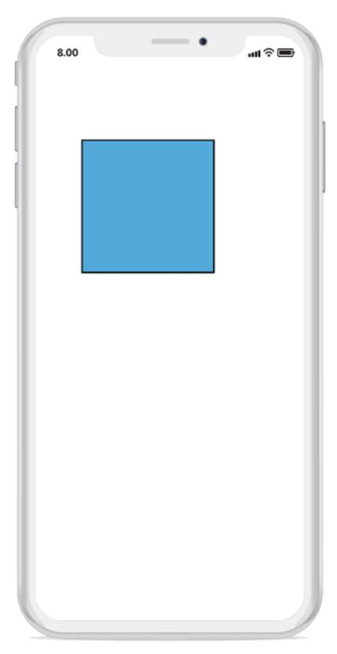

# Node
Nodes are graphical objects used to visually represent the geometrical information, process flow, internal business procedure, or any other kind of data. It represents the functions of a complete system in regards to how it interacts with external entities.

## Create node
A node can be created and added to the diagram, either programmatically or interactively. Nodes are stacked on the diagram area from bottom to top.
The following code snippet illustrates how to create the node:


//Initialize Node
Node n = new Node() { Width = 120, Height = 40, OffsetX = 300,OffsetY = 60, ShapeType = ShapeType.Rectangle };
//Adds the node to the SfDiagram
diagram.AddNode(n);



## Create a node with custom path/shape
A node can be created with different custom shapes and paths using SfGraphics.
The following code snippet is used to create the node with custom shape or path.


//Initialize Node
Node node = new Node();
//Initialize SfGraphics
SfGraphics graphics = new SfGraphics();
Pen pen = new Pen();
pen.StrokeBrush = new SolidBrush(UIColor.Red);
pen.StrokeWidth = 2;
SolidBrush brush = new SolidBrush(UIColor.Yellow);
brush.FillColor = UIColor.Yellow;
pen.Brush = brush2;
graphics.DrawRectangle(pen, new Rectangle(0, 0, 50, 50));
//Update the SfGraphics to the node
node.UpdateSfGraphics(graphics);



## Accessing a node from the diagram instance
You can access node from the diagram instance using the following code snippet:


//Access the node from the diagram instance.
Node node = diagram.Nodes[0];



## Remove a node
The following code snippet is used to remove node from the diagram:


//Remove the node from the diagram.
Node node = new Node();
diagram.RemoveNode(node);



## Customization:
You can customize the entire node with your own customized design using template property.


//Initialize the template
var template = new UIView()
template.Frame=new CGRect(0,0,node.Width,node.Height);
template.Layout.BorderWidth=1;
var image=new UIImageView();
image.Frame=new CGRect(0,0,node.Width,node.Height);
image.Image=UIImage.FromBundle(“employee.png”);
template.AddSubview(image);
//Initialize node with template.
Node node = new Node() { Width = 120, Height = 40, OffsetX = 300, OffsetY = 60, Template = template};



## Constraints
Node constraints allow to enable or disable the following behaviors of node:
•Drag
•Resize
•Rotate
•AnnotationEditing
•IsLocked
Example:
The following code illustrates how to disable node dragging:


//Initialize the node with constraints
Node node = new Node() {EnableDrag = false;, Width = 50, Height = 50, OffsetX = 100, OffsetY = 100};


