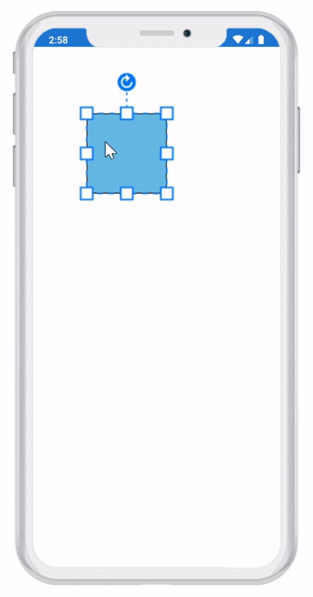
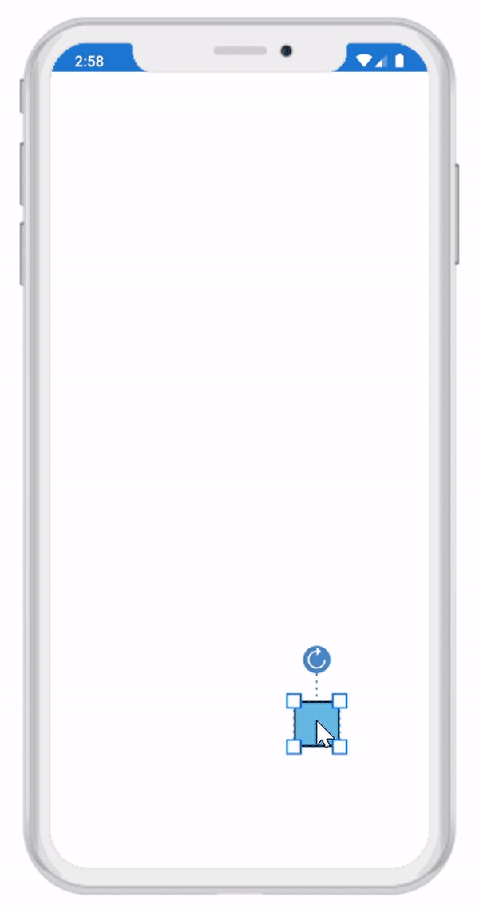
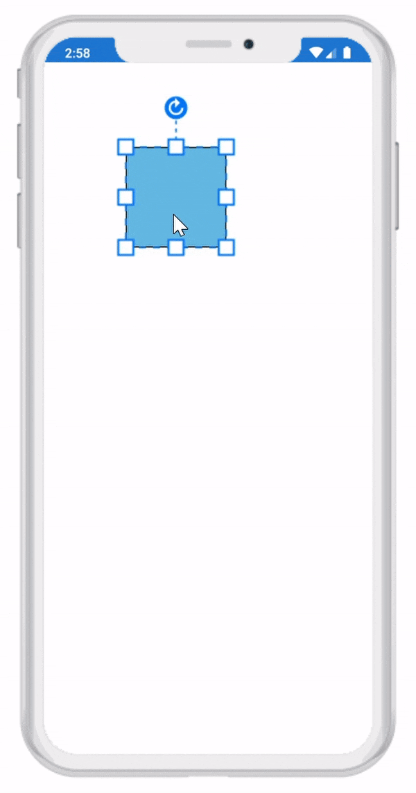

# Drag Limit in Xamarin Diagram (SfDiagram)

The drag limit allows you to define the dragging region of the Diagram while diagram objects are getting dragged. The `DragLimit` property of scroll settings class helps to limit the dragging area. It includes the following options:

* Infinity: Allows you to drag the diagram objects in all directions without any restriction.
* Diagram: Allows you to drag the diagram objects within the Diagram content.
* Limited: Allows you to drag the diagram objects within the specified area. The `EditableArea` property is used to specify the area that is allowed to dragging.

The default operation is `Infinity.`



//Initialize the SfDiagram.
SfDiagram diagram = new SfDiagram();
//Initialize the scroll settings with drag limit and drag limit area.
diagram.ScrollSettings = new ScrollSettings()
{
    DragLimit = ScrollLimit.Limited,
    EditableArea = new Rect(100, 100, 400, 300),
};



| DragLimit | Output |
|---|---|
| Infinity | |
| Diagram | |
| Limited   EditableArea = (100, 100, 400, 300) |  |
