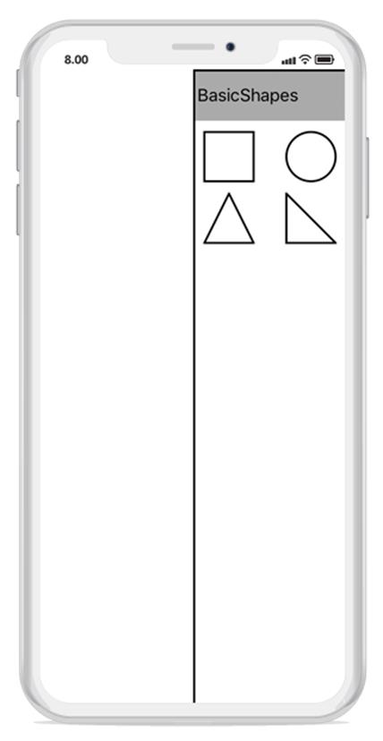
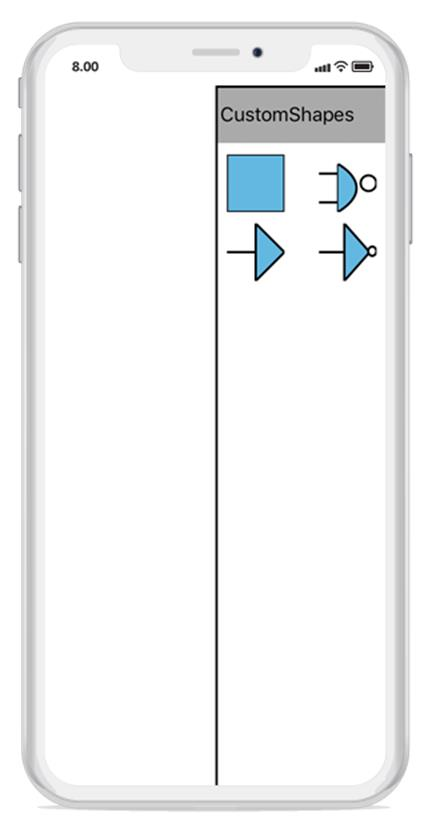
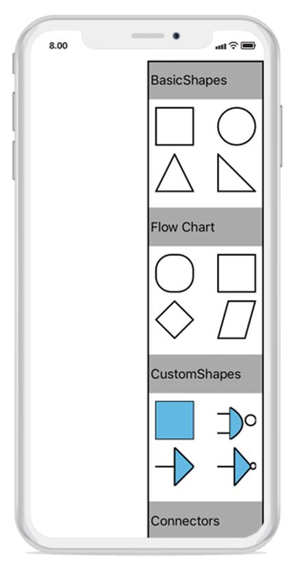

# Stencil
Stencil has a collection of symbols. It is used to clone the desired symbol by dragging it from the stencil and dropping it into the SfDiagram. Each symbol can be grouped together by using the SymbolGroup.

## Add Default shapes into stencil
The below given collection will be the items of a stencil. Based on the items, the stencil will populate the symbols. 
The following code example illustrates how to add the symbol into a collection:


//Add Symbols into SymbolCollection
SymbolCollection Collection1 = new SymbolCollection();
Collection1.Add(new Node() { Width = 50, Height = 50, ShapeType = ShapeType.Rectangle});
Collection1.Add(new Node() { Width = 50, Height = 50, ShapeType = ShapeType.Ellipse});
Collection1.Add(new Node() { Width = 50, Height = 50, ShapeType = ShapeType.Triangle});
Collection1.Add(new Node() { Width = 50, Height = 50, ShapeType = ShapeType.RightAngleTriangle});
//Add collection into SymbolGroup
stencil.SymbolGroups.Add(new SymbolGroup() { Items = coll, Header = "BasicShapes" });



## Add custom shapes into stencil
The following code example illustrates how to add the custom shapes into a collection:


//Custom shapes 
Node custom = new Node();
SfGraphics grap = new SfGraphics();
Pen pen2 = new Pen();
pen2.StrokeBrush = new SolidBrush(UIColor.Black);
pen2.StrokeWidth = 2;
SolidBrush brush2 = new SolidBrush(UIColor.FromRGB(99, 184, 225));
pen2.Brush = brush2;
grap.DrawRectangle(pen2, new Rectangle(0, 0, 50, 50));
custom.UpdateSfGraphics(grap);
Pen pen4 = new Pen();
pen4.StrokeBrush = new SolidBrush(UIColor.Black);
pen4.StrokeWidth = 2;
SolidBrush brush4 = new SolidBrush(UIColor.White);
pen4.Brush = brush4;
Node custom4 = new Node();
SfGraphics grap4 = new SfGraphics();
SfGraphicsPath sfpath4 = new SfGraphicsPath();
Pen pen14 = new Pen();
pen14.StrokeBrush = new SolidBrush(UIColor.Black);
pen14.StrokeWidth = 2;
SolidBrush brush14 = new SolidBrush(UIColor.White);
brush14.FillColor = UIColor.White;
pen14.Brush = brush14;
System.Collections.Generic.List<Point> coll4 = new System.Collections.Generic.List<Point>();
coll4.Add(new Point(0, 120));
coll4.Add(new Point(120, 120));
coll4.Add(new Point(120, 60));
coll4.Add(new Point(120, 420));
coll4.Add(new Point(120, 300));
coll4.Add(new Point(0, 300));
grap4.DrawLines(pen14, coll4);
sfpath4.MoveTo(120, 60);
sfpath4.CubicTo(120, 60, 380, 200, 120, 360);
grap4.DrawEllipse(pen4, new Rectangle(260, 130, 100, 100));
grap4.DrawPath(sfpath4);
custom4.UpdateSfGraphics(grap4);
Node custom5 = new Node();
SfGraphics grap5 = new SfGraphics();
SfGraphicsPath sfpath5 = new SfGraphicsPath();
System.Collections.Generic.List<Point> pointscol5 = new System.Collections.Generic.List<Point>();
pointscol5.Add(new Point(0, 150));
pointscol5.Add(new Point(150, 150));
pointscol5.Add(new Point(150, 0));
pointscol5.Add(new Point(300, 150));
pointscol5.Add(new Point(150, 300));
pointscol5.Add(new Point(150, 150));
sfpath5.AddLines(pointscol5.ToArray());
grap5.DrawPath(sfpath5);
custom5.UpdateSfGraphics(grap5);
Node custom6 = new Node();
SfGraphics grap6 = new SfGraphics();
SfGraphicsPath sfpath6 = new SfGraphicsPath();
System.Collections.Generic.List<Point> pointscol6 = new System.Collections.Generic.List<Point>();
pointscol6.Add(new Point(0, 150));
pointscol6.Add(new Point(150, 150));
pointscol6.Add(new Point(150, 0));
pointscol6.Add(new Point(300, 150));
pointscol6.Add(new Point(150, 300));
pointscol6.Add(new Point(150, 150));
sfpath6.AddLines(pointscol5.ToArray());
grap6.DrawPath(sfpath6);
grap6.DrawEllipse(pen4, new Rectangle(290, 120, 50, 50));
custom6.UpdateSfGraphics(grap6);
var col4 = new SymbolCollection();
col4.Add(custom);
col4.Add(custom4);
col4.Add(custom5);
col4.Add(custom6);
//Add custom shapes into group
stencil.SymbolGroups.Add(new SymbolGroup() { Items = col4 , Header = "CustomShapes" });



## Add Category heading text
You can add category of symbol group heading in stencil. The following code example illustrates how to add category heading text in stencil.


//SymbolCollection1 
SymbolCollection coll = new SymbolCollection();
coll.Add(new Node() { Width = 50, Height = 50, ShapeType = ShapeType.Rectangle, Style = new Style() { Brush = new SolidBrush(UIColor.White), StrokeBrush = new SolidBrush(UIColor.Gray) } });
coll.Add(new Node() { Width = 50, Height = 50, ShapeType = ShapeType.Ellipse, Style = new Style() { Brush = new SolidBrush(UIColor.White), StrokeBrush = new SolidBrush(UIColor.Gray) } });
coll.Add(new Node() { Width = 50, Height = 50, ShapeType = ShapeType.Triangle, Style = new Style() { Brush = new SolidBrush(UIColor.White), StrokeBrush = new SolidBrush(UIColor.Gray) } });
coll.Add(new Node() { Width = 50, Height = 50, ShapeType = ShapeType.RightAngleTriangle, Style = new Style() { Brush = new SolidBrush(UIColor.White), StrokeBrush = new SolidBrush(UIColor.Gray) } });
//SymbolCollection2 
SymbolCollection coll1 = new SymbolCollection();
coll1.Add(new Node() { Width = 50, Height = 50, ShapeType = ShapeType.RoundedRectangle, Style = new Style() { Brush = new SolidBrush(UIColor.White), StrokeBrush = new SolidBrush(UIColor.Gray) } });
coll1.Add(new Node() { Width = 50, Height = 50, ShapeType = ShapeType.Rectangle, Style = new.Style() { Brush = new SolidBrush(UIColor.White), StrokeBrush = new SolidBrush(UIColor.Gray) } });
coll1.Add(new Node() { Width = 50, Height = 50, ShapeType = ShapeType.Diamond, Style = new Style() { Brush = new SolidBrush(UIColor.White), StrokeBrush = new SolidBrush(UIColor.Gray) } });
coll1.Add(new Node() { Width = 50, Height = 50, ShapeType = ShapeType.Parallelogram, Style = new Style() { Brush = new SolidBrush(UIColor.White), StrokeBrush = new SolidBrush(UIColor.Gray) } });
//SymbolCollection3
SymbolCollection con1 = new SymbolCollection();
con1.Add(new Connector() { SegmentType = SegmentType.OrthoSegment, SourcePoint = new Point(0, 0), TargetPoint = new Point(50, 50) });
con1.Add(new Connector() { SegmentType = SegmentType.StraightSegment, SourcePoint = new Point(0, 0), TargetPoint = new Point(50, 50) });
//Add category of symbol group with heading text
stencil.SymbolGroups.Add(new SymbolGroup() { SymbolSource = coll, HeaderName = "BasicShapes" });
stencil.SymbolGroups.Add(new SymbolGroup() { SymbolSource = coll1, HeaderName = "Flow Chart" });
stencil.SymbolGroups.Add(new SymbolGroup() { SymbolSource = coll2, HeaderName = "CustomShapes" });
stencil.SymbolGroups.Add(new SymbolGroup() { SymbolSource = con1, HeaderName = "Connectors" });
diagram.Stencil=stencil;



