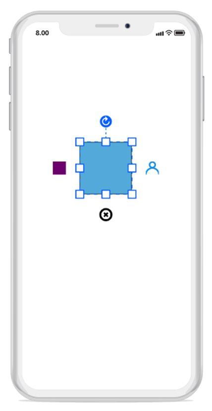
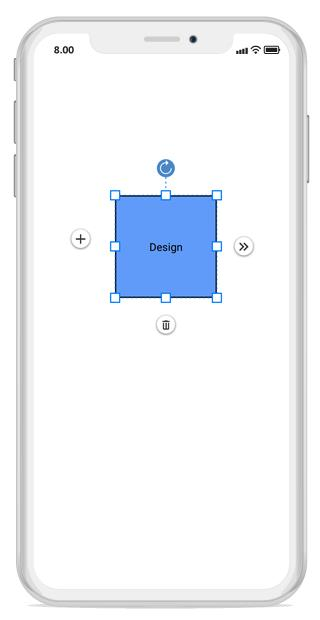

# User handles
User handles are customizable handles which can be used to perform custom actions and also default clipboard actions. You can able to customize the user handles using:
* SfGraphicPath
* Image
* UIView
The following code illustrates how to add custom user handle in diagram:


//Add Graphic path into custom handle
SfGraphics graph = new SfGraphics();
Pen stroke = new Pen();
stroke.Brush = new SolidBrush(UIColor.Clear);
stroke.StrokeWidth = 3;
stroke.StrokeBrush = new SolidBrush(UIColor.FromRGB(24, 161, 237));
graph.DrawEllipse(stroke, new System.Drawing.Rectangle(10, 0, 20, 20));
graph.DrawArc(stroke, 0, 20, 40, 40, 180, 180);

//Add image into custom handle
var image = new UIImageView(UIImage.FromBundle("delete.png"));
image.BackgroundColor = UIColor.Clear;

//Add UIView into custom handle
diagram.UserHandles.Add(new UserHandle("UIView", UserHandlePosition.Left, new UIView() { BackgroundColor = UIColor.Purple }));

diagram.UserHandles.Add(new UserHandle("delete", UserHandlePosition.Bottom, image) { });

diagram.UserHandles.Add(new UserHandle("right", UserHandlePosition.Right,graph){ });




## User handles clicked event
The following code illustrate how to define user handles clicked event and its action.


//User handles clicked event
diagram.UserHandleClicked += Diagram_UserHandleClicked;

private void Diagram_UserHandleClicked(object sender, UserHandleClickedEventArgs args)
{
     // Delete custom handle action
     if (args.Item.Name == "delete")
     {
        diagram.Delete();
    }
}




## Customizing user handle position
User handle position can be moved or adjusted from its default position. The following code illustrates how to adjust the position using the “MoveBy” method.


     //Define the user handle 

            UserHandleCollection user_hanldes = new UserHandleCollection();
            UserHandle left = new UserHandle("Left", UserHandlePosition.Left, plusTemplate) { Visible = true };
     //Customize the user handle position using move by method
            left.MoveBy(-10, -10);
            user_hanldes.Add(left);
            user_hanldes.Add(new UserHandle("Right", UserHandlePosition.Right, m_expandTemplate) { Visible = true });
            user_hanldes.Add(new UserHandle("Delete", UserHandlePosition.Bottom, deleteTemplate) { Visible = true });
            diagram.UserHandles = user_hanldes;



