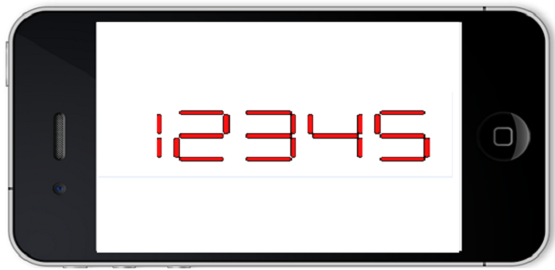
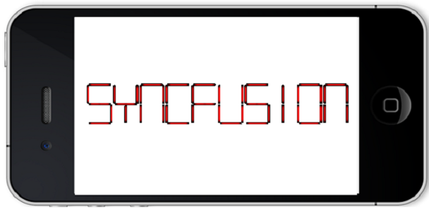
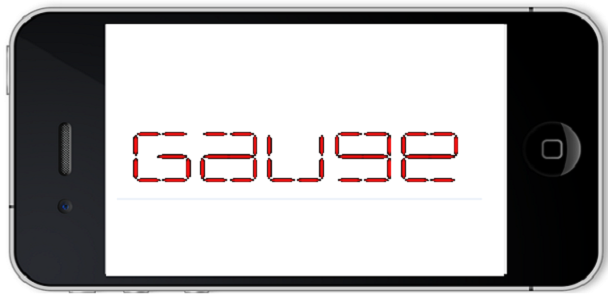
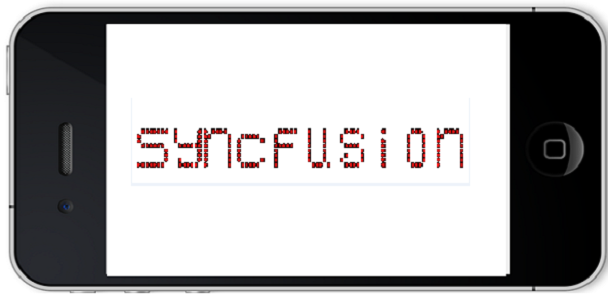

# CharacterType

The Digital Characters can be drawn in 4 different segments as follows.
 
1. Seven

2. Fourteen

3. Sixteen

4. EightCrossEightDotMatrix

N> SegmentSeven is the default CharacterType in the SfDigitalGauge.

## Seven Segment



	 digitalGauge.CharacterType=SFDigitalGaugeCharacterType.SFDigitalGaugeCharacterTypeSegmentSeven;



## Fourteen Segment



	 digitalGauge.CharacterType=SFDigitalGaugeCharacterType.SFDigitalGaugeCharacterTypesegmentFourteen;



## Sixteen Segment



	 digitalGauge.CharacterType=SFDigitalGaugeCharacterType.SFDigitalGaugeCharacterTypesegmentSixteen;



## EightCrossEightDotMatrix Segment



	 digitalGauge.CharacterType=SFDigitalGaugeCharacterType.SFDigitalGaugeCharacterTypeEightCrossEightDotMatrix;



