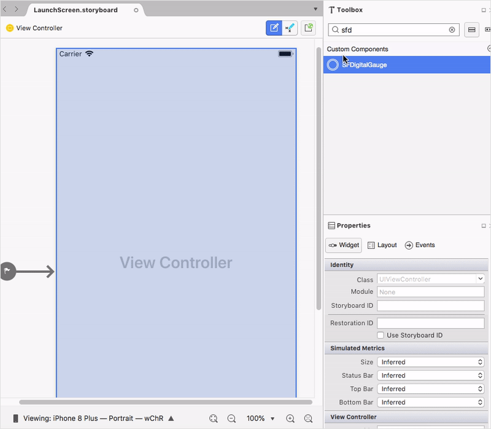
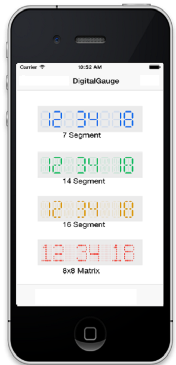

# Getting Started with SfDigitalGauge

This section explains you the steps to configure a SfDigitalGauge control in a real-time scenario and some of the customization features available in it.

## Referencing Essential Studio Components in Your Solution

After installing Essential Studio for Xamarin, you can find all the required assemblies in the installation folders, typically:

{Syncfusion Installed location}\Essential Studio {version number}\lib

And below assembly reference to the iOS unified project.

iOS-unified\Syncfusion.SfGauge.iOS.dll 

## Initialize digital gauge from designer

[`SFDigitalGauge`](https://help.syncfusion.com/cr/cref_files/xamarin-ios/Syncfusion.SfGauge.iOS~Syncfusion.SfGauge.iOS.SFDigitalGauge.html) allows users to drag the control from toolbox to designer window. The properties window will be displayed where you change the necessary functionalities to customize the digital gauge in designer.

### Add SfDigitalGauge

* Adding namespace for the added assemblies. 





	using Syncfusion.SfGauge.iOS; 





* Now add the SfDigitalGauge control with a required optimal name by using the included namespace.





SFDigitalGauge  digitalGauge = new SFDigitalGauge ();
this.AddSubview(digitalGauge);





## Configuring properties

Character Height, Width and segment  which is used to display the Characters can be customized as in the below code snippets.





digitalGauge.CharacterHeight = 36;
digitalGauge.CharacterWidth = 18;
digitalGauge.CharacterType = SFDigitalGaugeCharacterType.SFDigitalGaugeCharacterTypeSegmentSeven;
digitalGauge.Value = (NSString)“Syncfusion”;





You can find the complete getting started sample from this [`link`](https://github.com/SyncfusionExamples/SfDigitalGauge_GettingStarted_Xamarin.iOS).