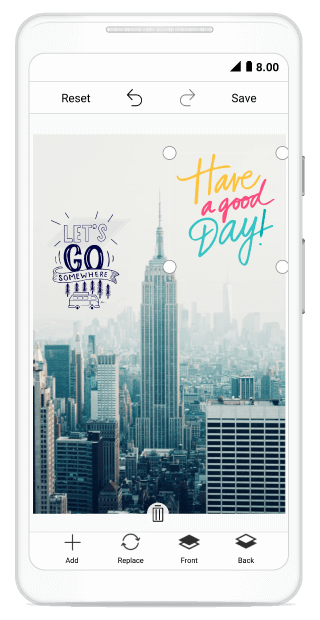

# CustomView

You can add any custom shapes or views on the image by using the `AddCustomView` method in the SfImageEditor control. To add the custom view, specify any view and its desired `CustomViewSettings` as shown in the following code snippet.



            UIImageView view = new UIImageView();
            view.Image = UIImage.FromBundle("image.png");
            editor.AddCustomView(view, new CustomViewSettings());



## CustomViewSettings

CustomViewSettings is defined to set the values for `CanMaintainAspectRatio` and `Bounds`.
•	CanMaintainAspectRatio property is used to set the Boolean value to maintain the aspect ratio value or not when resizing the custom view.
•	Bounds property is used to set the bounds of the custom view. Using this property to position the custom view wherever you want on the image.



        CustomViewSettings customViewSettings = new CustomViewSettings()
            {
                CanMaintainAspectRatio = false,
                Bounds = new Rectangle(0, 0, 100, 100)
            };



