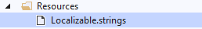
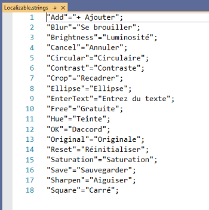
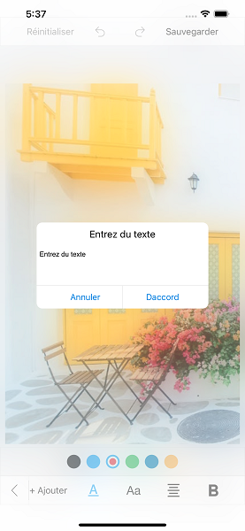

# Localization

The image editor control provides support for localization.You can localize ImageEditor contents by adding equivalent localized string.

You can localize custom text available in the control by adding equivalent localized string in the resource file.

Create Localizable.strings in resource file in iOS.

Location- ProjectName.iOS/Resources/Localizable.strings

In below screenshot we have localized the text to French language.

