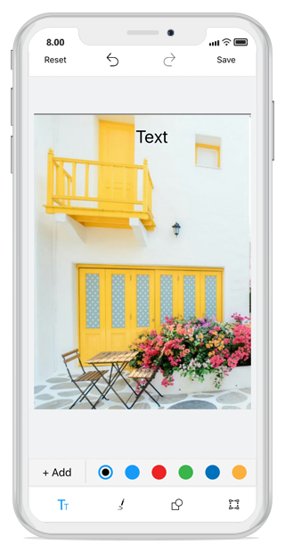
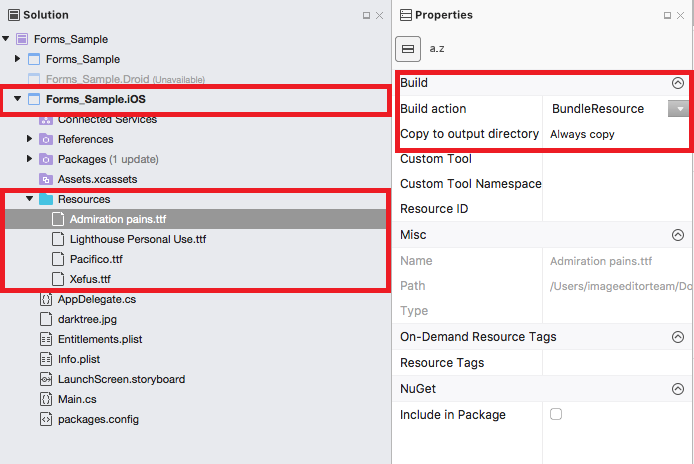
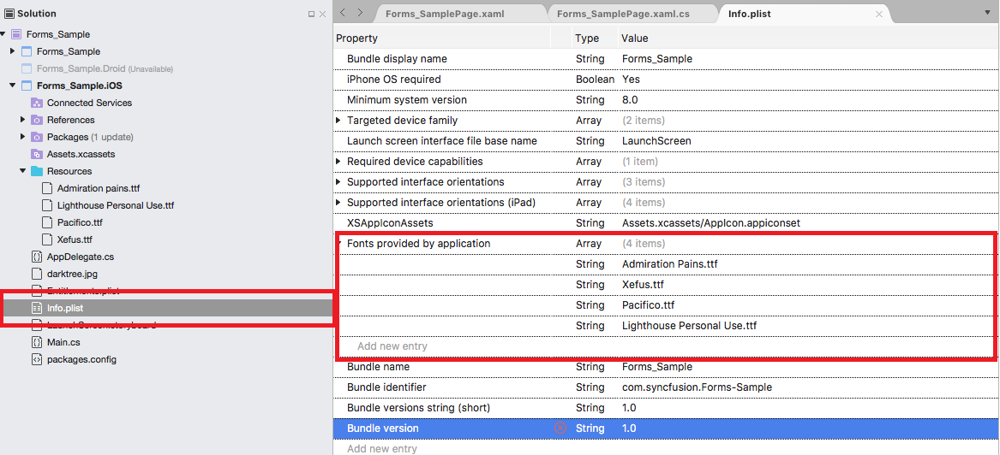
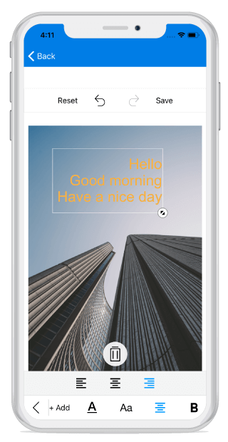

## Text

To add the desired text elements over the image, use the following two ways:

* From Toolbar
* Using Code

### From Toolbar

To add text from the toolbar, click on the Text icon in the toolbar. When the Text is tapped, a pop-up will appear. To add the text over the image, Type the desired text and click OK. To close the pop-up, click CANCEL button. By dragging, the text can be moved to the desired place.Text can be Resized with the help of handle.

#### Change Color of the selected Text

To change the color of the selected text, select the desired text and click on the color buttons available in the sub menu.

### Using Code

You can also add the desired text elements over the image from the code programmatically. The `AddText` method in the SfImageEditor control is used to add text based on the string value and `TextSettings`.

## TextSettings

TextSettings is defined to set the values for `Color`, `FontSize`, `FontFamily` and `Angle`. By default there are six types of font family has been given in toolbar that are 
`Arial`, `Noteworthy`, `Marker Felt`, `SignPainter`,`Bradley Hand`, `Snell Round hand`.





            editor.AddText("New Text", new TextSettings() { Color = Color.Black, FontSize = 16d, FontFamily = UIFont.FromName("ArialMT",18), Angle=45 });





## Bounds

`Bounds` property allows you to set frame for the newly added `Text` and you can position the text wherever you want on the image. The value of the text frame should be in percentage(maximum - 100 & minimum - 0).



  editor.AddText("New Text", new TextSettings() { Bounds = new Rectangle(20, 20, 35, 35) });



## Custom Font Family

Using a font other than the built-in typefaces can be applied for image editor text style with the help of custom font family support. Download the custom fonts file in ttf file format and add these fonts into required folder in particular project file.

Add the custom fonts into Resource folder,

   

Right click the font file and open properties, in that Change the "Build Action" property of every font file as "BundleResource" and "Copy to output directory" to "Copy Always" then add the custom font family name into info list as like below,



     UIFont font = UIFont.FromName("Admiration pains", 18);



## Multiline text and text alignment

### Multiline text
You can annotate multiple line text over an image with the help of text preview window.

### Text alignment
`TextAlignment` is an enum type and text can be aligned with the help of text alignment enum values such as left, right and center. 

N> The default text alignment is `Left` and text alignment is not applicable for single line text.



    editor.AddText("Hello\nGood morning\nHave a nice day", new TextSettings() {TextAlignment = UITextAlignment.Right });



## Text Rotation

You can rotate and resize the text by enabling the `RotatableElements` property of image editor. `ImageEditorElements` is an enum type with values Text, CustomView and None as shown in the following code snippet.





    editor.RotatableElements = ImageEditorElements.Text;   





N> The default value for RotatableElements is `None`.

You can rotate the text based on a particular angle using `Angle` property in `TextSettings` as shown in the following code snippet. 





    editor.AddText("Good morning", new TextSettings(){Angle = 45});    





