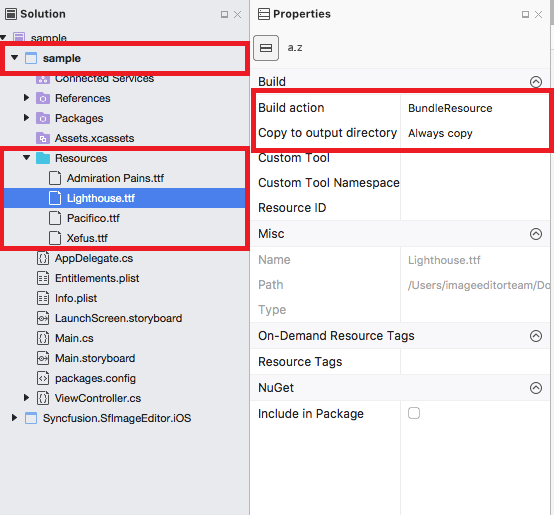
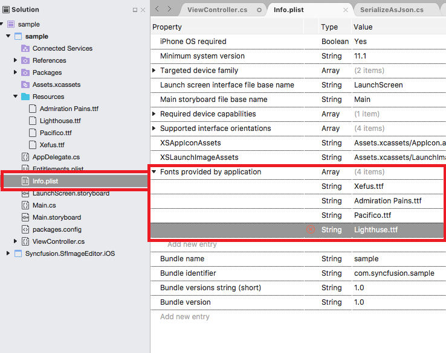

# Text

To add the desired text elements over the image, use the following two ways:

* From Toolbar
* Using Code

### From Toolbar

To add text from the toolbar, click on the Text icon in the toolbar. When the Text is tapped, a pop-up will appear. To add the text over the image, Type the desired text and click OK. To close the pop-up, click CANCEL button. By dragging, the text can be moved to the desired place.Text can be Resized with the help of handle.

#### Change Color of the selected Text

To change the color of the selected text, select the desired text and click on the color buttons available in the sub menu.

### Using Code

You can also add the desired text elements over the image from the code programmatically. The `AddText` method in the SfImageEditor control is used to add text based on the string value and `TextSettings`.

#### TextSettings

TextSettings is defined to set the values for `Color`, `FontSize` and `FontFamily`. By default there are six types of font family has been given in toolbar that are 
`Arial`, `Noteworthy`, `Marker Felt`, `SignPainter`,`Bradley Hand`, `Snell Round hand`.





    editor.AddText("New Text", new TextSettings() { Color = UIColor.Black, FontSize = 16d, FontFamily=UIFont.FromName("Arial",16f)});





# Custom Font Family

Using a font other than the built-in UIFont is also available in iOS. Download the custom fonts file in ttf file format and add these fonts into "Resource" folder in sample project.

Right click the font file and open properties, in that Change the "Build Action" property of every font file as "BundleResource" and "Copy to output directory" to "Always Copy".
    

Open the "info.plist" file and select the "source" at the bottom of the file.

After open the "source" file you should need to add "Fonts provided by application" into the "source" file and add the downloaded custom fonts name with ".ttf" extension.

Use the below code snippet to apply custom font.





    editor.AddText("New Pacifico Text", new TextSettings() { FontFamily = UIFont.FromName("Pacifico",20f) });





