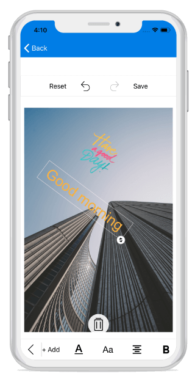

## Text

You can annotate the desired text elements to an image using the `AddText` method with customization options.



    editor.AddText("New Text");



## Customize text with TextSettings

You can customize the appearance of the text using the `TextSettings` property.

The `TextSettings` property consists of the following properties:

* [`Color`](https://help.syncfusion.com/cr/xamarin-ios/Syncfusion.SfImageEditor.iOS.TextSettings.html#Syncfusion_SfImageEditor_iOS_TextSettings_Color): Defines the color of the desired text.
* [`FontSize`](https://help.syncfusion.com/cr/xamarin-ios/Syncfusion.SfImageEditor.iOS.TextSettings.html#Syncfusion_SfImageEditor_iOS_TextSettings_FontSize): Specifies the desired font size of the text under text settings.
* [`FontFamily`](https://help.syncfusion.com/cr/xamarin-ios/Syncfusion.SfImageEditor.iOS.TextSettings.html#Syncfusion_SfImageEditor_iOS_TextSettings_FontFamily): Specifies the desired font family for text. Six types of font families are available in toolbar: `Arial`, `Noteworthy`, `Marker Felt`, `SignPainter`, `Bradley Hand`, `Snell Round hand`.
* [`Bounds`](https://help.syncfusion.com/cr/xamarin-ios/Syncfusion.SfImageEditor.iOS.TextSettings.html#Syncfusion_SfImageEditor_iOS_TextSettings_Bounds): Allows to set frame for the newly added `Text`. You can position the text wherever you want on the image. In percentage, the value of the text frame should fall between 0 and 100.
* [`Opacity`](https://help.syncfusion.com/cr/xamarin-ios/Syncfusion.SfImageEditor.iOS.TextSettings.html#Syncfusion_SfImageEditor_iOS_TextSettings_Opacity): Changes the opacity of text.
* [`Angle`](https://help.syncfusion.com/cr/xamarin-ios/Syncfusion.SfImageEditor.iOS.TextSettings.html#Syncfusion_SfImageEditor_iOS_TextSettings_Angle): Changes the angle of text.
* [`TextEffects`](https://help.syncfusion.com/cr/xamarin-ios/Syncfusion.SfImageEditor.iOS.TextSettings.html#Syncfusion_SfImageEditor_iOS_TextSettings_TextEffects): Changes the effects of the text such as `Bold`, `Italic` and `Underline`.





            editor.AddText("New Text", new TextSettings() { Color = UIColor.Black, FontSize = 16d, FontFamily = UIFont.FromName("ArialMT", 18), Bounds = new Rectangle(20, 20, 35, 35), Angle = 45, TextEffects = TextEffects.Bold | TextEffects.Italic | TextEffects.Underline });





## Custom Font Family

Using a font other than the built-in typefaces can be applied for image editor text style with the help of custom font family support. Download the custom fonts file in ttf file format and add these fonts into resource folder.

Right click the font file and open properties, in that Change the "Build Action" property of every font file as "BundleResource" and "Copy to output directory" to "Copy Always" then add the custom font family name into info list as like below,



     UIFont font = UIFont.FromName("Admiration pains", 18);



## Multiline text and text alignment

### Multiline text
You can annotate multiple line text over an image with the help of text preview window.

### Text alignment
`TextAlignment` is an enum type and text can be aligned with the help of text alignment enum values such as left, right and center. 

N> The default text alignment is `Left` and text alignment is not applicable for single line text.



    editor.AddText("Hello\nGood morning\nHave a nice day", new TextSettings() {TextAlignment = UITextAlignment.Right });



## Text Rotation

You can rotate and resize the text by enabling the `RotatableElements` property of image editor. `ImageEditorElements` is an enum type with values Text, CustomView and None as shown in the following code snippet.





    editor.RotatableElements = ImageEditorElements.Text;   





N> The default value for RotatableElements is `None`.

You can rotate the text based on a particular angle using `Angle` property in `TextSettings` as shown in the following code snippet. 





    editor.AddText("Good morning", new TextSettings(){Angle = 45});    





