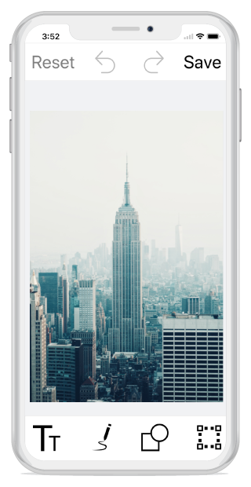

# ToolbarCustomization

You can customize color palette and visibility of the toolbar.

## To customize the ColorPalette

You can change default colors of the ColorPalette in toolbar.





    	ObservableCollection<UIColor> CustomColorPalette = new ObservableCollection<UIColor>()
	{
				UIColor.Yellow,
				UIColor.Blue,
				UIColor.DarkGray
	};

			editor.ColorPalette = CustomColorPalette;




## To Hide/Show toolbar

To show or hide toolbar by setting toolbar IsVisible property to either true or false. By default toolbar IsVisible property is set to true.





     
     editor.ToolbarSettings.IsVisible = false;
     





## To Hide/Visible the toolbar Item

You can hide or show the toolbar items by specifying its icon name and set boolean value to false or true. 

 N> You can customize icon  by specifying its names  like  text, path, shapes, transform, rectangle, circle, arrow, flip, crop, rotate, reset, undo, Redo and save.





    editor.SetToolbarItemVisibility("text,save", false);





## ToolbarHeight Customization

You can customize `height of the toolbar` and also toolbar items `icon` and `text`.

### Customize Toolbar Height 

SfImageEditor control supports to customize the default height of `Header`, `Footer` and `Sub item` Toolbar by using following properties,
1.	HeaderToolbarHeight
2.	FooterToolbarHeight 
3.	SubItemToolbarHeight

Toolbar items will be resize based on the toolbar height. To change Height of the Toolbar as like below,





    editor.ToolbarSettings.HeaderToolbarHeight = 70;
    editor.ToolbarSettings.FooterToolbarHeight = 70;
    editor.ToolbarSettings.SubItemToolbarHeight = 70;





### Individual Toolbar Item Height Customization

To arrange toolbar items aspect fit based on the toolbar height by using following properties  

1.  TextHeight
2.  IconHeight

•	To change the toolbar item Text and Icon height as like below,





	FooterToolbarItem footerItem = new FooterToolbarItem()
            {
                IconHeight=40,
                TextHeight=20,
                Icon=UIImage.FromBundle("share.png"),
                Text = "Share"
            };

            editor.ToolbarSettings.ToolbarItems.Add(footerItem);





