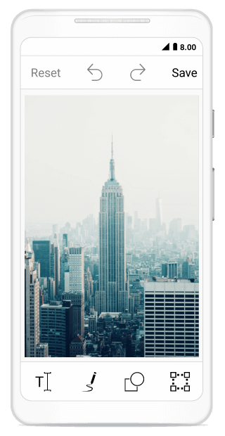

## ToolbarCustomization

You can customize color palette, toolbar visibility and appearance of each toolbar item.

## Customize toolbar items

SfImageEditor control supports to customize and configure the appearance of toolbar menu. You can customize image editor toolbar by adding respective FooterToolbarItem and HeaderToolbarItem 

#### ToolbarItem

You can customize each toolbar item with the help of `Text` and `Icon` properties.

ImageEditor Toolbar menu contains set of header and footer menu items which helps to perform image editor actions and this can be categorized into the following types,

1.HeaderToolbarItem
2.FooterToolbarItem
3.SubItems

## Adding HeaderToolbarItem

`HeaderToolbarItem` will be arranged on top of the image editor and you can customize header toolbar item with the help of Icon and Text as like below,



            editor.ToolBarSettings.ToolbarItems.Add(new HeaderToolbarItem() { Icon = UIImage.FromBundle("share.png"), Text = "Share" });



## Adding FooterToolbarItem   

 `FooterToolbarItem` will be arranged on bottom of the image editor and you can customize footer toolbar item with the help of Icon and Text along with sub items.

Refer to the below code snippet to customize footer toolbar item,



            editor.ToolBarSettings.ToolbarItems.Add(new FooterToolbarItem() { Icon = UIImage.FromBundle("delete.png"), Text="Delete" });
            editor.ToolBarSettings.ToolbarItems.Add(new FooterToolbarItem() { Icon = UIImage.FromBundle("more.png"), Text="More" });



## Adding SubItems to the FooterToolbarItem

`SubItems` only applicable for `FooterToolbarItem` and it represents grouped action of respective footer toolbar item. SubItems will be arranged above the footer toolbar item layout and you can also customize sub items appearance as like main toolbar items. 

Refer to the below code snippet to customize sub items of footer toolbar item,



 	 editor.ToolBarSettings.ToolbarItems.Add(new FooterToolbarItem()
            {
                Text = "More",
                Icon = UIImage.FromBundle("more.png"),
                SubItems = new ObservableCollection<ToolbarItem>()
                {
                   new ToolbarItem() {
                Icon = UIImage.FromBundle("download.png")
                },
                   new ToolbarItem() {
                Icon = UIImage.FromBundle("share.png")
                } }
            });



N> You can remove existing toolbar items("back, Text, Add, TextColor, FontFamily, Arial, Noteworthy, Marker Felt,
Bradley Hand, SignPainter, Opacity, Path, StrokeThickness, Colors, Opacity, Shape, Rectangle, StrokeThickness, Circle, Arrow, Transform, Crop, free, original, square, 3:1, 3:2, 4:3, 5:4, 16:9, Rotate, Flip, Reset, Undo, Redo, TextAlignment, Left, Right, Center, Texteffects, Bold, Italic, Underline and Save") from the image editor toolbarItems collection based on the index value. 

You can change icon and text value dynamically for any of already added toolbar item based on the index as like below,



editor.ToolBarSettings.ToolbarItems[5].Text = "new item";
editor.ToolBarSettings.ToolbarItems[3].Icon = UIImage.FromBundle("image.png")



## ToolbarItemSelected event 

Whenever you tap the toolbar menu item, the `ToolbarItemSelected` event will be triggered and you can get the respective tapped toolbar item as an argument as shown below, 



       public override void ViewDidLoad()
        {
			   . . .

            editor.ToolBarSettings.ToolbarItemSelected += ToolbarSettings_ToolBarItemSelected;

			   . . .
        }

        private void ToolBarSettings_ToolbarItemSelected(object sender, ToolbarItemSelectedEventArgs e)
        {
           UIAlertView alert = new UIAlertView()
            {
                Title = "ToolbarItem",
                Message = "Selected ToolbarItem is" + e.ToolbarItem.Text
            };
            alert.AddButton("OK");
            alert.Show();
        }



### MoveSubItemsToFooterToolbar 

`MoveSubItemsToFooterToolbar` boolean property of ToolbarItemSelected event argument decides the placement of each sub items of respective footer toolbar item. 

If you set the value to `true`, the respective sub items of footer item will be placed on footer toolbar layout. If you set `false`, then the sub items will be placed above the footer toolbar layout.



        public override void ViewDidLoad()
            {
                        . . .

               
            SfImageEditor edit = new SfImageEditor(this);
            edit.ToolBarSettings.ToolbarItems.Add(new FooterToolbarItem()
				{
					Text = "NewFooterItem",
					SubItems = new List<ToolbarItem>()
							{
								new ToolbarItem(){ Text= "Subitem1"},
								new ToolbarItem(){ Text= "Subitem2"},
								new ToolbarItem(){ Text= "Subitem3"},
							}
				});
                edit.ToolBarSettings.ToolbarItemSelected += ToolBarSettings_ToolbarItemSelected;
                        
                        . . .
            }

          private void ToolBarSettings_ToolbarItemSelected(object sender, ToolbarItemSelectedEventArgs e)
            {
                if(e.ToolbarItem != null && e.ToolbarItem is FooterToolbarItem)
                {
                    if(e.ToolbarItem.Text == "NewFooterItem")
                    {
                        e.MoveSubItemsToFooterToolbar = false;
                    }
                }
            }



N> This is not applicable for built-in footer toolbar items .

## To Hide/Show toolbar

To show or hide toolbar by setting toolbar IsVisible property to either true or false. By default toolbar IsVisible property is set to true.





     
     editor.ToolBarSettings.IsVisible = false;
     





## To Hide/Visible the toolbar Item

You can hide or show the toolbar items by specifying its icon name and set boolean value to false or true. 

 N> You can customize icon  by specifying its names  like  "back, Text, Add, TextColor, FontFamily, Arial, Noteworthy, Marker Felt,
Bradley Hand, SignPainter, Opacity, Path, StrokeThickness, Colors, Opacity, Shape, Rectangle, StrokeThickness, Circle, Arrow, Transform, Crop, free, original, square, 3:1, 3:2, 4:3, 5:4, 16:9, Rotate, Flip, Reset, Undo, Redo, Save"





    editor.SetToolbarItemVisibility("text,save", false);





## To customize the ColorPalette

You can change default colors of the ColorPalette in toolbar.





    	ObservableCollection<UIColor> CustomColorPalette = new ObservableCollection<UIColor>()
	{
				UIColor.Yellow,
				UIColor.Blue,
				UIColor.DarkGray
	};

			editor.ColorPalette = CustomColorPalette;




## ToolbarHeight Customization

You can customize `height of the toolbar` and also toolbar items `icon` and `text`.

### Customize Toolbar Height 

SfImageEditor control supports to customize the default height of `Header`, `Footer` and `Sub item` Toolbar by using following properties,
1.	HeaderToolbarHeight
2.	FooterToolbarHeight 
3.	SubItemToolbarHeight

Toolbar items will be resize based on the toolbar height. To change Height of the Toolbar as like below,





    editor.ToolBarSettings.HeaderToolbarHeight = 70;
    editor.ToolBarSettings.FooterToolbarHeight = 70;
    editor.ToolBarSettings.SubItemToolbarHeight = 70;





## Individual Toolbar Item Height Customization

To arrange toolbar items aspect fit based on the toolbar height by using following properties  

1.  TextHeight
2.  IconHeight

To change the toolbar item Text and Icon height as like below,





     FooterToolbarItem footerItem = new FooterToolbarItem()
            {
                IconHeight=40,
                TextHeight=20,
                Icon = UIImage.FromBundle("share.png"),
                Text = "Share"
            };

            editor.ToolBarSettings.ToolbarItems.Add(footerItem);
    




