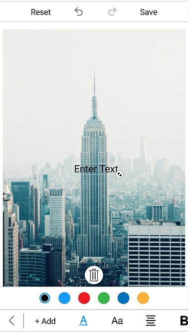

## ToolbarCustomization

You can customize color palette, toolbar visibility and appearance of each toolbar item.

## Customize toolbar items

The image editor control provides support to customize and configure the appearance of toolbar menu. You can customize the toolbar by adding respective FooterToolbarItem and HeaderToolbarItem.

#### ToolbarItem

You can customize each toolbar item using the `Text` and `Icon` properties.

### Name

You can get or set the names of built-in toolbar and dynamically added toolbar items using the `Name` property.



        public override void ViewDidLoad()
        {
            SfImageEditor editor = new SfImageEditor();
            var itemName = editor.ToolBarSettings.ToolbarItems[2].Name;
            base.ViewDidLoad();
        }



N> The following built-in toolbar item names are available in image editor: `Back`, `Text`, `Add`, `TextColor`, `FontFamily`, `Arial`, `Noteworthy`, `Marker Felt`, `Bradley Hand`, `SignPainter`, `TextEffects`, `Bold`, `Italic`, `Underline`, `Opacity`, `Path`, `StrokeThickness`, `Colors`, `Opacity`, `Shape`, `Rectangle`, `StrokeThickness`, `Circle`, `Arrow`, `Transform`, `Crop`, `free`, `original`, `square`, `3:1`, `3:2`, `4:3`, `5:4`, `16:9`, `Rotate`, `Flip`, `Reset`, `Undo`, `Redo`, `Save`, `Effects`, `Hue`, `Saturation`, `Brightness`, `Contrast`, `Blur` and `Sharpen`.

N> You cannot modify the names of existing built-in toolbar items and cannot create toolbar item with these list.

The toolbar menu contains a set of header and footer menu items that helps to perform editing actions. This can be categorized into the following types:

1. HeaderToolbarItem
2. FooterToolbarItem
3. SubItems

## Adding HeaderToolbarItem

The `HeaderToolbarItem` is placed on the top of the image editor, and you can customize the header toolbar item using the `Icon` and `Text` properties:



            editor.ToolBarSettings.ToolbarItems.Add(new HeaderToolbarItem() { Icon = UIImage.FromBundle("share.png"), Text = "Share" });



## Adding FooterToolbarItem   

The `FooterToolbarItem` is placed on the bottom of the image editor, and you can customize the footer toolbar item using the `Icon` and `Text` properties.

Refer to the below code snippet to customize footer toolbar item,



            editor.ToolBarSettings.ToolbarItems.Add(new FooterToolbarItem() { Icon = UIImage.FromBundle("delete.png"), Text = "Delete" });
            editor.ToolBarSettings.ToolbarItems.Add(new FooterToolbarItem() { Icon = UIImage.FromBundle("more.png"), Text = "More" });


## Adding SubItems to the FooterToolbarItem

`SubItems` only applicable for `FooterToolbarItem` and it represents grouped action of respective footer toolbar item. SubItems will be arranged above the footer toolbar item layout and you can also customize sub items appearance as like main toolbar items. 

Refer to the below code snippet to customize sub items of footer toolbar item,



            editor.ToolBarSettings.ToolbarItems.Add(new FooterToolbarItem()
            {
                Text = "More",
                Icon = UIImage.FromBundle("more.png"),
                SubItems = new List<ToolbarItem>()
                {
                    new ToolbarItem() {Icon = UIImage.FromBundle("download.png")},
                    new ToolbarItem() {Icon = UIImage.FromBundle("share.png")}
                }
            });



N> You can remove the existing toolbar items [names](/xamarin/sfimageeditor/toolbarcustomization#name) from image editor toolbarItems collection based on the index value and change the icon and text values dynamically for any of the already added toolbar item based on the index as shown in the following code snippet.



            editor.ToolBarSettings.ToolbarItems[5].Text = "new item";
            editor.ToolBarSettings.ToolbarItems[3].Icon = UIImage.FromBundle("image.png");



## ToolbarItemSelected event 

Whenever you tap the toolbar menu item, the `ToolbarItemSelected` event will be triggered, and you can get the respective tapped toolbar item as an argument as shown in the following code snippet. 



        public override void ViewDidLoad()
        {
            editor.ToolBarSettings.ToolbarItemSelected += ToolBarSettings_ToolbarItemSelected;
        }

        private void ToolBarSettings_ToolbarItemSelected(object sender, ToolbarItemSelectedEventArgs e)
        {
            UIAlertView alert = new UIAlertView()
            {
                Title = "ToolbarItem",
                Message = "Selected ToolbarItem is" + e.ToolbarItem.Text
            };
            alert.AddButton("OK");
            alert.Show();
        }



### MoveSubItemsToFooterToolbar 

The `MoveSubItemsToFooterToolbar` is boolean property of the ToolbarItemSelected event argument; it decides the placement of each sub items of respective footer toolbar item. 

If you set the value to `true`, the respective sub items of footer item will be placed on footer toolbar layout. If you set `false`, then the sub items will be placed above the footer toolbar layout.



        public override void ViewDidLoad()
        {
            editor = new SfImageEditor();
            editor.ToolBarSettings.ToolbarItems.Add(new FooterToolbarItem()
            {
                Text = "NewFooterItem",
                SubItems = new List<ToolbarItem>()
                {
                    new ToolbarItem(){ Text= "Subitem1"},
                    new ToolbarItem(){ Text= "Subitem2"},
                    new ToolbarItem(){ Text= "Subitem3"},
                }
            });
            editor.ToolBarSettings.ToolbarItemSelected += ToolBarSettings_ToolbarItemSelected;

            base.ViewDidLoad();
        }

        private void ToolBarSettings_ToolbarItemSelected(object sender, ToolbarItemSelectedEventArgs e)
        {
            if (e.ToolbarItem != null && e.ToolbarItem is FooterToolbarItem)
            {
                if (e.ToolbarItem.Text == "NewFooterItem")
                {
                    e.MoveSubItemsToFooterToolbar = false;
                }
            }
        }



N> This is not applicable for built-in footer toolbar items.

## To Hide/Show toolbar

To show or hide toolbar by setting toolbar IsVisible property to either true or false. By default toolbar IsVisible property is set to true.





     
     editor.ToolBarSettings.IsVisible = false;
     





## To Hide/Visible the toolbar Item

You can hide or show the toolbar items by specifying its icon name and set boolean value to false or true. 

 N> You can customize icon  by specifying its names  like  "back, Text, Add, TextColor, FontFamily, Arial, Noteworthy, Marker Felt,
Bradley Hand, SignPainter, Opacity, Path, StrokeThickness, Colors, Opacity, Shape, Rectangle, StrokeThickness, Circle, Arrow, Transform, Crop, free, original, square, 3:1, 3:2, 4:3, 5:4, 16:9, Rotate, Flip, Reset, Undo, Redo, Save"





    editor.SetToolbarItemVisibility("text,save", false);





## To customize the ColorPalette

You can change default colors of the ColorPalette in toolbar.





            ObservableCollection<UIColor> CustomColorPalette = new ObservableCollection<UIColor>()
            {
                UIColor.Yellow,
                UIColor.Blue,
                UIColor.DarkGray
            };

            editor.ColorPalette = CustomColorPalette;





## Default Color Selected Index

You can change the default index of the color palette in toolbar. By default, color palette index value is 2.





    editor.DefaultSelectedColorIndex = 0;





## ToolbarHeight Customization

You can customize `height of the toolbar` and also toolbar items `icon` and `text`.

### Customize Toolbar Height 

SfImageEditor control supports to customize the default height of `Header`, `Footer` and `Sub item` Toolbar by using following properties,

1. HeaderToolbarHeight
2. FooterToolbarHeight 
3. SubItemToolbarHeight

The toolbar items will be resized based on the height. To change the height of the toolbar, refer to the following code snippet.





            editor.ToolBarSettings.HeaderToolbarHeight = 70;
            editor.ToolBarSettings.FooterToolbarHeight = 70;
            editor.ToolBarSettings.SubItemToolbarHeight = 70;





## Individual Toolbar Item Height Customization

You can arrange the toolbar items based on the toolbar height using the following properties:

1.  TextHeight
2.  IconHeight

To change the toolbar item Text and Icon height as like below,





            FooterToolbarItem footerItem = new FooterToolbarItem()
            {
                IconHeight = 40,
                TextHeight = 20,
                Icon = UIImage.FromBundle("share.png"),
                Text = "Share"
            };

            editor.ToolBarSettings.ToolbarItems.Add(footerItem);
    



