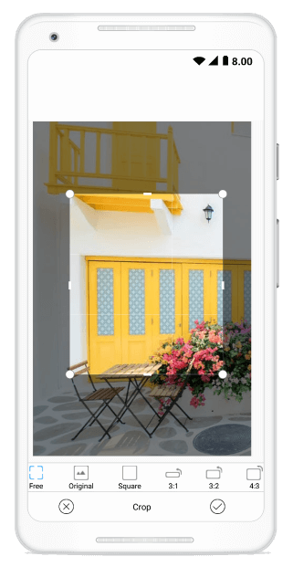

## Crop

The image editor control gives you an option to crop the image as desired. Cropping the image can be done in two ways:

* From Toolbar
* Cropping programmatically

### From Toolbar

To enable cropping, in the `Transforms` submenu, click the `Crop` icon. When the `Crop` icon is tapped, a sub toolbar will appear on top of that toolbar. While the cropping is enabled, the crop sub toolbar, `Cancel` and `OK` buttons will be available. From that sub toolbar, you can able to crop the image with the following aspect ratios.

* `Free`- crop the image to any desired size.
* `Original`-crop the image based on image width and height. 
* `Square`-crop the image based on equal width and height.
* Crop the image to specific aspect ratio such as `3:1, 1:3, 3:2, 2:3, 4:3, 3:4, 5:4, 4:5, 16:9, 9:16`. On double tapping the aspect ratio icon reversed ratio will shown. 

To disable cropping,click the `Cancel` button. To save the cropped area, after selected the desired area, Click the `OK` button, the toolbars will reappear after the cropping operation is completed.

### Cropping programmatically

Cropping operation can be done programmatically in two ways:

* Enable Cropping and Selecting the Crop region visually
* Manually enter the cropping area

## Handling the cropping tool

The `ToggleCropping` method in the SfImageEditor control is used to enable and disable a cropping region placed over the image to visually choose the area for cropping. 

*	To crop the image to any desired size.





//  for free hand cropping

editor.ToggleCropping();    





* To crop an image based on original width and height of the image.





// for cropping the image with original width and height of the image.

editor.ToggleCropping(float.NaN,float.NaN);    





* To crop an image based on specific ratio.





// for cropping the image with ratio x value as 9 and y value as 17

editor.ToggleCropping(9,17);    





* Crop an image based on custom region. The value of the rectangle should be ranges from 0 to 100.





Rectangle rect = new Rectangle(20,20,50,50);

editor.ToggleCropping(rect);    



 

After the cropping area has been selected, the `Crop` method is called which in turn crops the selected region and displays the cropped image on the ImageEditor.





editor.Crop();





## Manually enter the cropping area

If you want to manually enter the cropping rectangle without even enabling the cropping functionality, you can make use of the overloaded Crop(Rectangle rect) method. This can be done by defining a rectangle yourself and pass it to Crop(rect) method.





editor.Crop(new Rectangle(100,100,150,200));





