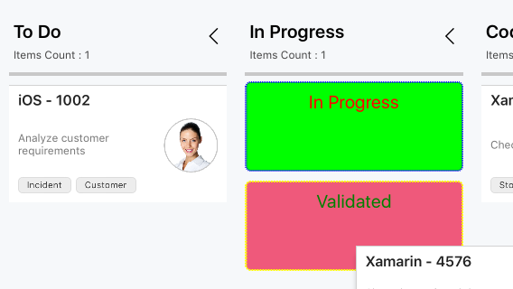

# Placeholder for Xamarin.iOS Kanban (SfKanban)

The placeholder is used to denote the new position of a card in the [`KanbanColumn`](https://help.syncfusion.com/cr/xamarin-ios/Syncfusion.SfKanban.iOS.KanbanColumn.html). It will appear when dragging a card over the column.

### Placeholder style

The [`PlaceholderStyle`](https://help.syncfusion.com/cr/xamarin-ios/Syncfusion.SfKanban.iOS.SfKanban.html#Syncfusion_SfKanban_iOS_SfKanban_PlaceholderStyle) property is used to customize the placeholder. The following [`KanbanPlaceholderStyle`](https://help.syncfusion.com/cr/xamarin-ios/Syncfusion.SfKanban.iOS.KanbanPlaceholderStyle.html) properties are used to customize its appearance:

* [`BackgroundColor`](https://help.syncfusion.com/cr/xamarin-ios/Syncfusion.SfKanban.iOS.KanbanPlaceholderStyle.html#Syncfusion_SfKanban_iOS_KanbanPlaceholderStyle_BackgroundColor) - Changes the background color of placeholder.
* [`StrokeDashes`](https://help.syncfusion.com/cr/xamarin-ios/Syncfusion.SfKanban.iOS.KanbanPlaceholderStyle.html#Syncfusion_SfKanban_iOS_KanbanPlaceholderStyle_StrokeDashes) - Used to change the dashes of placeholder.
* [`StrokeColor`](https://help.syncfusion.com/cr/xamarin-ios/Syncfusion.SfKanban.iOS.KanbanPlaceholderStyle.html#Syncfusion_SfKanban_iOS_KanbanPlaceholderStyle_StrokeColor) - Changes the stroke color of placeholder.
* [`StrokeWidth`](https://help.syncfusion.com/cr/xamarin-ios/Syncfusion.SfKanban.iOS.KanbanPlaceholderStyle.html#Syncfusion_SfKanban_iOS_KanbanPlaceholderStyle_StrokeWidth) - Changes the stroke width of placeholder.
* [`TextFont`](https://help.syncfusion.com/cr/xamarin-ios/Syncfusion.SfKanban.iOS.KanbanPlaceholderStyle.html#Syncfusion_SfKanban_iOS_KanbanPlaceholderStyle_TextFont) - Changes the text size of placeholder.
* [`TextColor`](https://help.syncfusion.com/cr/xamarin-ios/Syncfusion.SfKanban.iOS.KanbanPlaceholderStyle.html#Syncfusion_SfKanban_iOS_KanbanPlaceholderStyle_TextColor) - Changes the text color of placeholder.

The following properties are used to customize the selected category when you have more than one category in a column:

* [`SelectedBackgroundColor`](https://help.syncfusion.com/cr/xamarin-ios/Syncfusion.SfKanban.iOS.KanbanPlaceholderStyle.html#Syncfusion_SfKanban_iOS_KanbanPlaceholderStyle_SelectedBackgroundColor) - Changes the background color of a selected placeholder.
* [`SelectedStrokeDashes`](https://help.syncfusion.com/cr/xamarin-ios/Syncfusion.SfKanban.iOS.KanbanPlaceholderStyle.html#Syncfusion_SfKanban_iOS_KanbanPlaceholderStyle_SelectedStrokeDashes) - Used to change the dashes of a selected placeholder.
* [`SelectedStrokeColor`](https://help.syncfusion.com/cr/xamarin-ios/Syncfusion.SfKanban.iOS.KanbanPlaceholderStyle.html#Syncfusion_SfKanban_iOS_KanbanPlaceholderStyle_SelectedStrokeColor) - Changes the stroke color of a selected placeholder.
* [`SelectedStrokeWidth`](https://help.syncfusion.com/cr/xamarin-ios/Syncfusion.SfKanban.iOS.KanbanPlaceholderStyle.html#Syncfusion_SfKanban_iOS_KanbanPlaceholderStyle_SelectedStrokeWidth) - Changes the stroke width of a selected placeholder.
* [`SelectedTextFont`](https://help.syncfusion.com/cr/xamarin-ios/Syncfusion.SfKanban.iOS.KanbanPlaceholderStyle.html#Syncfusion_SfKanban_iOS_KanbanPlaceholderStyle_SelectedTextFont) - Changes the size of the text in a selected placeholder.
* [`SelectedTextColor`](https://help.syncfusion.com/cr/xamarin-ios/Syncfusion.SfKanban.iOS.KanbanPlaceholderStyle.html#Syncfusion_SfKanban_iOS_KanbanPlaceholderStyle_SelectedTextColor) - Changes the color of the text in a selected placeholder.

The following code example describes the above behavior.



KanbanPlaceholderStyle style = new KanbanPlaceholderStyle();           
style.BackgroundColor = UIColor.FromRGB(239, 89, 123);          
style.StrokeColor = UIColor.Blue;          
style.StrokeWidth = 2;          
style.TextColor = UIColor.Green;        
style.StrokeDashes = new nfloat[] { 1, 1 };         
style.TextFont = UIFont.SystemFontOfSize(20);

style.SelectedBackgroundColor = UIColor.FromRGB(0, 255, 0);          
style.SelectedStrokeDashes = new nfloat[] { 2, 1 };
style.SelectedStrokeColor = UIColor.Yellow;
style.SelectedStrokeWidth = 2;
style.SelectedTextFont = UIFont.SystemFontOfSize(20);
style.SelectedTextColor = UIColor.Red;

kanban.PlaceholderStyle = style;



The following screenshot illustrates the result of the above code sample.

