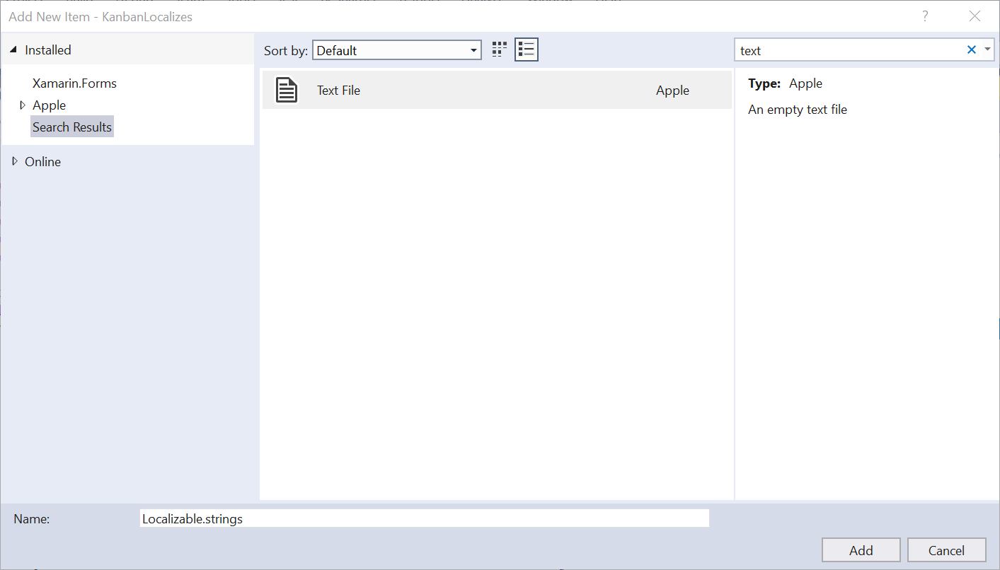
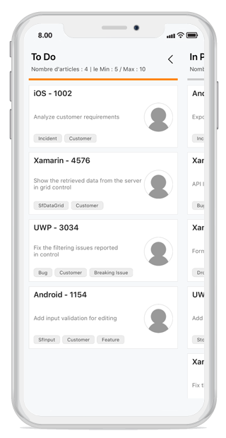

# Localization

Localization is the process of translating the application resources into different languages for specific cultures. You can localize the SfKanban by adding a strings file. Application culture can be changed by language settings in device.

To localize the SfKanban based on language settings in device using string files, use the following steps:

1. Right-click the PCL project, click **Add** and then click **NewFolder**, name the folder as **Resources**.

2. Right-click the **Resources** folder, click **Add**, and then click **NewFolder**, name the folder as **[language name].lproj**.

For example, you will have to give name as **fr.lrpoj** for French culture.

3. Right-click the **[language name].lproj** folder, click **Add**, and then click **NewItem**.

4. In the Add New Item dialog, click the Text File, and name the filename as **Localizable.strings**.

5. Add the Name/Value pair in **Localizable.strings** file, and change its corresponding value to corresponding culture.

You can get the SfKanban’s key from default resource [Localizable.strings](http://www.syncfusion.com/downloads/support/directtrac/general/ze/en.lproj-600843036).

You can download the sample for localizing the Kanban from [here](http://www.syncfusion.com/downloads/support/directtrac/general/ze/IOSKanbanLocalizes-1239841243)