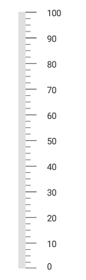

# Change Orientation

[`SFLinearGauge`](https://help.syncfusion.com/cr/xamarin-ios/Syncfusion.SfGauge.iOS.SFLinearGauge.html) supports horizontal and vertical orientations. By default, [`SFLinearGauge`](https://help.syncfusion.com/cr/xamarin-ios/Syncfusion.SfGauge.iOS.SFLinearGauge.html) is rendered with horizontal orientation. You can the change the orientation by using the `Orientation` property. 



           SFLinearGauge linearGauge = new SFLinearGauge();
            linearGauge.BackgroundColor = UIColor.White;
            linearGauge.Orientation = SFLinearGaugeOrientation.SFLinearGaugeOrientationVertical;
            SFLinearScale linearScale = new SFLinearScale();
            linearScale.ScalePosition = SFLinearGaugeScalePosition.SFLinearGaugeScalePositionBackward;
            linearScale.Interval = 10;
            linearScale.ScaleBarLength = 350;
            linearScale.ScaleBarColor = UIColor.FromRGB(224, 224, 224);
            linearScale.LabelColor = UIColor.FromRGB(66, 66, 66);
            linearScale.MajorTickSettings.Length = 12;
            linearScale.MinorTickSettings.Length = 5;
            linearGauge.Scales.Add(linearScale);
            this.View.AddSubview(linearGauge);



