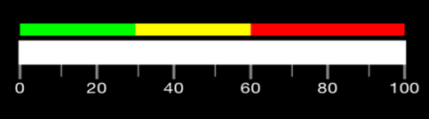

# Configure Range Indicator

Ranges of the linear scale are a collection of the linear range. A linear range is a visual element that starts with a specified StartValue and ends with a specified EndValue within the linear scale. These start and end values can be mentioned using LinearRange class.





SFLinearRange symbolRange = new SFLinearRange ();
symbolRange.StartValue = 0;
symbolRange.EndValue = 50;
symbolRange.Color = UIColor.FromRGB (234, 248, 249);
symbolRange.StartWidth = 10;
symbolRange.EndWidth = 10;
symbolRange.Offset =  nfloat.Parse("-0.17");
scale.Ranges.Add (symbolRange);
//Range
SFLinearRange pointerRange = new SFLinearRange ();
pointerRange.StartValue = 50;
pointerRange.EndValue = 100;
pointerRange.Color = UIColor.FromRGB (50, 184, 198);
pointerRange.StartWidth = 10;
pointerRange.EndWidth = 10; 
pointerRange.Offset =  nfloat.Parse("-0.17");                      
scale.Ranges.Add (pointerRange); 
	




