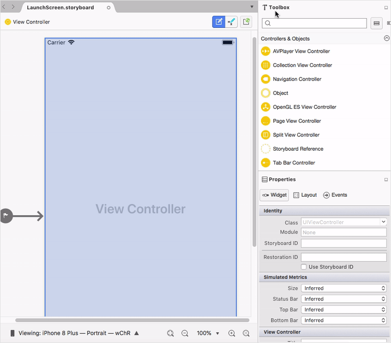

# Getting Started

This section explains the steps required to configure a [`SFLinearGauge`](https://help.syncfusion.com/cr/cref_files/xamarin-ios/Syncfusion.SfGauge.iOS~Syncfusion.SfGauge.iOS.SFLinearGauge.html) control in a real-time scenario and also provides a walk-through on some of the customization features available in [`SFLinearGauge`](https://help.syncfusion.com/cr/cref_files/xamarin-ios/Syncfusion.SfGauge.iOS~Syncfusion.SfGauge.iOS.SFLinearGauge.html) control.

**Adding namespace for the added assemblies**



	      using Com.Syncfusion.Gauges.SfLinearGauge;



## Initialize gauge

You can initialize the [`SFLinearGauge`](https://help.syncfusion.com/cr/cref_files/xamarin-ios/Syncfusion.SfGauge.iOS~Syncfusion.SfGauge.iOS.SFLinearGauge.html) control with a required optimal name by using the included namespace.



		public override void ViewDidLoad()
		{
			base.ViewDidLoad();    
                        SFLinearGauge linearGauge = new SFLinearGauge();
                        this.View.AddSubview(linearGauge);
		}



## Initialize gauge from designer

[`SFLinearGauge`](https://help.syncfusion.com/cr/cref_files/xamarin-ios/Syncfusion.SfGauge.iOS~Syncfusion.SfGauge.iOS.SFLinearGauge.html) allows users to drag the designer screen from toolbox to designer window. The properties window will be displayed where you change the necessary functionalities to customize the linear gauge in designer.

## Adding header

You can assign a unique header to [`SFLinearGauge`](https://help.syncfusion.com/cr/cref_files/xamarin-ios/Syncfusion.SfGauge.iOS~Syncfusion.SfGauge.iOS.SFLinearGauge.html) by using the [`SFLinearLabel`](https://help.syncfusion.com/cr/cref_files/xamarin-ios/Syncfusion.SfGauge.iOS~Syncfusion.SfGauge.iOS.SFLinearLabel.html) property and position it wherever as you desired by using the [`Position`](https://help.syncfusion.com/cr/cref_files/xamarin-ios/Syncfusion.SfGauge.iOS~Syncfusion.SfGauge.iOS.SFLinearLabel~Position.html) property.



            SFLinearGauge linearGauge = new SFLinearGauge();
            linearGauge.BackgroundColor = UIColor.White;
            SFLinearLabel linearHeader = new SFLinearLabel();
            linearHeader.Text = (Foundation.NSString)"Thermometer";
            linearHeader.Font = UIFont.FromName("Helvetica", 20f);
            linearHeader.Position = new CoreGraphics.CGPoint(0.35, 0.35);
            linearHeader.Color = UIColor.Black;
            linearGauge.Header = linearHeader;



## Configuring scales

Scales is a collection of [`SFLinearScale`](https://help.syncfusion.com/cr/cref_files/xamarin-ios/Syncfusion.SfGauge.iOS~Syncfusion.SfGauge.iOS.SFLinearScale.html), which is used to indicate the numeric values. Scale bar, ticks, labels, ranges, and pointers are the sub elements of a scale. 

The [`Minimum`](https://help.syncfusion.com/cr/cref_files/xamarin-ios/Syncfusion.SfGauge.iOS~Syncfusion.SfGauge.iOS.SFLinearScale~Minimum.html) and [`Maximum`](https://help.syncfusion.com/cr/cref_files/xamarin-ios/Syncfusion.SfGauge.iOS~Syncfusion.SfGauge.iOS.SFLinearScale~Maximum.html) properties allow you to set the scale range.



	      SFLinearScale linearScale = new SFLinearScale();
            linearGauge.Header = new SFLinearLabel();
            linearScale.ScaleBarColor = UIColor.FromRGB(224, 224, 224);
            linearScale.MajorTickSettings.Length = 12;
            linearScale.MinorTickSettings.Length = 5;
            linearScale.LabelColor = UIColor.FromRGB(66, 66, 66);
            linearGauge.Scales.Add(linearScale);
	


## Adding a symbol pointer

[`SFSymbolPointer`](https://help.syncfusion.com/cr/cref_files/xamarin-ios/Syncfusion.SfGauge.iOS~Syncfusion.SfGauge.iOS.SFSymbolPointer.html) is a shape that can be placed to mark the pointer value in gauge.



	    SFSymbolPointer symbolPointer = new SFSymbolPointer();
            symbolPointer.Value = 60;
            symbolPointer.Thickness = 10;
            symbolPointer.SymbolPosition = SymbolPointerPosition.Away;
            symbolPointer.Color = UIColor.FromRGB(117, 117, 117);
            linearScale.Pointers.Add(symbolPointer);



## Adding a bar pointer

[`SFBarPointer`](https://help.syncfusion.com/cr/cref_files/xamarin-ios/Syncfusion.SfGauge.iOS~Syncfusion.SfGauge.iOS.SFBarPointer.html) is used to mark the scale values. It starts at the beginning of gauge and ends at the pointer value.



		   SFBarPointer barPointer = new SFBarPointer();
            barPointer.Value = 50;
            barPointer.Thickness = 10;
            barPointer.Color = UIColor.FromRGB(117, 117, 117);
            linearScale.Pointers.Add(barPointer);
	


## Adding ranges

You can categorize the scale values using the start and end values properties in [`SFLinearRange`](https://help.syncfusion.com/cr/cref_files/xamarin-ios/Syncfusion.SfGauge.iOS~Syncfusion.SfGauge.iOS.SFLinearRange.html). You can add multiple ranges for a scale using the `ranges` property.

    
	
            SFLinearRange linearRange = new SFLinearRange();
            linearRange.StartValue = 0;
            linearRange.EndValue = 40;
            linearRange.Color = UIColor.FromRGB(39, 190, 183);
            linearRange.Offset = -20;
            linearRange.StartWidth = 10;
            linearRange.EndWidth = 10;
            linearScale.Ranges.Add(linearRange);

            SFLinearRange linearRange1 = new SFLinearRange();
            linearRange1.StartValue = 40;
            linearRange1.EndValue = 100;
            linearRange1.Color = UIColor.FromRGB(224 , 255 , 255);
            linearRange1.Offset = -20;
            linearRange1.StartWidth = 10;
            linearRange1.EndWidth = 10;
            linearScale.Ranges.Add(linearRange1);



