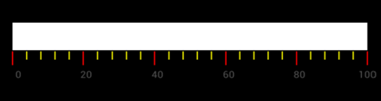

# LinearTickSettings

Ticks are categorized into two types as Major and Minor. These ticks are arranged with respect to the specified frequency i.e., Interval of the linear scale. The minor ticks are displayed using the 
`MinorTicksPerInterval` property.



	SFLinearTickSettings minor = new SFLinearTickSettings ();
	minor.Length = 10;
	minor.Color = UIColor.FromRGB (175, 175, 175);
	minor.Thickness = 1;
	scale.MinorTickSettings = minor;
	//Major Ticks setting
	SFLinearTickSettings major = new SFLinearTickSettings ();
	major.Length = 10;
	major.Color = UIColor.FromRGB (175, 175, 175);
    major.Thickness = 1;
    scale.MajorTickSettings = major; 
	


