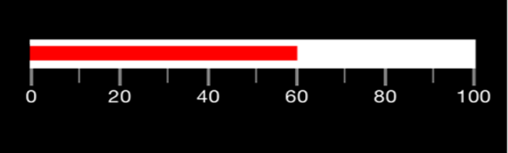

# Types of Value Indicator

SfLinearGauge provides support to mark the values using BarPointer and SymbolPointer.

## Through Bar Pointer

`BarPointer` is an accenting line or colored bar that is placed on the SfLinearGauge to mark the values.





    List<LinearPointer> pointers = new List<LinearPointer> ();
    //BarPointer
    SFBarPointer rangePointer = new SFBarPointer ();
    rangePointer.Value = 50;
    rangePointer.Color = UIColor.FromRGB (206, 69, 69);
    rangePointer.Thickness = 10;
    pointers.Add (rangePointer);





## Through Symbol Pointer

In SymbolPointer, the value is pointed by a symbol on the scale. The Symbol Pointer class is derived from Pointer class. You can modify the symbol pointer size using the `StrokeWidth` property. The color of the symbol pointer is changed using the `Color` property.





    //SymbolPointer
    SFSymbolPointer symbolPointer = new SFSymbolPointer ();
    symbolPointer.Value = 50;
    symbolPointer.Offset = 0.0;
    symbolPointer.Thickness = 3;
    symbolPointer.Color = UIColor.FromRGB (65, 77, 79);
    pointers.Add (symbolPointer);
	




