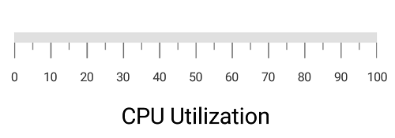
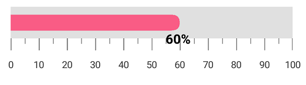

---

layout: post
title: Annotations in LinearGauge
description: Learn how to set annotations in LinearGauge
platform: Xamarin.iOS
control: LinearGauge
documentation: ug

---

# Annotations

[`SFLinearGauge`](https://help.syncfusion.com/cr/xamarin-ios/Syncfusion.SfGauge.iOS.SFLinearGauge.html) supports [`Annotations`](https://help.syncfusion.com/cr/xamarin-ios/Syncfusion.SfGauge.iOS.SFLinearGauge.html#Syncfusion_SfGauge_iOS_SFLinearGauge_Annotations), which is used to mark the specific area of interest in the gauge area with texts, shapes, or images. You can add any number of annotations to the gauge.

##  Annotation

By using the [`View`](https://help.syncfusion.com/cr/xamarin-ios/Syncfusion.SfGauge.iOS.SFLinearGaugeAnnotation.html#Syncfusion_SfGauge_iOS_SFLinearGaugeAnnotation_View) property of annotation object, you can specify the new element that needs to be displayed in the gauge area.


    
            SFLinearGauge linearGauge = new SFLinearGauge();
            linearGauge.Header = new SFLinearLabel();
            linearGauge.BackgroundColor = UIColor.White;
            SFLinearGaugeAnnotation linearGaugeAnnotation = new SFLinearGaugeAnnotation();
            linearGaugeAnnotation.OffsetX = (float)0.6;
            linearGaugeAnnotation.OffsetY = (float)0.4;
            UILabel textView = new UILabel();
            textView.Frame = new CoreGraphics.CGRect(0, 0, 200, 50);
            textView.Text = "CPU Utilization";
            textView.Font = UIFont.FromName("Helvetica", 20f);
            textView.TextColor = UIColor.Black;
            linearGaugeAnnotation.View = textView;
            linearGauge.Annotations.Add(linearGaugeAnnotation);
            SFLinearScale linearScale = new SFLinearScale();
            linearScale.ScaleBarColor = UIColor.FromRGB(224, 224, 224);
            linearScale.LabelColor = UIColor.FromRGB(66, 66, 66);
            linearScale.MajorTickSettings.Length = 12;
            linearScale.MinorTickSettings.Length = 5;
            linearScale.MinorTicksPerInterval = 1;
            linearGauge.Scales.Add(linearScale);
            this.View.AddSubview(linearGauge);
    


##  Positioning the annotation

You can place the annotation anywhere in gauge area by using the `Offset` or `ScaleValue` property.

### Change annotation position by using offset

You can position the annotation anywhere in the linear gauge by using the [`OffsetX`](https://help.syncfusion.com/cr/xamarin-ios/Syncfusion.SfGauge.iOS.SFLinearGaugeAnnotation.html#Syncfusion_SfGauge_iOS_SFLinearGaugeAnnotation_OffsetX) and [`OffsetY`](https://help.syncfusion.com/cr/xamarin-ios/Syncfusion.SfGauge.iOS.SFLinearGaugeAnnotation.html#Syncfusion_SfGauge_iOS_SFLinearGaugeAnnotation_OffsetY) properties. It ranges from 0 to 1.


    
            SFLinearGauge linearGauge = new SFLinearGauge();
            linearGauge.Header = new SFLinearLabel();
            linearGauge.BackgroundColor = UIColor.White;
            SFLinearGaugeAnnotation linearGaugeAnnotation = new SFLinearGaugeAnnotation();
            linearGaugeAnnotation.OffsetX = (float)0.6;
            linearGaugeAnnotation.OffsetY = (float)0.6;
            UILabel textView = new UILabel();
            textView.Frame = new CoreGraphics.CGRect(0, 0, 200, 50);
            textView.Text = "CPU Utilization";
            textView.Font = UIFont.FromName("Helvetica", 20f);
            textView.TextColor = UIColor.Black;
            linearGaugeAnnotation.View = textView;
            linearGauge.Annotations.Add(linearGaugeAnnotation);
            SFLinearScale linearScale = new SFLinearScale();
            linearScale.ScaleBarColor = UIColor.FromRGB(224, 224, 224);
            linearScale.LabelColor = UIColor.FromRGB(66, 66, 66);
            linearScale.MajorTickSettings.Length = 12;
            linearScale.MinorTickSettings.Length = 5;
            linearScale.MinorTicksPerInterval = 1;
            linearGauge.Scales.Add(linearScale);
            this.View.AddSubview(linearGauge);
    


### Change annotation position by using scale value

You can also place the annotation by specifying the [`ScaleValue`](https://help.syncfusion.com/cr/xamarin-ios/Syncfusion.SfGauge.iOS.SFLinearGaugeAnnotation.html#Syncfusion_SfGauge_iOS_SFLinearGaugeAnnotation_ScaleValue) property.


              
              SFLinearGauge linearGauge = new SFLinearGauge();
            linearGauge.Header = new SFLinearLabel();
            linearGauge.BackgroundColor = UIColor.White;
            SFLinearGaugeAnnotation linearGaugeAnnotation = new SFLinearGaugeAnnotation();
            linearGaugeAnnotation.ScaleValue = 60;
            UILabel textView = new UILabel();
            textView.Frame = new CoreGraphics.CGRect(0, 0, 50, 70);
            textView.Text = "60%";
            textView.Font = UIFont.FromName("Helvetica-Bold", 20f);
            textView.TextColor = UIColor.Black;
            linearGaugeAnnotation.View = textView;
            linearGauge.Annotations.Add(linearGaugeAnnotation);
            SFLinearScale linearScale = new SFLinearScale();
            linearScale.ScaleBarColor = UIColor.FromRGB(224, 224, 224);
            linearScale.LabelColor = UIColor.FromRGB(66, 66, 66);
            linearScale.MajorTickSettings.Length = 12;
            linearScale.MinorTickSettings.Length = 5;
            linearScale.MinorTicksPerInterval = 1;
            linearScale.ScaleBarSize = 40;
            linearScale.MinorTicksPerInterval = 1;

            SFBarPointer barPointer = new SFBarPointer();
            barPointer.Value = 60;
            barPointer.Thickness = 20;
            barPointer.CornerRadius = 10;
            barPointer.CornerRadiusType = CornerRadiusType.End;
            barPointer.Color = UIColor.FromRGB(249, 92, 133);
            linearScale.Pointers.Add(barPointer);

            linearGauge.Scales.Add(linearScale);
            this.View.AddSubview(linearGauge);
    


## Set margin to the annotation

You can adjust the annotation by specifying the [`ViewMargin`](https://help.syncfusion.com/cr/xamarin-ios/Syncfusion.SfGauge.iOS.SFLinearGaugeAnnotation.html#Syncfusion_SfGauge_iOS_SFLinearGaugeAnnotation_ViewMargin) property in pixel, which adjusts the annotation element from its current position. 


    
            SFLinearGauge linearGauge = new SFLinearGauge();
            linearGauge.Header = new SFLinearLabel();
            linearGauge.BackgroundColor = UIColor.White;
            SFLinearGaugeAnnotation linearGaugeAnnotation = new SFLinearGaugeAnnotation();
            linearGaugeAnnotation.ScaleValue = 60;
            linearGaugeAnnotation.ViewMargin = new CoreGraphics.CGPoint((float)10, (float)60);
            UILabel textView = new UILabel();
            textView.Frame = new CoreGraphics.CGRect(0, 0, 50, 70);
            textView.Text = "60%";
            textView.Font = UIFont.FromName("Helvetica-Bold", 20f);
            textView.TextColor = UIColor.Black;
            linearGaugeAnnotation.View = textView;
            linearGauge.Annotations.Add(linearGaugeAnnotation);
            SFLinearScale linearScale = new SFLinearScale();
            linearScale.ScaleBarColor = UIColor.FromRGB(224, 224, 224);
            linearScale.LabelColor = UIColor.FromRGB(66, 66, 66);
            linearScale.MajorTickSettings.Length = 12;
            linearScale.MinorTickSettings.Length = 5;
            linearScale.MinorTicksPerInterval = 1;
            linearScale.ScaleBarSize = 40;
            linearScale.MinorTicksPerInterval = 1;

            SFBarPointer barPointer = new SFBarPointer();
            barPointer.Value = 60;
            barPointer.Thickness = 20;
            barPointer.CornerRadius = 10;
            barPointer.CornerRadiusType = CornerRadiusType.End;
            barPointer.Color = UIColor.FromRGB(249, 92, 133);
            linearScale.Pointers.Add(barPointer);

            linearGauge.Scales.Add(linearScale);
            this.View.AddSubview(linearGauge);
    


## Alignment of annotation

You can align the annotation using the [`HorizontalViewAlignment`](https://help.syncfusion.com/cr/xamarin-ios/Syncfusion.SfGauge.iOS.SFLinearGaugeAnnotation.html#Syncfusion_SfGauge_iOS_SFLinearGaugeAnnotation_HorizontalViewAlignment) and [`VerticalViewAlignment`](https://help.syncfusion.com/cr/xamarin-ios/Syncfusion.SfGauge.iOS.SFLinearGaugeAnnotation.html#Syncfusion_SfGauge_iOS_SFLinearGaugeAnnotation_VerticalViewAlignment) properties.

### Setting horizontal view alignment


    
             SFLinearGauge linearGauge = new SFLinearGauge();
            linearGauge.Header = new SFLinearLabel();
            linearGauge.BackgroundColor = UIColor.White;
            SFLinearGaugeAnnotation linearGaugeAnnotation = new SFLinearGaugeAnnotation();
            linearGaugeAnnotation.ScaleValue = 60;
            linearGaugeAnnotation.HorizontalViewAlignment = ViewAlignment.Start;
            UILabel textView = new UILabel();
            textView.Frame = new CoreGraphics.CGRect(0, 0, 150, 70);
            textView.Text = "CPU Utilization";
            textView.Font = UIFont.FromName("Helvetica-Bold", 15f);
            textView.TextColor = UIColor.Black;
            linearGaugeAnnotation.View = textView;
            linearGauge.Annotations.Add(linearGaugeAnnotation);
            SFLinearScale linearScale = new SFLinearScale();
            linearScale.ScaleBarColor = UIColor.FromRGB(224, 224, 224);
            linearScale.LabelColor = UIColor.FromRGB(66, 66, 66);
            linearScale.MajorTickSettings.Length = 12;
            linearScale.MinorTickSettings.Length = 5;
            linearScale.MinorTicksPerInterval = 1;
            linearScale.ScaleBarSize = 40;
            linearScale.MinorTicksPerInterval = 1;

            SFBarPointer barPointer = new SFBarPointer();
            barPointer.Value = 60;
            barPointer.Thickness = 20;
            barPointer.CornerRadius = 10;
            barPointer.CornerRadiusType = CornerRadiusType.End;
            barPointer.Color = UIColor.FromRGB(249, 92, 133);
            linearScale.Pointers.Add(barPointer);

            linearGauge.Scales.Add(linearScale);
            this.View.AddSubview(linearGauge);
    


### Setting vertical view alignment


    
          SFLinearGauge linearGauge = new SFLinearGauge();
            linearGauge.Header = new SFLinearLabel();
            linearGauge.BackgroundColor = UIColor.White;
            SFLinearGaugeAnnotation linearGaugeAnnotation = new SFLinearGaugeAnnotation();
            linearGaugeAnnotation.ScaleValue = 60;
            linearGaugeAnnotation.VerticalViewAlignment = ViewAlignment.Start;
            UILabel textView = new UILabel();
            textView.Frame = new CoreGraphics.CGRect(0, 0, 150, 70);
            textView.Text = "CPU Utilization";
            textView.Font = UIFont.FromName("Helvetica-Bold", 15f);
            textView.TextColor = UIColor.Black;
            linearGaugeAnnotation.View = textView;
            linearGauge.Annotations.Add(linearGaugeAnnotation);
            SFLinearScale linearScale = new SFLinearScale();
            linearScale.ScaleBarColor = UIColor.FromRGB(224, 224, 224);
            linearScale.LabelColor = UIColor.FromRGB(66, 66, 66);
            linearScale.MajorTickSettings.Length = 12;
            linearScale.MinorTickSettings.Length = 5;
            linearScale.MinorTicksPerInterval = 1;
            linearScale.ScaleBarSize = 40;
            linearScale.MinorTicksPerInterval = 1;

            SFBarPointer barPointer = new SFBarPointer();
            barPointer.Value = 60;
            barPointer.Thickness = 20;
            barPointer.CornerRadius = 10;
            barPointer.CornerRadiusType = CornerRadiusType.End;
            barPointer.Color = UIColor.FromRGB(249, 92, 133);
            linearScale.Pointers.Add(barPointer);

            linearGauge.Scales.Add(linearScale);
            this.View.AddSubview(linearGauge);
    


## Setting scale index for annotation

You can set the index for the scale by using [`ScaleIndex`](https://help.syncfusion.com/cr/xamarin-ios/Syncfusion.SfGauge.iOS.SFLinearGaugeAnnotation.html#Syncfusion_SfGauge_iOS_SFLinearGaugeAnnotation_ScaleIndex)



              SFLinearGauge linearGauge = new SFLinearGauge();
            linearGauge.Header = new SFLinearLabel();
            linearGauge.BackgroundColor = UIColor.White;
            SFLinearGaugeAnnotation linearGaugeAnnotation = new SFLinearGaugeAnnotation();
            linearGaugeAnnotation.OffsetX = (float)0.5;
            linearGaugeAnnotation.OffsetY = (float)0.45;
            linearGaugeAnnotation.ScaleIndex = 0;
            UILabel textView = new UILabel();
            textView.Frame = new CoreGraphics.CGRect(0, 0, 150, 70);
            textView.Text = "CPU Utilization";
            textView.Font = UIFont.FromName("Helvetica-Bold", 15f);
            textView.TextColor = UIColor.Black;
            linearGaugeAnnotation.View = textView;
            linearGauge.Annotations.Add(linearGaugeAnnotation);

            SFLinearGaugeAnnotation linearGaugeAnnotation1 = new SFLinearGaugeAnnotation();
            linearGaugeAnnotation1.OffsetX = (float)0.5;
            linearGaugeAnnotation1.OffsetY = (float)0.6;
            linearGaugeAnnotation1.ScaleIndex = 1;
            UILabel textView1 = new UILabel();
            textView1.Frame = new CoreGraphics.CGRect(0, 0, 150, 70);
            textView1.Text = "Thermometer";
            textView1.Font = UIFont.FromName("Helvetica-Bold", 15f);
            textView1.TextColor = UIColor.Black;
            linearGaugeAnnotation1.View = textView1;
            linearGauge.Annotations.Add(linearGaugeAnnotation1);

            SFLinearScale linearScale = new SFLinearScale();
            linearScale.ScaleBarColor = UIColor.FromRGB(224, 224, 224);
            linearScale.LabelColor = UIColor.FromRGB(66, 66, 66);
            linearScale.MajorTickSettings.Length = 12;
            linearScale.MinorTickSettings.Length = 5;
            linearScale.MinorTicksPerInterval = 1;

            SFLinearScale linearScale1 = new SFLinearScale();
            linearScale1.ScaleBarColor = UIColor.FromRGB(224, 224, 224);
            linearScale1.LabelColor = UIColor.FromRGB(66, 66, 66);
            linearScale1.MajorTickSettings.Length = 12;
            linearScale1.MinorTickSettings.Length = 5;
            linearScale1.MinorTicksPerInterval = 1;
            linearScale1.Offset = 100;

            linearGauge.Scales.Add(linearScale);
            linearGauge.Scales.Add(linearScale1);
            this.View.AddSubview(linearGauge);



## Multiple annotations

You can add multiple annotations to the gauge as demonstrated below.



            SFLinearGauge linearGauge = new SFLinearGauge();
            linearGauge.BackgroundColor = UIColor.White;
            linearGauge.Header = new SFLinearLabel();

            SFLinearGaugeAnnotation annotation1 = new SFLinearGaugeAnnotation();
            annotation1.ScaleValue = 15;
            annotation1.ViewMargin = new CoreGraphics.CGPoint(0, 30);
            UIImageView image1 = new UIImageView();
            image1.Frame = new CoreGraphics.CGRect(0, 0, 30, 30);
            image1.Image = UIImage.FromBundle("Low.png");
            annotation1.View = image1;

            SFLinearGaugeAnnotation annotation2 = new SFLinearGaugeAnnotation();
            annotation2.ScaleValue = 45;
            annotation2.ViewMargin = new CoreGraphics.CGPoint(0, 30);
            UIImageView image2 = new UIImageView();
            image2.Frame = new CoreGraphics.CGRect(0, 0, 30, 30);
            image2.Image = UIImage.FromBundle("Moderate.png");
            annotation2.View = image2;

            SFLinearGaugeAnnotation annotation3 = new SFLinearGaugeAnnotation();
            annotation3.ScaleValue = 75;
            annotation3.ViewMargin = new CGPoint(0, 30);
            UIImageView image3 = new UIImageView();
            image3.Frame = new CGRect(0, 0, 30, 30);
            image3.Image = UIImage.FromBundle("High.png");
            annotation3.View = image3;

            SFLinearGaugeAnnotation annotation4 = new SFLinearGaugeAnnotation();
            annotation4.ScaleValue = 15;
            annotation4.HorizontalViewAlignment = ViewAlignment.Center;
            annotation4.ViewMargin = new CGPoint(0, 80);
            UILabel label1 = new UILabel();
            label1.Frame = new CGRect(0, 0, 30, 30);
            label1.Text = "Low";
            label1.Font = UIFont.FromName("Helvetica", 12f);
            label1.TextColor = UIColor.FromRGB(48, 179, 45);
            annotation4.View = label1;

            SFLinearGaugeAnnotation annotation5 = new SFLinearGaugeAnnotation();
            annotation5.ScaleValue = 45;
            annotation5.HorizontalViewAlignment = ViewAlignment.Center;
            annotation5.ViewMargin = new CGPoint(0, 80);
            UILabel label2 = new UILabel();
            label2.Text = "Moderate";
            label2.Frame = new CGRect(0, 0, 60, 50);
            label2.Font = UIFont.FromName("Helvetica", 12f);
            label2.TextColor = UIColor.FromRGB(255, 221, 0);
            annotation5.View = label2;

            SFLinearGaugeAnnotation annotation6 = new SFLinearGaugeAnnotation();
            annotation6.ScaleValue = 75;
            annotation6.HorizontalViewAlignment = ViewAlignment.Center;
            annotation6.ViewMargin = new CGPoint(0, 80);
            UILabel label3 = new UILabel();
            label3.Text = "High";
            label3.Frame = new CGRect(0, 0, 30, 30);

            label3.Font = UIFont.FromName("Helvetica", 12f);
            label3.TextColor = UIColor.FromRGB(240, 62, 62);
            annotation6.View = label3;

            SFLinearGaugeAnnotation annotation7 = new SFLinearGaugeAnnotation();
            annotation7.ScaleValue = 45;
            annotation7.HorizontalViewAlignment = ViewAlignment.Center;
            annotation7.ViewMargin = new CGPoint(0, -80);
            UILabel label4 = new UILabel();
            label4.Frame = new CGRect(0, 0, 130, 175);
            label4.Text = "CPU Utilization";
            //label4.Font = UIFont.FromName("Helvetica", 14f);
            label4.TextColor = UIColor.Black;
            annotation7.View = label4;

            linearGauge.Annotations.Add(annotation1);
            linearGauge.Annotations.Add(annotation2);
            linearGauge.Annotations.Add(annotation3);
            linearGauge.Annotations.Add(annotation4);
            linearGauge.Annotations.Add(annotation5);
            linearGauge.Annotations.Add(annotation6);
            linearGauge.Annotations.Add(annotation7);

            SFLinearScale scale = new SFLinearScale();
            scale.Minimum = 0;
            scale.Maximum = 90;
            scale.ShowScaleLabel = false;
            scale.MinorTicksPerInterval = 0;
            scale.ScaleBarSize = 13;
            scale.ShowTicks = false;
            scale.ScaleBarColor = UIColor.Clear;

            SFLinearTickSettings major = new SFLinearTickSettings();
            major.Length = 0;
            scale.MajorTickSettings = major;

            SFLinearRange range1 = new SFLinearRange();
            range1.StartValue = 0;
            range1.EndValue = 30;
            range1.StartWidth = 60;
            range1.EndWidth = 60;
            range1.Color = UIColor.FromRGB(48, 179, 45);
            scale.Ranges.Add(range1);

            SFLinearRange range2 = new SFLinearRange();
            range2.StartValue = 30;
            range2.EndValue = 60;
            range2.StartWidth = 60;
            range2.EndWidth = 60;
            range2.Color = UIColor.FromRGB(255, 221, 0);
            scale.Ranges.Add(range2);

            SFLinearRange range3 = new SFLinearRange();
            range3.StartValue = 60;
            range3.EndValue = 90;
            range3.StartWidth = 60;
            range3.EndWidth = 60;
            range3.Color = UIColor.FromRGB(240, 62, 62);
            scale.Ranges.Add(range3);
            linearGauge.Scales.Add(scale);

            this.View.AddSubview(linearGauge);
    


