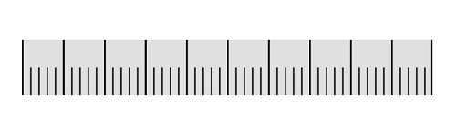

---

layout: post
title: Labels in Syncfusion LinearGauge control for Xamarin.iOS
description:  Learn how to set labels in Syncfusion LinearGauge control
platform: Xamarin.iOS
control: LinearGauge
documentation: ug

---

# Labels 

[`SFLinearScale`](https://help.syncfusion.com/cr/cref_files/xamarin-ios/Syncfusion.SfGauge.iOS~Syncfusion.SfGauge.iOS.SFLinearScale.html) labels associate a numeric value with major scale tick marks.

## Label color customization

The label color can be changed using the [`LabelColor`](https://help.syncfusion.com/cr/cref_files/xamarin-ios/Syncfusion.SfGauge.iOS~Syncfusion.SfGauge.iOS.SFLinearScale~LabelColor.html) property.



              SFLinearGauge linearGauge = new SFLinearGauge();
            linearGauge.BackgroundColor = UIColor.White;
            linearGauge.Header = new SFLinearLabel();
            SFLinearScale linearScale = new SFLinearScale();
            linearScale.ScaleBarColor = UIColor.FromRGB(224, 224, 224);
            linearScale.MajorTickSettings.Length = 12;
            linearScale.MinorTickSettings.Length = 7;
            linearScale.LabelColor = UIColor.Purple;
            linearGauge.Scales.Add(linearScale);
            this.View.AddSubview(linearGauge);

    


## Label font customization

The label font can be customized by using the [`LabelFont`](https://help.syncfusion.com/cr/cref_files/xamarin-ios/Syncfusion.SfGauge.iOS~Syncfusion.SfGauge.iOS.SFLinearScale~LabelFont.html) property.



            SFLinearGauge linearGauge = new SFLinearGauge();
            linearGauge.BackgroundColor = UIColor.White;
            linearGauge.Header = new SFLinearLabel();
            SFLinearScale linearScale = new SFLinearScale();
            linearScale.ScaleBarColor = UIColor.FromRGB(224, 224, 224);
            linearScale.MajorTickSettings.Length = 12;
            linearScale.MinorTickSettings.Length = 7;
            linearScale.LabelFont = UIFont.FromName("Chalkduster", 15f);
            linearScale.LabelColor = UIColor.FromRGB(66, 66, 66);
            linearGauge.Scales.Add(linearScale);
            this.View.AddSubview(linearGauge);
    


## Setting position for labels

The labels can be positioned far away from the ticks by using the [`LabelOffset`](https://help.syncfusion.com/cr/cref_files/xamarin-ios/Syncfusion.SfGauge.iOS~Syncfusion.SfGauge.iOS.SFLinearScale~LabelOffset.html) property in pixel.



            SFLinearGauge linearGauge = new SFLinearGauge();
            linearGauge.BackgroundColor = UIColor.White;
            linearGauge.Header = new SFLinearLabel();
            SFLinearScale linearScale = new SFLinearScale();
            linearScale.ScaleBarColor = UIColor.FromRGB(224, 224, 224);
            linearScale.MajorTickSettings.Length = 12;
            linearScale.MinorTickSettings.Length = 7;
            linearScale.LabelColor = UIColor.FromRGB(66, 66, 66);
            linearScale.LabelOffset = 5;
            linearGauge.Scales.Add(linearScale);
            this.View.AddSubview(linearGauge);

   


### Setting postfix and prefix for labels

You can  postfix/prefix values to the scale labels using the [`LabelPostfix`](https://help.syncfusion.com/cr/cref_files/xamarin-ios/Syncfusion.SfGauge.iOS~Syncfusion.SfGauge.iOS.SFLinearScale~LabelPostfix.html) and [`LabelPrefix`](https://help.syncfusion.com/cr/cref_files/xamarin-ios/Syncfusion.SfGauge.iOS~Syncfusion.SfGauge.iOS.SFLinearScale~LabelPrefix.html) properties, respectively.

### Setting label postfix

The [`LabelPostfix`](https://help.syncfusion.com/cr/cref_files/xamarin-ios/Syncfusion.SfGauge.iOS~Syncfusion.SfGauge.iOS.SFLinearScale~LabelPostfix.html) property allows you to postfix the values to scale labels.



              SFLinearGauge linearGauge = new SFLinearGauge();
            linearGauge.BackgroundColor = UIColor.White;
            linearGauge.Header = new SFLinearLabel();
            SFLinearScale linearScale = new SFLinearScale();
            linearScale.ScaleBarColor = UIColor.FromRGB(224, 224, 224);
            linearScale.MajorTickSettings.Length = 12;
            linearScale.MinorTickSettings.Length = 7;
            linearScale.LabelColor = UIColor.FromRGB(66, 66, 66);
            linearScale.Minimum = 0;
            linearScale.Maximum = 1000;
            linearScale.Interval = 200;
            linearScale.LabelPostfix =(Foundation.NSString) "K";
            linearGauge.Scales.Add(linearScale);
            this.View.AddSubview(linearGauge);
    


### Setting label prefix

The [`LabelPrefix`](https://help.syncfusion.com/cr/cref_files/xamarin-ios/Syncfusion.SfGauge.iOS~Syncfusion.SfGauge.iOS.SFLinearScale~LabelPrefix.html) property allows you to prefix the values to scale labels.



            SFLinearGauge linearGauge = new SFLinearGauge();
            linearGauge.BackgroundColor = UIColor.White;
            linearGauge.Header = new SFLinearLabel();
            SFLinearScale linearScale = new SFLinearScale();
            linearScale.ScaleBarColor = UIColor.FromRGB(224, 224, 224);
            linearScale.MajorTickSettings.Length = 12;
            linearScale.MinorTickSettings.Length = 7;
            linearScale.LabelColor = UIColor.FromRGB(66, 66, 66);;
            linearScale.LabelPrefix =(Foundation.NSString) "$";
            linearGauge.Scales.Add(linearScale);
            this.View.AddSubview(linearGauge);

    


## Labels visibility

Labels visibility can be customized using the [`ShowScaleLabel`](https://help.syncfusion.com/cr/cref_files/xamarin-ios/Syncfusion.SfGauge.iOS~Syncfusion.SfGauge.iOS.SFLinearScale~ShowScaleLabel.html) property of linear scale.



           SFLinearGauge linearGauge = new SFLinearGauge();
            linearGauge.BackgroundColor = UIColor.White;
            linearGauge.Header = new SFLinearLabel();
            SFLinearScale linearScale = new SFLinearScale();
            linearScale.ScaleBarColor = UIColor.FromRGB(224, 224, 224);
            linearScale.MajorTickSettings.Length = 12;
            linearScale.MinorTickSettings.Length = 7;
            linearScale.ScaleBarSize = 40;
            linearScale.MajorTickSettings.Color = UIColor.Black;
            linearScale.MinorTickSettings.Color = UIColor.Black;
            linearScale.MajorTickSettings.Length = 40;
            linearScale.MinorTickSettings.Offset = -20;
            linearScale.MajorTickSettings.Offset = -40;
            linearScale.MinorTickSettings.Length = 20;
            linearScale.MinorTicksPerInterval = 4;
            linearScale.ShowScaleLabel = false;
            linearGauge.Scales.Add(linearScale);
            linearGauge.Scales.Add(linearScale);
   


