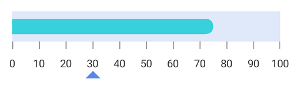

# Pointers

[`SFLinearGauge`](https://help.syncfusion.com/cr/xamarin-ios/Syncfusion.SfGauge.iOS.SFLinearGauge.html) provides support to mark the values using [`SFBarPointer`](https://help.syncfusion.com/cr/xamarin-ios/Syncfusion.SfGauge.iOS.SFBarPointer.html) and [`SFSymbolPointer`](https://help.syncfusion.com/cr/xamarin-ios/Syncfusion.SfGauge.iOS.SFSymbolPointer.html).

## Adding bar pointer to scale

[`SFBarPointer`](https://help.syncfusion.com/cr/xamarin-ios/Syncfusion.SfGauge.iOS.SFBarPointer.html) is used to mark the scale values. It starts at the beginning of gauge and ends at the pointer value.


	
		    SFLinearGauge linearGauge = new SFLinearGauge();
            linearGauge.BackgroundColor = UIColor.White;
            linearGauge.Header = new SFLinearLabel();

            SFLinearScale linearScale = new SFLinearScale();
            linearScale.ScaleBarColor = UIColor.FromRGB(224, 224, 224);
            linearScale.LabelColor = UIColor.FromRGB(66, 66, 66);
            linearScale.ScaleBarSize = 20;
            linearScale.LabelFont = UIFont.FromName("Helvetica", 14f);
            linearScale.MinorTicksPerInterval = 0;
            linearScale.MajorTickSettings.Color = UIColor.FromRGB(158, 158, 158);
            linearScale.MajorTickSettings.Thickness = 1;
            linearScale.MajorTickSettings.Length = 10;

            SFBarPointer barPointer = new SFBarPointer();
            barPointer.Value = 75;
            barPointer.Thickness = 20;
            barPointer.Color = UIColor.FromRGB(54, 209, 220);
            linearScale.Pointers.Add(barPointer);
            linearGauge.Scales.Add(linearScale);
            this.View.AddSubview(linearGauge);



## Bar pointer customization

The bar pointer’s UI is customized by using the [`Color`](https://help.syncfusion.com/cr/xamarin-ios/Syncfusion.SfGauge.iOS.SFLinearPointer.html#Syncfusion_SfGauge_iOS_SFLinearPointer_Color) and [`Thickness`](https://help.syncfusion.com/cr/xamarin-ios/Syncfusion.SfGauge.iOS.SFLinearPointer.html#Syncfusion_SfGauge_iOS_SFLinearPointer_Thickness) properties.


	
		      SFLinearGauge linearGauge = new SFLinearGauge();
            linearGauge.BackgroundColor = UIColor.White;
            linearGauge.Header = new SFLinearLabel();

            SFLinearScale linearScale = new SFLinearScale();
            linearScale.ScaleBarColor = UIColor.FromRGB(224, 224, 224);
            linearScale.LabelColor = UIColor.FromRGB(66, 66, 66);
            linearScale.ScaleBarSize = 40;
            linearScale.LabelFont = UIFont.FromName("Helvetica", 14f);
            linearScale.MinorTicksPerInterval = 0;
            linearScale.MajorTickSettings.Color = UIColor.FromRGB(62, 62, 62);
            linearScale.MajorTickSettings.Thickness = 1;
            linearScale.MajorTickSettings.Length = 10;

            SFBarPointer barPointer = new SFBarPointer();
            barPointer.Value = 75;
            barPointer.Thickness = 20;
            barPointer.EnableAnimation = false;
            barPointer.Color = UIColor.FromRGB(54, 209, 220);
            linearScale.Pointers.Add(barPointer);
            linearGauge.Scales.Add(linearScale);
            this.View.AddSubview(linearGauge);



## Setting corner radius type for bar pointer

Corners of the [`SFBarPointer`](https://help.syncfusion.com/cr/xamarin-ios/Syncfusion.SfGauge.iOS.SFBarPointer.html) can be customized by setting the value to the [`CornerRadiusType`](https://help.syncfusion.com/cr/xamarin-ios/Syncfusion.SfGauge.iOS.SFBarPointer.html#Syncfusion_SfGauge_iOS_SFBarPointer_CornerRadiusType) property. All corners of bar pointer can be customized using the `Start`, `End`, `Both`, and `None` options.
 [`CornerRadiusValue`](https://help.syncfusion.com/cr/xamarin-ios/Syncfusion.SfGauge.iOS.SFBarPointer.html#Syncfusion_SfGauge_iOS_SFBarPointer_CornerRadiusValue) property used to reduce the radius of the corners.



           SFLinearGauge linearGauge = new SFLinearGauge();
            linearGauge.BackgroundColor = UIColor.White;
            linearGauge.Header = new SFLinearLabel();

            SFLinearScale linearScale = new SFLinearScale();
            linearScale.ScaleBarColor = UIColor.FromRGB(224, 224, 224);
            linearScale.LabelColor = UIColor.FromRGB(66, 66, 66);
            linearScale.ScaleBarSize = 40;
            linearScale.LabelFont =UIFont.FromName("Helvetica", 14f);
            linearScale.MinorTicksPerInterval = 0;
            linearScale.MajorTickSettings.Color = UIColor.FromRGB(62, 62, 62);
            linearScale.MajorTickSettings.Thickness = 1;
            linearScale.MajorTickSettings.Length = 10;

            SFBarPointer barPointer = new SFBarPointer();
            barPointer.Value = 75;
            barPointer.Thickness = 20;
            barPointer.CornerRadiusType = CornerRadiusType.Start;
            barPointer.CornerRadius = 10;
            barPointer.EnableAnimation = false;
            barPointer.Color = UIColor.FromRGB(54, 209, 220);
            linearScale.Pointers.Add(barPointer);

            linearGauge.Scales.Add(linearScale);
            this.View.AddSubview(linearGauge);



## Setting gradient color for bar pointer

You can give smooth color transition to bar pointer to specifying the different colors based on bar pointer’s value by using [`GradientStops`](https://help.syncfusion.com/cr/xamarin-ios/Syncfusion.SfGauge.iOS.SFBarPointer.html#Syncfusion_SfGauge_iOS_SFBarPointer_GradientStops) property.



           SFLinearGauge linearGauge = new SFLinearGauge();
            linearGauge.BackgroundColor = UIColor.White;
            linearGauge.Header = new SFLinearLabel();

            SFLinearScale linearScale = new SFLinearScale();
            linearScale.ScaleBarColor = UIColor.FromRGB(247, 237, 237);
            linearScale.LabelColor = UIColor.Black;
            linearScale.ScaleBarSize = 40;
            linearScale.CornerRadius = 20;
            linearScale.CornerRadiusType = CornerRadiusType.Both;
            linearScale.LabelFont = UIFont.FromName("Helvetica", 14f);
            linearScale.Minimum = 0;
            linearScale.Maximum = 100;
            linearScale.Interval = 25;
            linearScale.LabelOffset = -10;
            linearScale.ShowTicks = false;

            SFBarPointer barPointer = new SFBarPointer();
            barPointer.Value = 75;
            barPointer.CornerRadiusType = CornerRadiusType.Both;
            barPointer.CornerRadius = 15;
            barPointer.Thickness = 30;
            barPointer.EnableAnimation = false;

            GaugeGradientStop gaugeGradientStop = new GaugeGradientStop();
            gaugeGradientStop.Value = 10;
            gaugeGradientStop.Color = UIColor.FromRGB(248, 186, 191);
            barPointer.GradientStops.Add(gaugeGradientStop);

            GaugeGradientStop gaugeGradientStop1 = new GaugeGradientStop();
            gaugeGradientStop1.Value = 40;
            gaugeGradientStop1.Color = UIColor.FromRGB(238, 137, 167);
            barPointer.GradientStops.Add(gaugeGradientStop1);

            GaugeGradientStop gaugeGradientStop2 = new GaugeGradientStop();
            gaugeGradientStop2.Value = 50;
            gaugeGradientStop2.Color = UIColor.FromRGB(228, 84, 140);
            barPointer.GradientStops.Add(gaugeGradientStop2);

            GaugeGradientStop gaugeGradientStop3 = new GaugeGradientStop();
            gaugeGradientStop3.Value = 60;
            gaugeGradientStop3.Color = UIColor.FromRGB(219, 37, 117);
            barPointer.GradientStops.Add(gaugeGradientStop3);

            linearScale.Pointers.Add(barPointer);
            linearGauge.Scales.Add(linearScale);
            this.View.AddSubview(linearGauge);



## Adding symbol pointer to scale

In [`SFSymbolPointer`](https://help.syncfusion.com/cr/xamarin-ios/Syncfusion.SfGauge.iOS.SFSymbolPointer.html), the value is pointed by a symbol on the scale.



            SFLinearGauge linearGauge = new SFLinearGauge();
            linearGauge.BackgroundColor = UIColor.White;
            linearGauge.Header = new SFLinearLabel();

            SFLinearScale linearScale = new SFLinearScale();
            linearScale.ScaleBarColor = UIColor.FromRGB(224, 224, 224);
            linearScale.LabelColor = UIColor.FromRGB(66, 66, 66);
            linearScale.ScaleBarSize = 40;
            linearScale.LabelFont = UIFont.FromName("Helvetica", 14f);
            linearScale.Minimum = 0;
            linearScale.Maximum = 100;
            linearScale.Interval = 10;
            linearScale.MinorTicksPerInterval = 0;
            linearScale.MajorTickSettings.Color = UIColor.FromRGB(62, 62, 62);
            linearScale.MajorTickSettings.Thickness = 1;
            linearScale.MajorTickSettings.Length = 10;

            SFBarPointer barPointer = new SFBarPointer();
            barPointer.Value = 75;
            barPointer.Thickness = 20;
            barPointer.CornerRadiusType = CornerRadiusType.End;
            barPointer.CornerRadius = 10;
            barPointer.EnableAnimation = false;
            barPointer.Color = UIColor.FromRGB(54, 209, 220);
            linearScale.Pointers.Add(barPointer);

            SFSymbolPointer symbolPointer = new SFSymbolPointer();
            symbolPointer.Value = 30;
            symbolPointer.Thickness = 10;
            symbolPointer.EnableAnimation = false;
            symbolPointer.Color = UIColor.FromRGB(91, 134, 229);
            linearScale.Pointers.Add(symbolPointer);

            linearGauge.Scales.Add(linearScale);
            this.View.AddSubview(linearGauge);



## Symbol pointer customization

You can modify the symbol pointer’s size using the [`Thickness`](https://help.syncfusion.com/cr/xamarin-ios/Syncfusion.SfGauge.iOS.SFLinearPointer.html#Syncfusion_SfGauge_iOS_SFLinearPointer_Thickness) property. The color of the symbol pointer is changed using the [`Color`](https://help.syncfusion.com/cr/xamarin-ios/Syncfusion.SfGauge.iOS.SFLinearPointer.html#Syncfusion_SfGauge_iOS_SFLinearPointer_Color) property.



            SFLinearGauge linearGauge = new SFLinearGauge();
            linearGauge.BackgroundColor = UIColor.White;
            linearGauge.Header = new SFLinearLabel();

            SFLinearScale linearScale = new SFLinearScale();
            linearScale.ScaleBarColor = UIColor.FromRGB(224, 224, 224);
            linearScale.LabelColor = UIColor.FromRGB(66, 66, 66);
            linearScale.MajorTickSettings.Thickness = 1;
            linearScale.MajorTickSettings.Length = 12;
            linearScale.MinorTickSettings.Length = 5;
            linearScale.MinorTicksPerInterval = 3;

            SFSymbolPointer symbolPointer = new SFSymbolPointer();
            symbolPointer.Value = 70;
            symbolPointer.Color = UIColor.FromRGB(0 , 191 , 255);
            symbolPointer.Thickness = 15;
            linearScale.Pointers.Add(symbolPointer);

            linearGauge.Scales.Add(linearScale);
            this.View.AddSubview(linearGauge);



## Positioning symbol pointer

You can position the [`SFSymbolPointer`](https://help.syncfusion.com/cr/xamarin-ios/Syncfusion.SfGauge.iOS.SFSymbolPointer.html) by using the following two ways:

## Setting symbol pointer position

You can customize the position of the [`SFSymbolPointer`](https://help.syncfusion.com/cr/xamarin-ios/Syncfusion.SfGauge.iOS.SFSymbolPointer.html) by using the [`SymbolPosition`](https://help.syncfusion.com/cr/xamarin-ios/Syncfusion.SfGauge.iOS.SFSymbolPointer.html#Syncfusion_SfGauge_iOS_SFSymbolPointer_SymbolPosition). The default symbol pointer position is `Far`.



            SFLinearGauge linearGauge = new SFLinearGauge();
            linearGauge.BackgroundColor = UIColor.White;
            linearGauge.Header = new SFLinearLabel();

            SFLinearScale linearScale = new SFLinearScale();
            linearScale.ScaleBarColor = UIColor.FromRGB(224, 224, 224);
            linearScale.LabelColor = UIColor.FromRGB(66, 66, 66);
            linearScale.ScaleBarSize = 40;
            linearScale.LabelFont = UIFont.FromName("Helvetica", 14f);
            linearScale.MinorTicksPerInterval = 0;
            linearScale.MajorTickSettings.Color = UIColor.FromRGB(62, 62, 62);
            linearScale.MajorTickSettings.Thickness = 1;
            linearScale.MajorTickSettings.Length = 10;

            SFBarPointer barPointer = new SFBarPointer();
            barPointer.Value = 75;
            barPointer.Thickness = 20;
            barPointer.CornerRadiusType = CornerRadiusType.End;
            barPointer.CornerRadius = 10;
            barPointer.EnableAnimation = false;
            barPointer.Color = UIColor.FromRGB(54, 209, 220);
            linearScale.Pointers.Add(barPointer);

            SFSymbolPointer symbolPointer = new SFSymbolPointer();
            symbolPointer.Value = 30;
            symbolPointer.Thickness = 10;
            symbolPointer.EnableAnimation = false;
            symbolPointer.SymbolPosition = SymbolPointerPosition.Away;
            symbolPointer.Color = UIColor.FromRGB(91, 134, 229);
            linearScale.Pointers.Add(symbolPointer);

            linearGauge.Scales.Add(linearScale);
            this.View.AddSubview(linearGauge);



## Setting offset for symbol pointer

You can move  the [`SFSymbolPointer`](https://help.syncfusion.com/cr/xamarin-ios/Syncfusion.SfGauge.iOS.SFSymbolPointer.html) by using the [`Offset`](https://help.syncfusion.com/cr/xamarin-ios/Syncfusion.SfGauge.iOS.SFSymbolPointer.html#Syncfusion_SfGauge_iOS_SFSymbolPointer_Offset) property. 



             SFLinearGauge linearGauge = new SFLinearGauge();
            linearGauge.BackgroundColor = UIColor.White;
            linearGauge.Header = new SFLinearLabel();

            SFLinearScale linearScale = new SFLinearScale();
            linearScale.ScaleBarColor = UIColor.FromRGB(224, 224, 224);
            linearScale.LabelColor = UIColor.FromRGB(66, 66, 66);
            linearScale.ScaleBarSize = 40;
            linearScale.LabelFont = UIFont.FromName("Helvetica", 14f);
            linearScale.MinorTicksPerInterval = 0;
            linearScale.MajorTickSettings.Color = UIColor.FromRGB(62, 62, 62);
            linearScale.MajorTickSettings.Thickness = 1;
            linearScale.MajorTickSettings.Length = 10;

            SFBarPointer barPointer = new SFBarPointer();
            barPointer.Value = 75;
            barPointer.Thickness = 20;
            barPointer.CornerRadiusType = CornerRadiusType.End;
            barPointer.CornerRadius = 10;
            barPointer.EnableAnimation = false;
            barPointer.Color = UIColor.FromRGB(54, 209, 220);
            linearScale.Pointers.Add(barPointer);

            SFSymbolPointer symbolPointer = new SFSymbolPointer();
            symbolPointer.Value = 30;
            symbolPointer.Thickness = 10;
            symbolPointer.EnableAnimation = false;
            symbolPointer.Offset = 40;
            symbolPointer.Color = UIColor.FromRGB(91, 134, 229);
            linearScale.Pointers.Add(symbolPointer);

            linearGauge.Scales.Add(linearScale);
            this.View.AddSubview(linearGauge);



## Change symbol pointer shapes

Different types of shapes are used in [`SFSymbolPointer`](https://help.syncfusion.com/cr/xamarin-ios/Syncfusion.SfGauge.iOS.SFSymbolPointer.html) to mark the pointer value in scale. You can change the shape of [`SFSymbolPointer`](https://help.syncfusion.com/cr/xamarin-ios/Syncfusion.SfGauge.iOS.SFSymbolPointer.html) by using the [`MarkerShape`](https://help.syncfusion.com/cr/xamarin-ios/Syncfusion.SfGauge.iOS.SFSymbolPointer.html#Syncfusion_SfGauge_iOS_SFSymbolPointer_MarkerShape) property in pointer. 



         SFLinearGauge linearGauge = new SFLinearGauge();
            linearGauge.BackgroundColor = UIColor.White;
            linearGauge.Header = new SFLinearLabel();

            SFLinearScale linearScale = new SFLinearScale();
            linearScale.ScaleBarColor = UIColor.FromRGB(224, 224, 224);
            linearScale.LabelColor = UIColor.FromRGB(66, 66, 66);
            linearScale.ScaleBarSize = 40;
            linearScale.LabelFont = UIFont.FromName("Helvetica", 14f);
            linearScale.MinorTicksPerInterval = 0;
            linearScale.MajorTickSettings.Color = UIColor.FromRGB(62, 62, 62);
            linearScale.MajorTickSettings.Thickness = 1;
            linearScale.MajorTickSettings.Length = 10;

            SFBarPointer barPointer = new SFBarPointer();
            barPointer.Value = 75;
            barPointer.Thickness = 20;
            barPointer.CornerRadiusType = CornerRadiusType.End;
            barPointer.CornerRadius = 10;
            barPointer.EnableAnimation = false;
            barPointer.Color = UIColor.FromRGB(54, 209, 220);
            linearScale.Pointers.Add(barPointer);

            SFSymbolPointer symbolPointer = new SFSymbolPointer();
            symbolPointer.Value = 30;
            symbolPointer.Thickness = 12;
            symbolPointer.EnableAnimation = false;
            symbolPointer.MarkerShape = MarkerShape.Circle;
            symbolPointer.SymbolPosition = SymbolPointerPosition.Away;
            symbolPointer.Color = UIColor.FromRGB(91, 134, 229);
            linearScale.Pointers.Add(symbolPointer);

            linearGauge.Scales.Add(linearScale);
            this.View.AddSubview(linearGauge);



## Setting image shape for symbol pointer

You can achieve the image shape  by setting the [`MarkerShape`](https://help.syncfusion.com/cr/xamarin-ios/Syncfusion.SfGauge.iOS.SFSymbolPointer.html#Syncfusion_SfGauge_iOS_SFSymbolPointer_MarkerShape) property to `Image` and setting image path to [`ImageSource`](https://help.syncfusion.com/cr/xamarin-ios/Syncfusion.SfGauge.iOS.SFSymbolPointer.html#Syncfusion_SfGauge_iOS_SFSymbolPointer_ImageSource) property in [`SFSymbolPointer`](https://help.syncfusion.com/cr/xamarin-ios/Syncfusion.SfGauge.iOS.SFSymbolPointer.html).



           SFLinearGauge linearGauge = new SFLinearGauge();
            linearGauge.BackgroundColor = UIColor.White;
            linearGauge.Header = new SFLinearLabel();

            SFLinearScale linearScale = new SFLinearScale();
            linearScale.ScaleBarColor = UIColor.FromRGB(224, 224, 224);
            linearScale.LabelColor = UIColor.FromRGB(66, 66, 66);
            linearScale.ScaleBarSize = 40;
            linearScale.LabelFont = UIFont.FromName("Helvetica", 14f);
            linearScale.MinorTicksPerInterval = 0;
            linearScale.MajorTickSettings.Color = UIColor.FromRGB(62, 62, 62);
            linearScale.MajorTickSettings.Thickness = 1;
            linearScale.MajorTickSettings.Length = 10;

            SFBarPointer barPointer = new SFBarPointer();
            barPointer.Value = 75;
            barPointer.Thickness = 20;
            barPointer.CornerRadiusType = CornerRadiusType.End;
            barPointer.CornerRadius = 10;
            barPointer.EnableAnimation = false;
            barPointer.Color = UIColor.FromRGB(54, 209, 220);
            linearScale.Pointers.Add(barPointer);

            SFSymbolPointer symbolPointer = new SFSymbolPointer();
            symbolPointer.Value = 30;
            symbolPointer.Thickness = 12;
            symbolPointer.EnableAnimation = false;
            symbolPointer.MarkerShape = MarkerShape.Image;
            symbolPointer.ImageSource = "location.png";
            symbolPointer.Offset = 40;
            symbolPointer.Color = UIColor.FromRGB(91, 134, 229);
            linearScale.Pointers.Add(symbolPointer);

            linearGauge.Scales.Add(linearScale);
            this.View.AddSubview(linearGauge);



## Adding multiple pointers

In addition to the default pointer, you can add n number of pointers to a linear scale by using the [`Pointers`](https://help.syncfusion.com/cr/xamarin-ios/Syncfusion.SfGauge.iOS.SFLinearScale.html#Syncfusion_SfGauge_iOS_SFLinearScale_Pointers) property.



               SFLinearGauge linearGauge = new SFLinearGauge();
            linearGauge.BackgroundColor = UIColor.White;
            linearGauge.Header = new SFLinearLabel();

            SFLinearScale linearScale = new SFLinearScale();
            linearScale.ScaleBarColor = UIColor.FromRGB(224, 224, 224);
            linearScale.LabelColor = UIColor.FromRGB(66, 66, 66);
            linearScale.ScaleBarSize = 40;
            linearScale.CornerRadius = 20;
            linearScale.CornerRadiusType = CornerRadiusType.End;
            linearScale.LabelFont = UIFont.FromName("Helvetica", 14f);
            linearScale.MinorTicksPerInterval = 0;
            linearScale.MajorTickSettings.Color = UIColor.FromRGB(62, 62, 62);
            linearScale.MajorTickSettings.Thickness = 1;
            linearScale.MajorTickSettings.Length = 10;

            SFBarPointer barPointer = new SFBarPointer();
            barPointer.Value = 75;
            barPointer.Thickness = 20;
            barPointer.CornerRadiusType = CornerRadiusType.End;
            barPointer.CornerRadius = 10;
            barPointer.EnableAnimation = false;
            barPointer.Color = UIColor.FromRGB(54, 209, 220);
            linearScale.Pointers.Add(barPointer);

            SFSymbolPointer symbolPointer = new SFSymbolPointer();
            symbolPointer.Value = 30;
            symbolPointer.Thickness = 12;
            symbolPointer.EnableAnimation = false;
            symbolPointer.MarkerShape = MarkerShape.Image;
            symbolPointer.ImageSource = "location.png";
            symbolPointer.SymbolPosition = SymbolPointerPosition.Away;
            symbolPointer.Color = UIColor.FromRGB(91, 134, 229);
            linearScale.Pointers.Add(symbolPointer);

            linearGauge.Scales.Add(linearScale);
            this.View.AddSubview(linearGauge);



