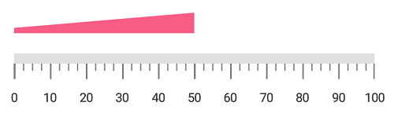
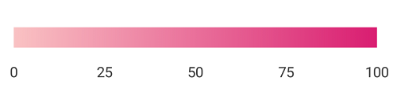

---

layout: post
title: Ranges in LinearGauge for Xamarin.iOS
description: Learn how to set ranges in LinearGauge
platform: Xamarin.iOS
control: LinearGauge
documentation: ug

---

# Ranges

Range is a visual element, which begins and ends at specified values within a scale. You can add any number of range for a scale by using the array of range objects.

## Setting start and end values for range

Start and end values of ranges are set by using the [`StartValue`](https://help.syncfusion.com/cr/xamarin-ios/Syncfusion.SfGauge.iOS.SFLinearRange.html#Syncfusion_SfGauge_iOS_SFLinearRange_StartValue) and [`EndValue`](https://help.syncfusion.com/cr/xamarin-ios/Syncfusion.SfGauge.iOS.SFLinearRange.html#Syncfusion_SfGauge_iOS_SFLinearRange_EndValue) properties.



             SFLinearGauge linearGauge = new SFLinearGauge();
            linearGauge.BackgroundColor = UIColor.White;
            linearGauge.Header = new SFLinearLabel();
            SFLinearScale linearScale = new SFLinearScale();
            linearScale.ScaleBarColor = UIColor.FromRGB(224, 224, 224);
            linearScale.LabelColor = UIColor.FromRGB(66, 66, 66);
            linearScale.MajorTickSettings.Length = 12;
            linearScale.MinorTickSettings.Length = 7;
            SFLinearRange linearRange = new SFLinearRange();
            linearRange.StartValue = 0;
            linearRange.EndValue = 60;
            linearRange.Color = UIColor.FromRGB(39,190,183);
            linearRange.Offset = -20;
            linearRange.StartWidth = 10;
            linearRange.EndWidth = 10;
            linearScale.Ranges.Add(linearRange);
            linearGauge.Scales.Add(linearScale);
            this.View.AddSubview(linearGauge);



## Range customization

To change the range’s background color, use the [`Color`](https://help.syncfusion.com/cr/xamarin-ios/Syncfusion.SfGauge.iOS.SFLinearRange.html#Syncfusion_SfGauge_iOS_SFLinearRange_Color) property of linear range. The thickness of the range can be changed using the [`StartWidth`](https://help.syncfusion.com/cr/xamarin-ios/Syncfusion.SfGauge.iOS.SFLinearRange.html#Syncfusion_SfGauge_iOS_SFLinearRange_StartWidth) and [`EndWidth`](https://help.syncfusion.com/cr/xamarin-ios/Syncfusion.SfGauge.iOS.SFLinearRange.html#Syncfusion_SfGauge_iOS_SFLinearRange_EndWidth) properties. 



            SFLinearGauge linearGauge = new SFLinearGauge();
            linearGauge.BackgroundColor = UIColor.White;
            linearGauge.Header = new SFLinearLabel();
            SFLinearScale linearScale = new SFLinearScale();
            linearScale.ScaleBarColor = UIColor.FromRGB(224, 224, 224);
            linearScale.LabelColor = UIColor.FromRGB(66, 66, 66);
            linearScale.MajorTickSettings.Length = 12;
            linearScale.MinorTickSettings.Length = 7;
            SFLinearRange linearRange = new SFLinearRange();
            linearRange.StartValue = 0;
            linearRange.Color = UIColor.FromRGB(249, 92, 133);
            linearRange.EndValue = 50;
            linearRange.StartWidth = -5;
            linearRange.EndWidth = -20;
            linearRange.Offset = -30;
            linearScale.Ranges.Add(linearRange);
            linearGauge.Scales.Add(linearScale);
            this.View.AddSubview(linearGauge);



## Setting position for range

The range can be adjusted above or below the scale by using the [`Offset`](https://help.syncfusion.com/cr/xamarin-ios/Syncfusion.SfGauge.iOS.SFLinearRange.html#Syncfusion_SfGauge_iOS_SFLinearRange_Offset) value in pixels.



            SFLinearGauge linearGauge = new SFLinearGauge();
            linearGauge.BackgroundColor = UIColor.White;
            SFLinearScale linearScale = new SFLinearScale();
            linearScale.ScaleBarColor = UIColor.FromRGB(224, 224, 224);
            linearScale.LabelColor = UIColor.FromRGB(66, 66, 66);
            linearGauge.Orientation = SFLinearGaugeOrientation.SFLinearGaugeOrientationVertical;
            linearScale.MinorTicksPerInterval = 1;
            linearScale.OpposedPosition = true;
            linearScale.ScalePosition = SFLinearGaugeScalePosition.SFLinearGaugeScalePositionBackward;
            linearScale.Interval = 10;
            linearScale.ScaleBarLength = 350;
            linearScale.MajorTickSettings.Length = 12;
            linearScale.MinorTickSettings.Length = 5;
            linearScale.OpposedPosition = true;
            SFLinearRange linearRange = new SFLinearRange();
            linearRange.StartValue = 0;
            linearRange.EndValue = 50;
            linearRange.StartWidth = 10;
            linearRange.EndWidth = 10;
            linearRange.Color = UIColor.FromRGB(39, 190, 183);
            linearRange.Offset = 30;
            linearScale.Ranges.Add(linearRange);
            linearGauge.Scales.Add(linearScale);
            this.View.AddSubview(linearGauge);



## Setting multiple ranges

You can add n number of ranges to a scale by using the [`SFLinearRange`](https://help.syncfusion.com/cr/xamarin-ios/Syncfusion.SfGauge.iOS.SFLinearRange.html) property of range as demonstrated below.



            SFLinearGauge linearGauge = new SFLinearGauge();
            linearGauge.BackgroundColor = UIColor.White;
            linearGauge.Header = new SFLinearLabel();

            SFLinearScale linearScale = new SFLinearScale();
            linearScale.ScaleBarColor = UIColor.Clear;
            linearScale.LabelColor = UIColor.FromRGB(66, 66, 66);
            linearScale.LabelFont = UIFont.FromName("Helvetica", 14f);
            linearScale.LabelOffset = -15;
            linearScale.Interval = 25;
            linearScale.MinorTicksPerInterval = 0;
            linearScale.ShowTicks = false;

            SFLinearRange linearRange = new SFLinearRange();
            linearRange.StartValue = 0;
            linearRange.EndValue = 25;
            linearRange.Color = UIColor.FromRGB(109, 229, 0);
            linearRange.StartWidth = -10;
            linearRange.EndWidth = -15;
            linearScale.Ranges.Add(linearRange);

            SFLinearRange linearRange1 = new SFLinearRange();
            linearRange1.StartValue = 25;
            linearRange1.EndValue = 50;
            linearRange1.Color = UIColor.FromRGB(83, 173, 0);
            linearRange1.StartWidth = -15;
            linearRange1.EndWidth = -20;
            linearScale.Ranges.Add(linearRange1);

            SFLinearRange linearRange2 = new SFLinearRange();
            linearRange2.StartValue = 50;
            linearRange2.EndValue = 75;
            linearRange2.Color = UIColor.FromRGB(0, 145, 72);
            linearRange2.StartWidth = -20;
            linearRange2.EndWidth = -25;
            linearScale.Ranges.Add(linearRange2);

            SFLinearRange linearRange3 = new SFLinearRange();
            linearRange3.StartValue = 75;
            linearRange3.EndValue = 100;
            linearRange3.Color = UIColor.FromRGB(2, 102, 35);
            linearRange3.StartWidth = -25;
            linearRange3.EndWidth = -30;
            linearScale.Ranges.Add(linearRange3);
            linearGauge.Scales.Add(linearScale);
            this.View.AddSubview(linearGauge);



## Setting gradient color for range

You can give smooth color transition to range to specifying the different colors based on range value by using [`GradientStops`](https://help.syncfusion.com/cr/xamarin-ios/Syncfusion.SfGauge.iOS.SFLinearRange.html#Syncfusion_SfGauge_iOS_SFLinearRange_GradientStops) property. 



              SFLinearGauge linearGauge = new SFLinearGauge();
            linearGauge.BackgroundColor = UIColor.White;
            linearGauge.Header = new SFLinearLabel();

            SFLinearScale linearScale = new SFLinearScale();
            linearScale.ScaleBarColor = UIColor.Clear;
            linearScale.LabelColor = UIColor.FromRGB(66, 66, 66);
            linearScale.LabelFont = UIFont.FromName("Helvetica", 14f);
            linearScale.LabelOffset = 10;
            linearScale.Interval = 25;
            linearScale.MinorTicksPerInterval = 0;
            linearScale.ShowTicks = false;
            linearScale.ScaleBarSize = 20;

            SFLinearRange linearRange = new SFLinearRange();
            linearRange.StartValue = 0;
            linearRange.EndValue = 100;
            linearRange.StartWidth = 20;
            linearRange.EndWidth = 20;
            ObservableCollection<GaugeGradientStop> gradientColor = new ObservableCollection<GaugeGradientStop>()
            {
                new GaugeGradientStop() {Value = 0, Color = UIColor.FromRGB(245,171,184)},
                new GaugeGradientStop() {Value = 100 ,Color = UIColor.FromRGB(220,49,122) }
            };
            linearRange.GradientStops = gradientColor;
            linearScale.Ranges.Add(linearRange);
            linearGauge.Scales.Add(linearScale);
            this.View.AddSubview(linearGauge);



