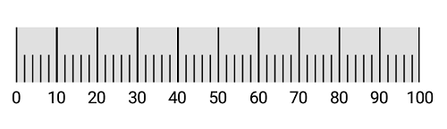

# Tick Setting 

The [`SFLinearTickSettings`](https://help.syncfusion.com/cr/cref_files/xamarin-ios/Syncfusion.SfGauge.iOS~Syncfusion.SfGauge.iOS.SFLinearTickSettings.html) property is used to identify the gauge’s data value by marking the gauge scale in regular increments.

## Ticks visibility

Ticks visibility can be customized using the [`ShowTicks`](https://help.syncfusion.com/cr/cref_files/xamarin-ios/Syncfusion.SfGauge.iOS~Syncfusion.SfGauge.iOS.SFLinearScale~ShowTicks.html) property of linear scale.



            SFLinearGauge linearGauge = new SFLinearGauge();
            linearGauge.Header = new SFLinearLabel();
            SFLinearScale linearScale = new SFLinearScale();
            linearScale.ScaleBarColor = UIColor.FromRGB(224, 224, 224);
            linearScale.LabelColor = UIColor.FromRGB(66, 66, 66);
            linearScale.LabelOffset = -10;
            linearScale.ShowTicks = false;
            linearGauge.Scales.Add(linearScale);
            this.View.AddSubview(linearGauge);
			


## Tick customization

You can customize the color and thickness of ticks by using the [`Color`](https://help.syncfusion.com/cr/cref_files/xamarin-ios/Syncfusion.SfGauge.iOS~Syncfusion.SfGauge.iOS.SFLinearTickSettings~Color.html) and [`Thickness`](https://help.syncfusion.com/cr/cref_files/xamarin-ios/Syncfusion.SfGauge.iOS~Syncfusion.SfGauge.iOS.SFLinearTickSettings~Thickness.html) properties. The ticks length also can be customized using the [`Length`](https://help.syncfusion.com/cr/cref_files/xamarin-ios/Syncfusion.SfGauge.iOS~Syncfusion.SfGauge.iOS.SFLinearTickSettings~Length.html) property as demonstrated below.

### Major tick customization



            SFLinearGauge linearGauge = new SFLinearGauge();
            linearGauge.BackgroundColor = UIColor.White;
            linearGauge.Header = new SFLinearLabel();
            SFLinearScale linearScale = new SFLinearScale();
            linearScale.ScaleBarColor = UIColor.FromRGB(224, 224, 224);
            linearScale.LabelColor = UIColor.FromRGB(66, 66, 66);
            SFLinearTickSettings majorTickSettings = new SFLinearTickSettings();
            majorTickSettings.Thickness = 1;
            majorTickSettings.Length = 25;
            majorTickSettings.Color = UIColor.FromRGB(0,191 ,255);
            linearScale.MajorTickSettings = majorTickSettings;
            linearGauge.Scales.Add(linearScale);
            this.View.AddSubview(linearGauge);
			


### Minor tick customization



            SFLinearGauge linearGauge = new SFLinearGauge();
            linearGauge.BackgroundColor = UIColor.White;
            linearGauge.Header = new SFLinearLabel();
            SFLinearScale linearScale = new SFLinearScale();
            linearScale.ScaleBarColor = UIColor.FromRGB(224, 224, 224);
            linearScale.LabelColor = UIColor.FromRGB(66, 66, 66);
            linearScale.MajorTickSettings.Thickness = 1;
            linearScale.MajorTickSettings.Length = 12;
            linearScale.MinorTicksPerInterval = 3;
            SFLinearTickSettings minorTickSettings = new SFLinearTickSettings();
            minorTickSettings.Thickness = 2;
            minorTickSettings.Length = 7;
            minorTickSettings.Color = UIColor.FromRGB(188 , 143 , 143);
            linearScale.MinorTickSettings = minorTickSettings;
            linearGauge.Scales.Add(linearScale);
            this.View.AddSubview(linearGauge);
			


## Setting minor ticks per interval

The [`Interval`](https://help.syncfusion.com/cr/cref_files/xamarin-ios/Syncfusion.SfGauge.iOS~Syncfusion.SfGauge.iOS.SFLinearScale~Interval.html) property is used to calculate the tick counts for a scale. Similar to ticks, minor ticks are also calculated by using the [`MinorTicksPerInterval`](https://help.syncfusion.com/cr/cref_files/xamarin-ios/Syncfusion.SfGauge.iOS~Syncfusion.SfGauge.iOS.SFLinearScale~MinorTicksPerInterval.html) property.



             SFLinearGauge linearGauge = new SFLinearGauge();
            linearGauge.BackgroundColor = UIColor.White;
            linearGauge.Header = new SFLinearLabel();
            SFLinearScale linearScale = new SFLinearScale();
            linearScale.MajorTickSettings.Thickness = 2;
            linearScale.MajorTickSettings.Length = 10;
            linearScale.MinorTickSettings.Thickness = 1;
            linearScale.MinorTickSettings.Length = 7;
            linearScale.ScaleBarColor = UIColor.FromRGB(224, 224, 224);
            linearScale.LabelColor = UIColor.FromRGB(66, 66, 66);
            linearScale.MinorTicksPerInterval = 4;
            linearGauge.Scales.Add(linearScale);
            this.View.AddSubview(linearGauge);
			


## Setting position for ticks

The major and minor ticks can be positioned far away from the scale by using the [`Offset`](https://help.syncfusion.com/cr/cref_files/xamarin-ios/Syncfusion.SfGauge.iOS~Syncfusion.SfGauge.iOS.SFLinearTickSettings~Offset.html) property.



             SFLinearGauge linearGauge = new SFLinearGauge();
            linearGauge.BackgroundColor = UIColor.White;
            linearGauge.Header = new SFLinearLabel();
            SFLinearScale linearScale = new SFLinearScale();
            linearScale.ScaleBarSize = 40;
            linearScale.ScaleBarColor = UIColor.FromRGB(224, 224, 224);
            linearScale.MajorTickSettings.Color = UIColor.Black;
            linearScale.MinorTickSettings.Color = UIColor.Black;
            linearScale.MajorTickSettings.Length = 40;
            linearScale.MinorTickSettings.Offset = -20;
            linearScale.MajorTickSettings.Offset = -40;
            linearScale.MajorTickSettings.Thickness = 1;
            linearScale.MinorTickSettings.Thickness = 1;
            linearScale.MinorTickSettings.Length = 20;
            linearScale.LabelOffset = -5;
            linearScale.MinorTicksPerInterval = 4;
            linearScale.LabelColor = UIColor.Black;
            linearGauge.Scales.Add(linearScale);
			


