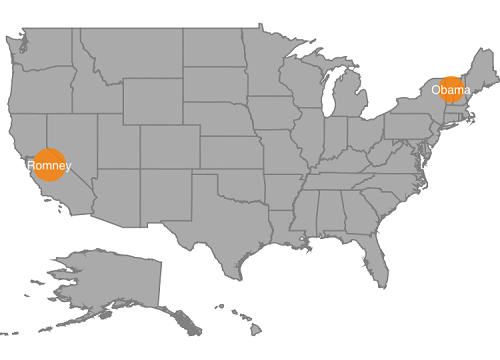

# Bubble marker

Bubbles in the maps control represents the underlying data values of the map. Bubbles are scattered throughout the map shapes that contain bound values.

## Bubble Data

Bubbles are included when the data binding and [`BubbleMarkerSetting`](https://help.syncfusion.com/cr/xamarin-ios/Syncfusion.SfMaps.iOS.SFShapeFileLayer.html#Syncfusion_SfMaps_iOS_SFShapeFileLayer_BubbleMarkerSetting) are set to the shape layers.

Below code snippet explains the data binding that is provided for bubble.





   SFMap map = new SFMap();

   SFShapeFileLayer layer = new SFShapeFileLayer();

   layer.Uri = (NSString)NSBundle.MainBundle.PathForResource("usa_state", "shp");

   layer.DataSource = GetDataSource();

   layer.ShapeIDTableField = (NSString)"STATE_NAME";

   layer.ShapeIDPath = (NSString)"State";

   map.Layers.Add(layer);

   this.View.AddSubview(map);

   NSMutableArray GetDataSource()

   {

    NSMutableArray array = new NSMutableArray();

    array.Add(getDictionary("California", "Romney", 55));

    array.Add(getDictionary("Vermont", "Obama", 3));

    return array;

   }

   NSDictionary getDictionary(string name, string type, int index)

   {

    NSString name1 = (NSString)name;

    object[] objects = new object[3];

    object[] keys = new object[3];

    keys.SetValue("State", 0);

    keys.SetValue("Candidate", 1);

    keys.SetValue("Electors", 2);

    objects.SetValue(name1, 0);

    objects.SetValue(type, 1);

    objects.SetValue(index, 2);

    return NSDictionary.FromObjectsAndKeys(objects, keys);

   }





## Adding bubbles

To add bubbles to a map, the bubble marker setting should be added to the shape file layer.[`ShowBubbles`](https://help.syncfusion.com/cr/xamarin-ios/Syncfusion.SfMaps.iOS.SFBubbleMarkerSetting.html#Syncfusion_SfMaps_iOS_SFBubbleMarkerSetting_ShowBubbles) property should be enabled for the bubble to be visible.

[`ValuePath`](https://help.syncfusion.com/cr/xamarin-ios/Syncfusion.SfMaps.iOS.SFBubbleMarkerSetting.html#Syncfusion_SfMaps_iOS_SFBubbleMarkerSetting_ValuePath) represents the field value that is to be fetched from the data for each bubble.





   SFBubbleMarkerSetting bubbleMarkerSetting = new SFBubbleMarkerSetting();

   bubbleMarkerSetting.ShowBubbles = true;

   bubbleMarkerSetting.ValuePath = (NSString)"Electors";

   layer.BubbleMarkerSetting = bubbleMarkerSetting;





## Bubble marker customization

### Color Customization

The fill color and opacity of the bubbles can be customized using the [`FillColor`](https://help.syncfusion.com/cr/xamarin-ios/Syncfusion.SfMaps.iOS.SFBubbleMarkerSetting.html#Syncfusion_SfMaps_iOS_SFBubbleMarkerSetting_FillColor) and [`Opacity`](https://help.syncfusion.com/cr/xamarin-ios/Syncfusion.SfMaps.iOS.SFBubbleMarkerSetting.html#Syncfusion_SfMaps_iOS_SFBubbleMarkerSetting_Opacity) properties.





   SFBubbleMarkerSetting bubbleMarkerSetting = new SFBubbleMarkerSetting();

   bubbleMarkerSetting.ShowBubbles = true;

   bubbleMarkerSetting.ValuePath = (NSString)"Electors";

   bubbleMarkerSetting.FillColor = UIColor.Orange;

   bubbleMarkerSetting.Opacity = 0.8f;

   layer.BubbleMarkerSetting = bubbleMarkerSetting;





### Size customization

The size of the bubbles depends on the data that is bound to the [`ValuePath`](https://help.syncfusion.com/cr/xamarin-ios/Syncfusion.SfMaps.iOS.SFBubbleMarkerSetting.html#Syncfusion_SfMaps_iOS_SFBubbleMarkerSetting_ValuePath) but the maximum and minimum size of the bubble can be customized using [`MaxSize`](https://help.syncfusion.com/cr/xamarin-ios/Syncfusion.SfMaps.iOS.SFBubbleMarkerSetting.html#Syncfusion_SfMaps_iOS_SFBubbleMarkerSetting_MaxSize) and [`MinSize`](https://help.syncfusion.com/cr/xamarin-ios/Syncfusion.SfMaps.iOS.SFBubbleMarkerSetting.html#Syncfusion_SfMaps_iOS_SFBubbleMarkerSetting_MinSize) properties.

I> [`ShowMapItems`](https://help.syncfusion.com/cr/xamarin-ios/Syncfusion.SfMaps.iOS.SFShapeFileLayer.html#Syncfusion_SfMaps_iOS_SFShapeFileLayer_ShowMapItems) should be enabled to display label on bubble marker.





   SFBubbleMarkerSetting bubbleMarkerSetting = new SFBubbleMarkerSetting();

   bubbleMarkerSetting.ShowBubbles = true;

   bubbleMarkerSetting.ValuePath = (NSString)"Electors";

   bubbleMarkerSetting.FillColor = UIColor.Orange;

   bubbleMarkerSetting.Opacity = 0.8f;

   bubbleMarkerSetting.MinSize = 20;

   bubbleMarkerSetting.MaxSize = 25;

   layer.BubbleMarkerSetting = bubbleMarkerSetting;





Following snippet explains the complete code for adding bubbles along with its customization.





   SFMap map = new SFMap();

   SFShapeFileLayer layer = new SFShapeFileLayer();

   layer.Uri = (NSString)NSBundle.MainBundle.PathForResource("usa_state", "shp");

   layer.DataSource = GetDataSource();

   layer.ShowMapItems = true;

   layer.ShapeIDTableField = (NSString)"STATE_NAME";

   layer.ShapeIDPath = (NSString)"State";

   layer.ShapeSettings.ValuePath = (NSString)"Candidate";

   SFBubbleMarkerSetting bubbleMarkerSetting = new SFBubbleMarkerSetting();

   bubbleMarkerSetting.ShowBubbles = true;

   bubbleMarkerSetting.ValuePath = (NSString)"Electors";

   bubbleMarkerSetting.FillColor = UIColor.Orange;

   bubbleMarkerSetting.Opacity = 0.8f;

   bubbleMarkerSetting.MinSize = 20;

   bubbleMarkerSetting.MaxSize = 25;

   layer.BubbleMarkerSetting = bubbleMarkerSetting;

   map.Layers.Add(layer);

   this.View.AddSubview(map);

   NSMutableArray GetDataSource()

   {

    NSMutableArray array = new NSMutableArray();

    array.Add(getDictionary("California", "Romney", 55));

    array.Add(getDictionary("Vermont", "Obama", 3));

    return array;

   }

   NSDictionary getDictionary(string name, string type, int index)

   {

    NSString name1 = (NSString)name;

    object[] objects = new object[3];

    object[] keys = new object[3];

    keys.SetValue("State", 0);

    keys.SetValue("Candidate", 1);

    keys.SetValue("Electors", 2);

    objects.SetValue(name1, 0);

    objects.SetValue(type, 1);

    objects.SetValue(index, 2);

    return NSDictionary.FromObjectsAndKeys(objects, keys);

   }





