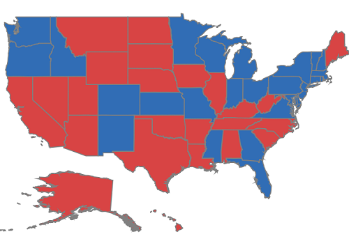
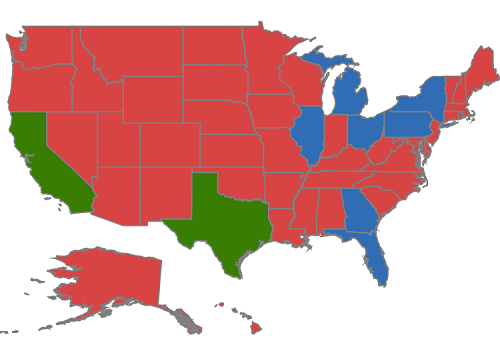

# Color mapping

The color mapping support enables the customization of shape colors based on the underlying value of shape received from the bounded data.

Maps provide two types of color mapping

* Equal color mapping
* Range Color mapping

## Equal color mapping

It is used to differentiate the shape’s fill based on its underlying value and color using the [`Value`](https://help.syncfusion.com/cr/xamarin-ios/Syncfusion.SfMaps.iOS.SFEqualColorMapping.html#Syncfusion_SfMaps_iOS_SFEqualColorMapping_Value) and [`Color`](https://help.syncfusion.com/cr/xamarin-ios/Syncfusion.SfMaps.iOS.SFMapColorMapping.html#Syncfusion_SfMaps_iOS_SFMapColorMapping_Color) properties.





SFMap map = new SFMap();

SFShapeFileLayer layer = new SFShapeFileLayer();

layer.Uri = (NSString)NSBundle.MainBundle.PathForResource("usa_state", "shp");

layer.DataSource = GetDataSource();

layer.ShapeIDTableField = (NSString)"STATE_NAME";

layer.ShapeIDPath = (NSString)"State";

SFEqualColorMapping colorMapping = new SFEqualColorMapping();

colorMapping.Color = UIColor.FromRGB(216, 68, 68);

colorMapping.Value = (NSString)"Romney";

SFEqualColorMapping colorMapping1 = new SFEqualColorMapping();

colorMapping1.Color = UIColor.FromRGB(49, 109, 181);

colorMapping1.Value = (NSString)"Obama";

SFShapeSetting shapeSetting = new SFShapeSetting();

shapeSetting.ValuePath = (NSString)"Candidate";

shapeSetting.ColorValuePath = (NSString)"Candidate";

shapeSetting.ColorMappings.Add(colorMapping);

shapeSetting.ColorMappings.Add(colorMapping1);

layer.ShapeSettings = shapeSetting;

map.Layers.Add(layer);

this.View.AddSubview(map);





## Range color mapping

It is used to differentiate the bubble fill based on its under-bound value and color ranges. 

The [`From`](https://help.syncfusion.com/cr/xamarin-ios/Syncfusion.SfMaps.iOS.SFRangeColorMapping.html#Syncfusion_SfMaps_iOS_SFRangeColorMapping_From) and [`To`](https://help.syncfusion.com/cr/xamarin-ios/Syncfusion.SfMaps.iOS.SFRangeColorMapping.html#Syncfusion_SfMaps_iOS_SFRangeColorMapping_To) properties are used to define the color range and color for the range that can be specified using the [`Color`](https://help.syncfusion.com/cr/xamarin-ios/Syncfusion.SfMaps.iOS.SFMapColorMapping.html#Syncfusion_SfMaps_iOS_SFMapColorMapping_Color) property.





SFMap map = new SFMap();

SFShapeFileLayer layer = new SFShapeFileLayer();

layer.Uri = (NSString)NSBundle.MainBundle.PathForResource("usa_state", "shp");

layer.DataSource = GetDataSource();

layer.ShapeIDTableField = (NSString)"STATE_NAME";

layer.ShapeIDPath = (NSString)"State";

SFRangeColorMapping rangeColorMapping = new SFRangeColorMapping();

rangeColorMapping.From = 30;

rangeColorMapping.To = 70;

rangeColorMapping.Color = UIColor.FromRGB(57, 125, 2);

SFRangeColorMapping rangeColorMapping1 = new SFRangeColorMapping();

rangeColorMapping1.From = 15;

rangeColorMapping1.To = 30;

rangeColorMapping1.Color = UIColor.FromRGB(49, 109, 181);

SFRangeColorMapping rangeColorMapping2 = new SFRangeColorMapping();

rangeColorMapping2.From = 0;

rangeColorMapping2.To = 15;

rangeColorMapping2.Color = UIColor.FromRGB(216, 68, 68);

SFShapeSetting shapeSetting = new SFShapeSetting();

shapeSetting.ColorValuePath = (NSString)"Electors";

shapeSetting.ColorMappings.Add(rangeColorMapping);

shapeSetting.ColorMappings.Add(rangeColorMapping1);

shapeSetting.ColorMappings.Add(rangeColorMapping2);

layer.ShapeSettings = shapeSetting;

map.Layers.Add(layer);

this.View.AddSubview(map);





