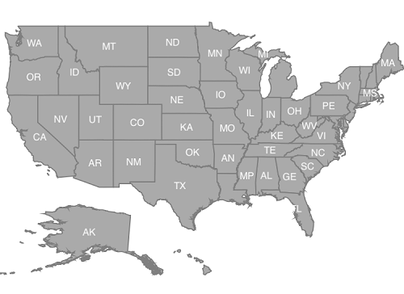
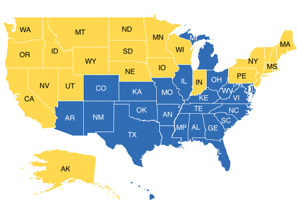
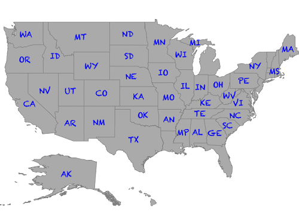
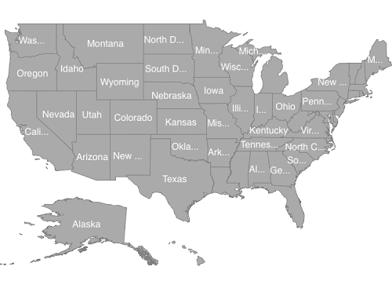
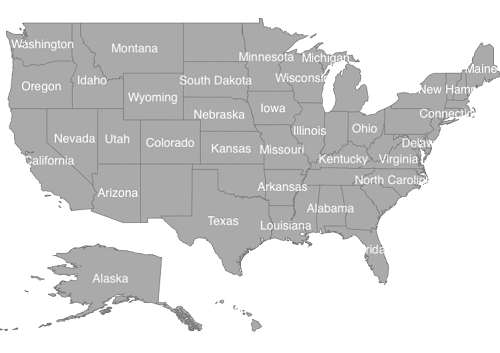

# Data Labels

Data labels are used to display the values of the shapes.

## Adding data labels

 [`ShowMapItems`](https://help.syncfusion.com/cr/cref_files/xamarin-ios/Syncfusion.SfMaps.iOS~Syncfusion.SfMaps.iOS.SFShapeFileLayer~ShowMapItems.html) property is a boolean property that displays or hides the data labels in shapes. You must set the [`ValuePath`](https://help.syncfusion.com/cr/cref_files/xamarin-ios/Syncfusion.SfMaps.iOS~Syncfusion.SfMaps.iOS.SFShapeSetting~ValuePath.html) property to get the data labels which is bound for each shape.





SFMap map = new SFMap();

SFShapeFileLayer layer = new SFShapeFileLayer();

layer.Uri = (NSString)NSBundle.MainBundle.PathForResource("usa_state", "shp");

layer.ShowMapItems = true;

layer.DataSource = GetDataSource();

layer.ShapeIDTableField = (NSString)"STATE_NAME";

layer.ShapeIDPath = (NSString)"Name";

layer.ShapeSettings.ValuePath = (NSString)"Type";

layer.ShapeSettings.Fill = UIColor.LightGray;

layer.DataLabelSettings.SmartLabelMode = IntersectAction.Hide;

map.Layers.Add(layer);

this.View.AddSubview(map);





## Setting contrast color

Based on the shape background color, contrast color will be applied for the data labels.





SFMap map = new SFMap();

SFShapeFileLayer layer = new SFShapeFileLayer();

layer.Uri = (NSString)NSBundle.MainBundle.PathForResource("usa_state", "shp");

layer.ShowMapItems = true;

layer.DataSource = GetDataSource();

layer.ShapeIDTableField = (NSString)"STATE_NAME";

layer.ShapeIDPath = (NSString)"Name";

layer.ShapeSettings.ValuePath = (NSString)"Type";

layer.ShapeSettings.ColorValuePath = (NSString)"Count";

layer.ShapeSettings.StrokeColor = UIColor.White;

layer.ShapeSettings.StrokeThickness = (nfloat)0.5;

SFRangeColorMapping rangeColorMapping = new SFRangeColorMapping();

rangeColorMapping.From = 0;

rangeColorMapping.To = 25;

rangeColorMapping.Color = UIColor.FromRGB(255, 216, 79);

SFRangeColorMapping rangeColorMapping1 = new SFRangeColorMapping();

rangeColorMapping1.From = 25;

rangeColorMapping1.To = 50;

rangeColorMapping1.Color = UIColor.FromRGB(49, 109, 181);

layer.ShapeSettings.ColorMappings.Add(rangeColorMapping);

layer.ShapeSettings.ColorMappings.Add(rangeColorMapping1);

layer.DataLabelSettings.SmartLabelMode = IntersectAction.Hide;

map.Layers.Add(layer);

this.View.AddSubview(map);





## Customizing data labels

Data labels can be customized using the [`SFDataLabelSetting`](https://help.syncfusion.com/cr/cref_files/xamarin-ios/Syncfusion.SfMaps.iOS~Syncfusion.SfMaps.iOS.SFDataLabelSetting.html) property in shape file layer. The font, and color can be customized using [`Font`](https://help.syncfusion.com/cr/cref_files/xamarin-ios/Syncfusion.SfMaps.iOS~Syncfusion.SfMaps.iOS.SFDataLabelSetting~Font.html), [`TextColor`](https://help.syncfusion.com/cr/cref_files/xamarin-ios/Syncfusion.SfMaps.iOS~Syncfusion.SfMaps.iOS.SFDataLabelSetting~TextColor.html) properties.





SFMap map = new SFMap();

SFShapeFileLayer layer = new SFShapeFileLayer();

layer.Uri = (NSString)NSBundle.MainBundle.PathForResource("usa_state", "shp");

layer.ShowMapItems = true;

layer.DataSource = GetDataSource();

layer.ShapeIDTableField = (NSString)"STATE_NAME";

layer.ShapeIDPath = (NSString)"Name";

layer.ShapeSettings.ValuePath = (NSString)"Type";

layer.ShapeSettings.ColorValuePath = (NSString)"Count";

layer.ShapeSettings.Fill = UIColor.LightGray;

layer.ShapeSettings.StrokeThickness = (nfloat)0.5;

layer.DataLabelSettings.TextColor = UIColor.Blue;

layer.DataLabelSettings.Font = UIFont.FromName("Chalkduster", 10f);

layer.DataLabelSettings.SmartLabelMode = IntersectAction.Hide;

map.Layers.Add(layer);

this.View.AddSubview(map);





## To smartly align data label

[`SmartLabelMode`](https://help.syncfusion.com/cr/cref_files/xamarin-ios/Syncfusion.SfMaps.iOS~Syncfusion.SfMaps.iOS.SFDataLabelSetting~SmartLabelMode.html) smartly aligns labels within shape boundaries and avoids label overlap. Labels can be customized using the Hide, Trim and None options.





SFMap map = new SFMap();

SFShapeFileLayer layer = new SFShapeFileLayer();

layer.Uri = (NSString)NSBundle.MainBundle.PathForResource("usa_state", "shp");

layer.ShowMapItems = true;

layer.DataSource = GetDataSource();

layer.ShapeIDTableField = (NSString)"STATE_NAME";

layer.ShapeIDPath = (NSString)"Name";

layer.ShapeSettings.ValuePath = (NSString)"Name";

layer.ShapeSettings.Fill = UIColor.LightGray;

layer.ShapeSettings.StrokeThickness = (nfloat)0.5;

layer.DataLabelSettings.SmartLabelMode = IntersectAction.Trim;

map.Layers.Add(layer);

this.View.AddSubview(map);





## To avoid overlap in data label

[`IntersectionAction`](https://help.syncfusion.com/cr/cref_files/xamarin-ios/Syncfusion.SfMaps.iOS~Syncfusion.SfMaps.iOS.SFDataLabelSetting~IntersectionAction.html) smartly aligns labels which is overlapped with another label. Labels can be customized using the Hide, Trim and None options. First, you should set the [`SmartLabelMode`](https://help.syncfusion.com/cr/cref_files/xamarin-ios/Syncfusion.SfMaps.iOS~Syncfusion.SfMaps.iOS.SFDataLabelSetting~SmartLabelMode.html) property as None.





SFMap map = new SFMap();

SFShapeFileLayer layer = new SFShapeFileLayer();

layer.Uri = (NSString)NSBundle.MainBundle.PathForResource("usa_state", "shp");

layer.ShowMapItems = true;

layer.DataSource = GetDataSource();

layer.ShapeIDTableField = (NSString)"STATE_NAME";

layer.ShapeIDPath = (NSString)"Name";

layer.ShapeSettings.ValuePath = (NSString)"Name";

layer.ShapeSettings.Fill = UIColor.LightGray;

layer.ShapeSettings.StrokeThickness = (nfloat)0.5;

layer.DataLabelSettings.SmartLabelMode = IntersectAction.None;

layer.DataLabelSettings.IntersectionAction = IntersectAction.Hide;

map.Layers.Add(layer);

this.View.AddSubview(map);





         
