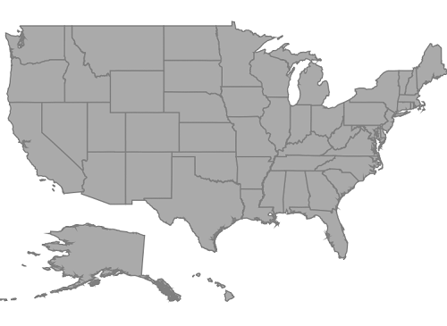

# Getting Started

This section explains the steps required to configure the SfMaps control and provides information to its basic customization.

## Configuring SfMaps 

THis section describes on configuring the SfMaps control along with its basic customization.

## Adding namespace

The following namespace needs to be added.





 using Syncfusion.SfMaps.iOS;





## Initializing Maps   

You can initialize the [`SFMap`](https://help.syncfusion.com/cr/cref_files/xamarin-ios/Syncfusion.SfMaps.iOS~Syncfusion.SfMaps.iOS.SFMap.html) control with a required optimal name by using the included namespace.





public override void ViewDidLoad()

{

base.ViewDidLoad();

SFMap map = new SFMap();

this.View.AddSubview(map);

}





## Adding layers

Map is maintained through [`Layers`](https://help.syncfusion.com/cr/cref_files/xamarin-ios/Syncfusion.SfMaps.iOS~Syncfusion.SfMaps.iOS.SFMap~Layers.html). It can accommodate one or more shape file layers.





SFMap map = new SFMap();

SFShapeFileLayer layer = new SFShapeFileLayer();

map.Layers.Add(layer);

this.View.AddSubview(map);





## Adding shape files

Shape file is a set of files that are stored in a non-topological geometry with the attribute information for the spatial features and records in a data set.

Maps control supports reading and loading the shape files.
Shape file can be a set of files or a single file. Generally, a shape file contains the following files:

* Main file (.shp)

* dBase file (.dbf)

### iOS

*	Add the necessary shape files in the Resources folder.
*	Right-click the added shape file, and navigate to properties.
*	Choose the `BundleResource` option under BuildAction of respective shape file.

[`Uri`](https://help.syncfusion.com/cr/cref_files/xamarin-ios/Syncfusion.SfMaps.iOS~Syncfusion.SfMaps.iOS.SFShapeFileLayer~Uri.html) property in shape file layer is used to retrieve the location of the shape file that is added.





SFMap map = new SFMap();

SFShapeFileLayer layer = new SFShapeFileLayer();

layer.Uri = (NSString)NSBundle.MainBundle.PathForResource("usa_state", "shp");

map.Layers.Add(layer);

this.View.AddSubview(map);


 


After loading the shapes file, the following output will be reproduced.

## GeoJSON support

Maps control supports reading and loading the GeoJSON files. GeoJSON file contains attribute information for the spatial features and coordinates in a dataset.
 



     
 SFShapeFileLayer layer = new SFShapeFileLayer();

 layer.Uri = "usa_state.json";
			




## Data binding

Data can be binded to the shape file layer using the [`DataSource`](https://help.syncfusion.com/cr/cref_files/xamarin-ios/Syncfusion.SfMaps.iOS~Syncfusion.SfMaps.iOS.SFShapeFileLayer~DataSource.html), [`ShapeIDPath`](https://help.syncfusion.com/cr/cref_files/xamarin-ios/Syncfusion.SfMaps.iOS~Syncfusion.SfMaps.iOS.SFShapeFileLayer~ShapeIDPath.html), [`ShapeIDTableField`](https://help.syncfusion.com/cr/cref_files/xamarin-ios/Syncfusion.SfMaps.iOS~Syncfusion.SfMaps.iOS.SFShapeFileLayer~ShapeIDTableField.html) properties.
 [`Populate data`](https://help.syncfusion.com/xamarin-ios/sfmaps/populate-data) topic gives the detailed explanation of data binding.





SFMap map = new SFMap();

SFShapeFileLayer layer = new SFShapeFileLayer();

layer.Uri = (NSString)NSBundle.MainBundle.PathForResource("usa_state", "shp");

layer.DataSource = GetDataSource();

layer.ShapeIDTableField = (NSString)"STATE_NAME";

layer.ShapeIDPath = (NSString)"State";

map.Layers.Add(layer);

this.View.AddSubview(map);





## Adding marker 

Markers are used to identify the shapes. This can be added to the shape file layers as shown in the following code sample.
Markers can be customized using the MarkerSetting property in shape file layer.

Detailed explanation of marker and its customization is provided under [`Markers`](https://help.syncfusion.com/xamarin-ios/sfmaps/markers) topic.





SFMapMarker mapMarker = new SFMapMarker();

mapMarker.Label = (NSString)"California";

mapMarker.Latitude = 37;

mapMarker.Longitude = -120;

layer.Markers.Add(mapMarker);





## Color mapping

The color mapping support enables the customization of shape colors based on the underlying value of shape received from the bounded data.
Both range and equal color mapping is supported in maps.

Detailed explanation of color mapping is provided in  [`ColorMapping`](https://help.syncfusion.com/xamarin-ios/sfmaps/color-mapping) topic.





SFEqualColorMapping colorMapping = new SFEqualColorMapping();

colorMapping.Color = UIColor.FromRGB(216, 68, 68);

colorMapping.LegendLabel = (NSString)"Romney";

colorMapping.Value = (NSString)"Romney";

SFEqualColorMapping colorMapping1 = new SFEqualColorMapping();

colorMapping1.Color = UIColor.FromRGB(49, 109, 181);

colorMapping1.LegendLabel = (NSString)"Obama";

colorMapping1.Value = (NSString)"Obama";

SFShapeSetting shapeSetting = new SFShapeSetting();

shapeSetting.ValuePath = (NSString)"Candidate";

shapeSetting.ColorValuePath = (NSString)"Candidate";

shapeSetting.ColorMappings.Add(colorMapping);

shapeSetting.ColorMappings.Add(colorMapping1);

layer.ShapeSettings = shapeSetting;




 
## Adding legend

The legends interpret what the map displays. It can be added to the shape file layer as in below code snippet. Legends will be displayed based on the data bound to the layer and color mapping plays a major role in that. 

Detailed explanation of legend is provided under [`Legend`](https://help.syncfusion.com/xamarin-ios/sfmaps/legend) topic.




	
SFMapLegendSettings setting = new SFMapLegendSettings();

setting.ShowLegend = true;

setting.Position = new CoreGraphics.CGPoint(50, 70);

 layer.LegendSettings = setting;





The following code example gives you the complete code for map with marker and legend.





using System;

using Foundation;

using Syncfusion.SfMaps.iOS;

using UIKit;

namespace Ugsam

{

public partial class ViewController : UIViewController

{

protected ViewController(IntPtr handle) : base(handle)
{
}

public override void ViewDidLoad()

{

base.ViewDidLoad();

SFMap map = new SFMap();

SFShapeFileLayer layer = new SFShapeFileLayer();

layer.Uri = (NSString)NSBundle.MainBundle.PathForResource("usa_state", "shp");

layer.DataSource = GetDataSource();

layer.ShapeIDTableField = (NSString)"STATE_NAME";

layer.ShapeIDPath = (NSString)"State";

SFMapMarker mapMarker = new SFMapMarker();

mapMarker.Label = (NSString)"California";

mapMarker.Latitude = 37;

mapMarker.Longitude = -120;

layer.Markers.Add(mapMarker);

SFEqualColorMapping colorMapping = new SFEqualColorMapping();

colorMapping.Color = UIColor.FromRGB(216, 68, 68);

colorMapping.LegendLabel = (NSString) "Romney";

colorMapping.Value = (NSString)"Romney";

SFEqualColorMapping colorMapping1 = new SFEqualColorMapping();

colorMapping1.Color = UIColor.FromRGB(49, 109, 181);

colorMapping1.LegendLabel = (NSString) "Obama";

colorMapping1.Value = (NSString) "Obama";

SFShapeSetting shapeSetting = new SFShapeSetting();

shapeSetting.ValuePath = (NSString)"Candidate";

shapeSetting.ColorValuePath = (NSString)"Candidate";

shapeSetting.ColorMappings.Add(colorMapping);

shapeSetting.ColorMappings.Add(colorMapping1);

layer.ShapeSettings = shapeSetting;

SFMapLegendSettings setting = new SFMapLegendSettings();

setting.ShowLegend = true;

setting.Position = new CoreGraphics.CGPoint(50, 70);

layer.LegendSettings = setting;

map.Layers.Add(layer);

this.View.AddSubview(map);

}

public override void DidReceiveMemoryWarning()
{

 base.DidReceiveMemoryWarning();

}

NSMutableArray GetDataSource()

{

NSMutableArray array = new NSMutableArray();

array.Add(getDictionary("Alabama", "Romney", 9));

array.Add(getDictionary("Alaska", "Romney", 3));

array.Add(getDictionary("Arizona", "Romney", 11));

array.Add(getDictionary("Arkansas", "Romney", 6));

array.Add(getDictionary("California", "Romney", 55));

array.Add(getDictionary("Colorado", "Obama", 9));

array.Add(getDictionary("Connecticut", "Obama", 7));

array.Add(getDictionary("Delaware", "Obama", 3));

array.Add(getDictionary("District of Columbia", "Obama", 3));

array.Add(getDictionary("Florida", "Obama", 29));

array.Add(getDictionary("Georgia", "Obama", 16));

array.Add(getDictionary("Hawaii", "Romney", 4));

array.Add(getDictionary("Idaho", "Obama", 4));

array.Add(getDictionary("Illinois", "Romney", 20));

array.Add(getDictionary("Indiana", "Obama", 11));

array.Add(getDictionary("Iowa", "Romney", 6));

array.Add(getDictionary("Kansas", "Obama", 6));

array.Add(getDictionary("Kentucky", "Romney", 8));

array.Add(getDictionary("Louisiana", "Romney", 8));

array.Add(getDictionary("Maine", "Romney", 4));

array.Add(getDictionary("Maryland", "Obama", 10));

array.Add(getDictionary("Massachusetts", "Obama", 11));

array.Add(getDictionary("Michigan", "Obama", 16));

array.Add(getDictionary("Minnesota", "Obama", 10));

array.Add(getDictionary("Mississippi", "Obama", 6));

array.Add(getDictionary("Missouri", "Obama", 10));

array.Add(getDictionary("Montana", "Romney", 3));

array.Add(getDictionary("Nebraska", "Romney", 5));

array.Add(getDictionary("Nevada", "Romney", 6));

array.Add(getDictionary("New Hampshire", "Obama", 4));

array.Add(getDictionary("New Jersey", "Obama", 14));

array.Add(getDictionary("New Mexico", "Obama", 5));

array.Add(getDictionary("New York", "Obama", 29));

array.Add(getDictionary("North Carolina", "Romney", 15));

array.Add(getDictionary("North Dakota", "Romney", 3));

array.Add(getDictionary("Ohio", "Obama", 18));

array.Add(getDictionary("Oklahoma", "Romney", 7));

array.Add(getDictionary("Oregon", "Obama", 7));

array.Add(getDictionary("Pennsylvania", "Obama", 20));

array.Add(getDictionary("Rhode Island", "Obama", 4));

array.Add(getDictionary("South Carolina", "Romney", 9));

array.Add(getDictionary("South Dakota", "Romney", 3));

array.Add(getDictionary("Tennessee", "Romney", 11));

array.Add(getDictionary("Texas", "Romney", 38));

array.Add(getDictionary("Utah", "Romney", 6));

array.Add(getDictionary("Vermont", "Obama", 3));

array.Add(getDictionary("Virginia", "Obama", 13));

array.Add(getDictionary("Washington", "Obama", 12));

array.Add(getDictionary("West Virginia", "Romney", 5));

array.Add(getDictionary("Wisconsin", "Obama", 10));

array.Add(getDictionary("Wyoming", "Romney", 3));

return array;
}

NSDictionary getDictionary(string name, string type, int index)

{

NSString name1 = (NSString)name;

object[] objects = new object[3];

object[] keys = new object[3];

keys.SetValue("State", 0);

keys.SetValue("Candidate", 1);

keys.SetValue("Electors", 2);

objects.SetValue(name1, 0);

objects.SetValue(type, 1);

objects.SetValue(index, 2);

return NSDictionary.FromObjectsAndKeys(objects, keys);

}
}
}





The following output is reproduced as a result of above codes.

 

You can download the complete getting started sample from this [link]().
