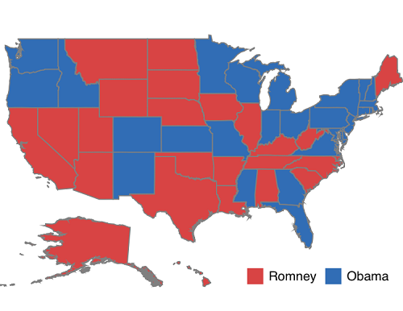

# Legend

A legend is a key used on a map that contains swatches of symbols with descriptions. A legend interprets what the map displays; it can be represented in various colors, shapes, or other identifiers based on the data. It gives a breakdown of what each symbol represents throughout the map.
Legends can be added with the help of [`LegendSettings`](https://help.syncfusion.com/cr/cref_files/xamarin-ios/Syncfusion.SfMaps.iOS~Syncfusion.SfMaps.iOS.SFShapeFileLayer~LegendSettings.html) in the shape file layer.

## Visibility

The legends can be made visible by setting the [`ShowLegend`](https://help.syncfusion.com/cr/cref_files/xamarin-ios/Syncfusion.SfMaps.iOS~Syncfusion.SfMaps.iOS.SFMapLegendSettings~ShowLegend.html) property in [`LegendSettings`](https://help.syncfusion.com/cr/cref_files/xamarin-ios/Syncfusion.SfMaps.iOS~Syncfusion.SfMaps.iOS.SFShapeFileLayer~LegendSettings.html) class to true.





SFMapLegendSettings setting = new SFMapLegendSettings();

setting.ShowLegend = true;

layer.LegendSettings = setting;





## Legend position

Based on the margin values of x and y-axes, the legends can be positioned using the [`Position`](https://help.syncfusion.com/cr/cref_files/xamarin-ios/Syncfusion.SfMaps.iOS~Syncfusion.SfMaps.iOS.SFMapLegendSettings~Position.html) property of [`LegendSettings`](https://help.syncfusion.com/cr/cref_files/xamarin-ios/Syncfusion.SfMaps.iOS~Syncfusion.SfMaps.iOS.SFShapeFileLayer~LegendSettings.html) class.





SFMapLegendSettings setting = new SFMapLegendSettings();

setting.ShowLegend = true;

setting.Position = new CGPoint(80, 65);

layer.LegendSettings = setting;





## Icon customization

The icon size of a legend can be customized using the [`IconSize`](https://help.syncfusion.com/cr/cref_files/xamarin-ios/Syncfusion.SfMaps.iOS~Syncfusion.SfMaps.iOS.SFMapLegendSettings~IconSize.html) property.





SFMapLegendSettings setting = new SFMapLegendSettings();

setting.ShowLegend = true;

setting.Position = new CGPoint(70, 75);

 setting.IconSize = new CGSize(15, 15);

layer.LegendSettings = setting;





## Legend label

[`LegendLabel`](https://help.syncfusion.com/cr/cref_files/xamarin-ios/Syncfusion.SfMaps.iOS~Syncfusion.SfMaps.iOS.SFMapColorMapping~LegendLabel.html) provides an information about the map content. It is specified under color mapping.





SFEqualColorMapping colorMapping = new SFEqualColorMapping();

colorMapping.Color = UIColor.FromRGB(216, 68, 68);

colorMapping.LegendLabel = (NSString)"Romney";

colorMapping.Value = (NSString)"Romney";

SFEqualColorMapping colorMapping1 = new SFEqualColorMapping();

colorMapping1.Color = UIColor.FromRGB(49, 109, 181);

colorMapping1.LegendLabel = (NSString)"Obama";

colorMapping1.Value = (NSString)"Obama";





The following code snippet explains the complete code for adding legend along with its customization.





SFMap map = new SFMap();

SFShapeFileLayer layer = new SFShapeFileLayer();

layer.Uri = (NSString)NSBundle.MainBundle.PathForResource("usa_state", "shp");

layer.DataSource = GetDataSource();

layer.ShapeIDTableField = (NSString)"STATE_NAME";

layer.ShapeIDPath = (NSString)"State";

SFEqualColorMapping colorMapping = new SFEqualColorMapping();

colorMapping.Color = UIColor.FromRGB(216, 68, 68);

colorMapping.LegendLabel = (NSString)"Romney";

colorMapping.Value = (NSString)"Romney";

SFEqualColorMapping colorMapping1 = new SFEqualColorMapping();

colorMapping1.Color = UIColor.FromRGB(49, 109, 181);

colorMapping1.LegendLabel = (NSString)"Obama";

colorMapping1.Value = (NSString)"Obama";

SFShapeSetting shapeSetting = new SFShapeSetting();

shapeSetting.ValuePath = (NSString)"Candidate";

shapeSetting.ColorValuePath = (NSString)"Candidate";

shapeSetting.ColorMappings.Add(colorMapping);

shapeSetting.ColorMappings.Add(colorMapping1);

layer.ShapeSettings = shapeSetting;

SFMapLegendSettings setting = new SFMapLegendSettings();

setting.ShowLegend = true;

setting.Position = new CGPoint(80, 65);

setting.IconSize = new CGSize(15,15);

layer.LegendSettings = setting;

map.Layers.Add(layer);

this.View.AddSubview(map);
 




