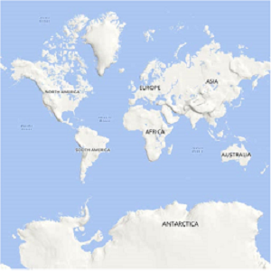
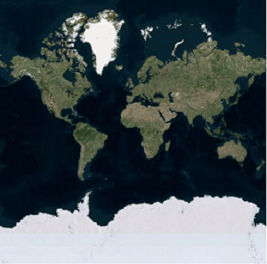
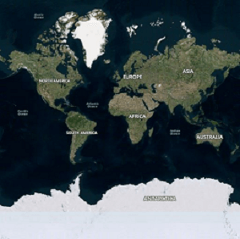
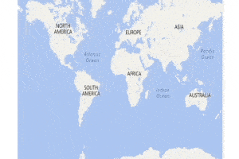
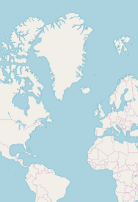
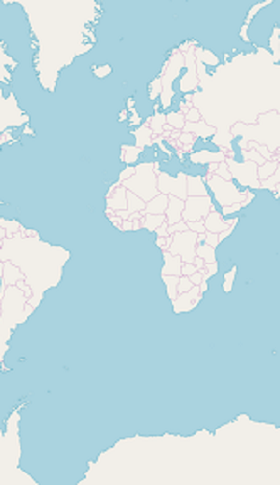
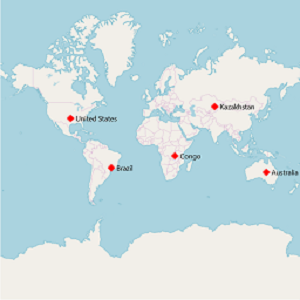

# Map Providers

The maps control supports map providers such as OpenStreetMap and Bing Maps that can be added to an imagery layer in maps.

## OpenStreetMap

The OpenStreetMap (OSM) is a world map; it was built by a community of mappers. It is free to use under an open license. This allows you view geographical data in a collaborative way from anywhere on the earth. The OSM provides small tile images based on your requests and combines them into a single image to display the map area in the maps control. 

### Adding OSM in maps

The maps control uses `imagery layer` to display the tile images from the OSM service. To use `OSM`, add an imagery layer in maps’ layers collection.





SFMap maps = new SFMap();
ImageryLayer layer = new ImageryLayer();
maps.Layers.Add(layer);
this.View.AddSubview(maps);





N> Both the [`SFShapeFileLayer`](https://help.syncfusion.com/cr/xamarin-ios/Syncfusion.SfMaps.iOS.SFShapeFileLayer.html) and `ImageryLayer` have been derived commonly from MapsLayer.

## Bing Maps

The Bing Maps is a world map owned by Microsoft. As OSM, Bing Maps also provides map tile images based on your requests and combines them into a single image to display the map area. To use `Bing maps`, set the [`LayerType`](https://help.syncfusion.com/cr/xamarin-ios/Syncfusion.SfMaps.iOS.ImageryLayer.html#Syncfusion_SfMaps_iOS_ImageryLayer_LayerType) property of ImageryLayer to “Bing”. Then, set the Bing Maps key, which is obtained from [Bing Maps Key](https://www.microsoft.com/en-us/maps/create-a-bing-maps-key).





SFMap maps = new SFMap();
ImageryLayer layer = new ImageryLayer();
layer.LayerType = LayerType.Bing;
layer.BingMapKey = "Your bing map key";
maps.Layers.Add(layer);
this.View.AddSubview(maps);





N> The [`LayerType`](https://help.syncfusion.com/cr/xamarin-ios/Syncfusion.SfMaps.iOS.ImageryLayer.html#Syncfusion_SfMaps_iOS_ImageryLayer_LayerType) property of [`ImageryLayer`](https://help.syncfusion.com/cr/xamarin-ios/Syncfusion.SfMaps.iOS.ImageryLayer.html) provides support to `OSM` and `Bing Maps`. The default value of the [`LayerType`](https://help.syncfusion.com/cr/xamarin-ios/Syncfusion.SfMaps.iOS.ImageryLayer.html#Syncfusion_SfMaps_iOS_ImageryLayer_LayerType) property is OSM.

## BingMapStyle

The ImageryLayer provides support to the following types of Bing Maps:

* `Road`
* `Aerial`
* `AerialWithLabels`

The desired style for the Bing Maps can be set using the [`BingMapStyle`](https://help.syncfusion.com/cr/xamarin-ios/Syncfusion.SfMaps.iOS.ImageryLayer.html#Syncfusion_SfMaps_iOS_ImageryLayer_BingMapStyle) property of ImageryLayer. The default value of [`BingMapStyle`](https://help.syncfusion.com/cr/xamarin-ios/Syncfusion.SfMaps.iOS.ImageryLayer.html#Syncfusion_SfMaps_iOS_ImageryLayer_BingMapStyle) is "Road".

### Road

The Road view displays the default map view of roads, buildings, and geography. The default value of the [`BingMapStyle`](https://help.syncfusion.com/cr/xamarin-ios/Syncfusion.SfMaps.iOS.ImageryLayer.html#Syncfusion_SfMaps_iOS_ImageryLayer_BingMapStyle) property of imagery layer is "Road".

### Aerial

The Aerial view displays the satellite images to highlight the roads and major landmarks for easy identification. The aerial view can be applied to maps by setting the [`BingMapStyle`](https://help.syncfusion.com/cr/xamarin-ios/Syncfusion.SfMaps.iOS.ImageryLayer.html#Syncfusion_SfMaps_iOS_ImageryLayer_BingMapStyle) to "Aerial".





SFMap maps = new SFMap();
ImageryLayer layer = new ImageryLayer();
layer.LayerType = LayerType.Bing;
layer.BingMapStyle = BingMapStyle.Aerial;
layer.BingMapKey = "Your bing map key";
maps.Layers.Add(layer);
this.View.AddSubview(maps);





## AerialWithLabel

The AerialWithLabel view displays the Aerial map with labels for continent, country, ocean, etc. This view can be applied to maps by setting the [`BingMapStyle`](https://help.syncfusion.com/cr/xamarin-ios/Syncfusion.SfMaps.iOS.ImageryLayer.html#Syncfusion_SfMaps_iOS_ImageryLayer_BingMapStyle) to "AerialWithLabel".





SFMap maps = new SFMap();
ImageryLayer layer = new ImageryLayer();
layer.LayerType = LayerType.Bing;
layer.BingMapStyle = BingMapStyle.AerialWithLabels;
layer.BingMapKey = "Your bing map key";
maps.Layers.Add(layer);
this.View.AddSubview(maps);





## Zooming and panning

The maps control provides interactive zooming and panning supports to OSM and Bing Maps.

Zooming helps you get a closer look of an area on maps for in-depth analysis. Panning helps you move a map around to focus the targeted area. You can perform zooming and panning with the pinching gesture in a map area.

## ResetOnDoubleTap

The ImageryLayer provides support to reset the maps to the default view when you double tap the imagery layer by setting the [`ResetOnDoubleTap`](https://help.syncfusion.com/cr/xamarin-ios/Syncfusion.SfMaps.iOS.ImageryLayer.html#Syncfusion_SfMaps_iOS_ImageryLayer_ResetOnDoubleTap) property to true. The default value of this property is true. This behavior can be restricted by setting the [`ResetOnDoubleTap`](https://help.syncfusion.com/cr/xamarin-ios/Syncfusion.SfMaps.iOS.ImageryLayer.html#Syncfusion_SfMaps_iOS_ImageryLayer_ResetOnDoubleTap) property to false.





SFMap maps = new SFMap();
ImageryLayer layer = new ImageryLayer();
layer.ResetOnDoubleTap = true;
maps.Layers.Add(layer);
this.View.AddSubview(maps);
      




## GeoCoordinates

The [`GeoCoordinates`](https://help.syncfusion.com/cr/xamarin-ios/Syncfusion.SfMaps.iOS.ImageryLayer.html#Syncfusion_SfMaps_iOS_ImageryLayer_GeoCoordinates) property allows you view the desired area at the center on loading. By default, the [`GeoCoordinates`](https://help.syncfusion.com/cr/xamarin-ios/Syncfusion.SfMaps.iOS.ImageryLayer.html#Syncfusion_SfMaps_iOS_ImageryLayer_GeoCoordinates) value is (0,0). So, the latitude value "0" and longitude value "0" are shown at the center.





SFMap maps = new SFMap();
maps.ZoomLevel = 2;
ImageryLayer layer = new ImageryLayer();
layer.GeoCoordinates = new CGPoint(69.07f, -37.08f);
maps.Layers.Add(layer);
this.View.AddSubview(maps);









SFMap maps = new SFMap();
maps.ZoomLevel = 2;
ImageryLayer layer = new ImageryLayer();
layer.GeoCoordinates = new CGPoint(0,0);
maps.Layers.Add(layer);
this.View.AddSubview(maps);





## Markers

As [`ShapeFileLayer`](https://help.syncfusion.com/cr/xamarin-ios/Syncfusion.SfMaps.iOS.SFShapeFileLayer.html), markers also can be added to imagery layer. Markers can be customized using the `MarkerSettings` property in imagery layer.
The detailed explanation of marker and its customization have been provided in Markers section.





SFMap maps = new SFMap();
ImageryLayer layer = new ImageryLayer();

SFMapMarkerSetting sFMapMarkerSetting = new SFMapMarkerSetting();
sFMapMarkerSetting.IconColor = UIColor.Red;
sFMapMarkerSetting.MarkerIcon = SFMapMarkerIcon.SFMapMarkerIconDiamond;
sFMapMarkerSetting.IconSize = 13;
layer.MarkerSettings = sFMapMarkerSetting;

SFMapMarker marker1 = new SFMapMarker();
marker1.Label = (NSString)"United States";
marker1.Latitude = 40;
marker1.Longitude = -101;
layer.Markers.Add(marker1);

SFMapMarker marker2 = new SFMapMarker();
marker2.Label = (NSString)"Brazil";
marker2.Latitude = -15.7833;
marker2.Longitude = -52;
layer.Markers.Add(marker2);

SFMapMarker marker3 = new SFMapMarker();
marker3.Label = (NSString)"Congo";
marker3.Latitude = -1.6;
marker3.Longitude = 24.4;
layer.Markers.Add(marker3);

SFMapMarker marker4 = new SFMapMarker();
marker4.Label = (NSString)"Kazakhstan";
marker4.Latitude = 49.9;
marker4.Longitude = 72.23;
layer.Markers.Add(marker4);

SFMapMarker marker5 = new SFMapMarker();
marker5.Label = (NSString)"Australia";
marker5.Latitude = -20.54;
marker5.Longitude = 134.10;
layer.Markers.Add(marker5);

maps.Layers.Add(layer);
this.View.AddSubview(maps);





## Cache tiles in application memory

The [`CanCacheTiles`](https://help.syncfusion.com/cr/xamarin-ios/Syncfusion.SfMaps.iOS.ImageryLayer.html#Syncfusion_SfMaps_iOS_ImageryLayer_CanCacheTiles) property used to decide whether the tiles should be cached or not.





SFMap maps = new SFMap();
ImageryLayer layer = new ImageryLayer();
layer.CanCacheTiles = true;
maps.Layers.Add(layer);
this.View.AddSubview(maps);





## Delete the tiles from cache

The [`DeleteTilesFromCache`](https://help.syncfusion.com/cr/xamarin-ios/Syncfusion.SfMaps.iOS.ImageryLayer.html#Syncfusion_SfMaps_iOS_ImageryLayer_DeleteTilesFromCache) method used to delete the cache stored in the applications.





SFMap maps = new SFMap();
ImageryLayer layer = new ImageryLayer();
layer.DeleteTilesFromCache();
maps.Layers.Add(layer);
this.View.AddSubview(maps);





## Events

[`ZoomLevelChanging`](https://help.syncfusion.com/cr/xamarin-ios/Syncfusion.SfMaps.iOS.ImageryLayer.html) event triggers when zoom level changed. Following arguments can be get from the ZoomLevelChanging event .

* [`Cancel`](https://help.syncfusion.com/cr/xamarin-ios/Syncfusion.SfMaps.iOS.ZoomLevelChangingEventArgs.html#Syncfusion_SfMaps_iOS_ZoomLevelChangingEventArgs_Cancel) - Used to cancel the zooming.

* [`PreviousLevel`](https://help.syncfusion.com/cr/xamarin-ios/Syncfusion.SfMaps.iOS.ZoomLevelChangingEventArgs.html#Syncfusion_SfMaps_iOS_ZoomLevelChangingEventArgs_PreviousLevel) - Returns the previous level after the zooming.

* [`CurrentLevel`](https://help.syncfusion.com/cr/xamarin-ios/Syncfusion.SfMaps.iOS.ZoomLevelChangingEventArgs.html#Syncfusion_SfMaps_iOS_ZoomLevelChangingEventArgs_CurrentLevel) - Returns the current level to be zoomed.





SFMap maps = new SFMap();
ImageryLayer layer = new ImageryLayer();
layer.ZoomLevelChanging += Layer_ZoomLevelChanging;
maps.Layers.Add(layer);
this.View.AddSubview(maps);

void Layer_ZoomLevelChanging(object sender, ZoomLevelChangingEventArgs e)
{
if (e.PreviousLevel == 10) // Returns the previous zoom level
{
e.Cancel = true; // Cancels the zooming event
var CurrentLevel = e.CurrentLevel; // Returns the current zoomed level
}
}





