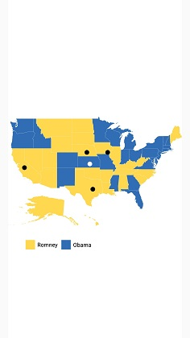

# Markers

Markers provide some messages on the map.

Markers are set to map by using the following two ways:

1. Adding marker objects to map.
2. Defining custom marker.

## Adding marker

Any number of markers can be added to the shape file layers using the [`Markers`](https://help.syncfusion.com/cr/cref_files/xamarin-ios/Syncfusion.SfMaps.iOS~Syncfusion.SfMaps.iOS.MapLayer~Markers.html) property. Each marker object contains the following list of properties:

[`Label`](https://help.syncfusion.com/cr/cref_files/xamarin-ios/Syncfusion.SfMaps.iOS~Syncfusion.SfMaps.iOS.SFMapMarker~Label.html): Text that is used to display information.

[`Latitude`](https://help.syncfusion.com/cr/cref_files/xamarin-ios/Syncfusion.SfMaps.iOS~Syncfusion.SfMaps.iOS.SFMapMarker~Latitude.html): Latitude point that specifies the y-axis position of the marker.

[`Longitude`](https://help.syncfusion.com/cr/cref_files/xamarin-ios/Syncfusion.SfMaps.iOS~Syncfusion.SfMaps.iOS.SFMapMarker~Longitude.html): Longitude point that specifies the x-axis position of the marker.





    SFShapeFileLayer layer = new SFShapeFileLayer();

    layer.Uri = (NSString)NSBundle.MainBundle.PathForResource("usa_state", "shp");

    SFMapMarker mapMarker = new SFMapMarker();

    mapMarker.Label = (NSString)"California";

    mapMarker.Latitude = 37;

    mapMarker.Longitude = -120;

    layer.Markers.Add(mapMarker);

    map.Layers.Add(layer);





## Marker customization

A map marker can be customized using the [`MarkerSettings`](https://help.syncfusion.com/cr/cref_files/xamarin-ios/Syncfusion.SfMaps.iOS~Syncfusion.SfMaps.iOS.MapLayer~MarkerSettings.html) property in shape file layer.

### Customizing marker icons

The size and color of a marker icon can be customized using the [`IconSize`](https://help.syncfusion.com/cr/cref_files/xamarin-ios/Syncfusion.SfMaps.iOS~Syncfusion.SfMaps.iOS.SFMapMarkerSetting~IconSize.html), and [`IconColor`](https://help.syncfusion.com/cr/cref_files/xamarin-ios/Syncfusion.SfMaps.iOS~Syncfusion.SfMaps.iOS.SFMapMarkerSetting~IconColor.html) properties.

### Icon types

The shape of a marker icon can be customized using the [`MarkerIcon`](https://help.syncfusion.com/cr/cref_files/xamarin-ios/Syncfusion.SfMaps.iOS~Syncfusion.SfMaps.iOS.SFMapMarkerSetting~MarkerIcon.html) property. Maps supports the following types of marker icons:

* Circle
* Diamond
* Image
* Rectangle
* Square





SFMap map = new SFMap();

SFShapeFileLayer layer = new SFShapeFileLayer();

layer.Uri = (NSString)NSBundle.MainBundle.PathForResource("usa_state", "shp");

SFMapMarker mapMarker = new SFMapMarker();

mapMarker.Label = (NSString)"California";

mapMarker.Latitude = 37;

mapMarker.Longitude = -120;

layer.Markers.Add(mapMarker);

SFMapMarkerSetting markerSetting = new SFMapMarkerSetting();

markerSetting.MarkerIcon = SFMapMarkerIcon.SFMapMarkerIconSquare;

layer.MarkerSettings = markerSetting;

map.Layers.Add(layer);

this.View.AddSubview(map);





### Setting contrast color

Based on the background color of the shapes, contrast color will be applied to marker icon.





       SFMap map = new SFMap();
 
            SFShapeFileLayer layer = new SFShapeFileLayer();
 
            layer.Uri =      (NSString)NSBundle.MainBundle.PathForResource("usa_state", "shp");
 
            layer.DataSource = GetDataSource();
 
            layer.ShapeIDTableField = (NSString)"STATE_NAME";
 
            layer.ShapeIDPath = (NSString)"State";
 
            SFEqualColorMapping colorMapping = new SFEqualColorMapping();
 
            colorMapping.Color = UIColor.FromRGB(216, 68, 68);
 
            colorMapping.Value = (NSString)"Romney";
 
            SFEqualColorMapping colorMapping1 = new SFEqualColorMapping();
 
            colorMapping1.Color = UIColor.FromRGB(49, 109, 181);
 
            colorMapping1.Value = (NSString)"Obama";
legendSetting.ShowLegend = true;
            legendSetting.Position = new CoreGraphics.CGPoint(30, 70);
            legendSetting.IconSize = new CoreGraphics.CGSize(20, 20);
            layer.LegendSettings = legendSetting;
            SFMapMarker marker = new SFMapMarker();
            marker.Latitude = 37;
            marker.Longitude = -120;
            layer.Markers.Add(marker);
            SFMapMarker marker1 = new SFMapMarker();
            marker1.Latitude = 31;
            marker1.Longitude = -97;
            layer.Markers.Add(marker1);
            SFMapMarker marker2 = new SFMapMarker();
            marker2.Latitude = 41;
            marker2.Longitude = -92;
            layer.Markers.Add(marker2);
            SFMapMarker marker3 = new SFMapMarker();
            marker3.Latitude = 38;
            marker3.Longitude = -98;
            layer.Markers.Add(marker3);
            SFMapMarker marker4 = new SFMapMarker();
            marker4.Latitude = 41;
            marker4.Longitude = -99;
            layer.Markers.Add(marker4);
 
            SFShapeSetting shapeSetting = new SFShapeSetting();
 
            shapeSetting.ValuePath = (NSString)"Candidate";
 
            shapeSetting.ColorValuePath = (NSString)"Candidate";
 
            shapeSetting.ColorMappings.Add(colorMapping);
 
            shapeSetting.ColorMappings.Add(colorMapping1);
 
            layer.ShapeSettings = shapeSetting;
 
            map.Layers.Add(layer);
 
            this.View.AddSubview(map);





### Setting image marker icon

You can pin the image as marker icon by setting the icon type as Image and [`ImageSource`](https://help.syncfusion.com/cr/cref_files/xamarin-ios/Syncfusion.SfMaps.iOS~Syncfusion.SfMaps.iOS.SFMapMarkerSetting~ImageSource.html) to get the image from local path.





SFMap map = new SFMap();

SFShapeFileLayer layer = new SFShapeFileLayer();

layer.Uri = (NSString)NSBundle.MainBundle.PathForResource("usa_state", "shp");

SFMapMarker marker = new SFMapMarker();

marker.Label = (NSString)"Texas";

marker.Latitude = 31.267153;

marker.Longitude = -97.7430608;

layer.Markers.Add(marker);

SFMapMarker mapMarker = new SFMapMarker();

mapMarker.Label = (NSString)"California";

mapMarker.Latitude = 37;

mapMarker.Longitude = -120;

layer.Markers.Add(mapMarker);

SFMapMarkerSetting markerSetting = new SFMapMarkerSetting();

markerSetting.MarkerIcon = SFMapMarkerIcon.Image;

markerSetting.ImageSource = (NSString)"pin.png";

layer.MarkerSettings = markerSetting;

map.Layers.Add(layer);

this.View.AddSubview(map);





 

### Label customization

A marker label’s color and size can be customized using the [`LabelColor`](https://help.syncfusion.com/cr/cref_files/xamarin-ios/Syncfusion.SfMaps.iOS~Syncfusion.SfMaps.iOS.SFMapMarkerSetting~LabelColor.html) and [`LabelSize`](https://help.syncfusion.com/cr/cref_files/xamarin-ios/Syncfusion.SfMaps.iOS~Syncfusion.SfMaps.iOS.SFMapMarkerSetting~LabelSize.html) properties.

The following code explains the marker customization.





SFMap map = new SFMap();

SFShapeFileLayer layer = new SFShapeFileLayer();

layer.Uri = (NSString)NSBundle.MainBundle.PathForResource("usa_state", "shp");

SFMapMarker mapMarker = new SFMapMarker();

mapMarker.Label = (NSString)"California";

mapMarker.Latitude = 37;

mapMarker.Longitude = -120;

layer.Markers.Add(mapMarker);

SFMapMarkerSetting markerSetting = new SFMapMarkerSetting();

markerSetting.IconColor = UIColor.Red;

markerSetting.IconSize = 15;

markerSetting.MarkerIcon = SFMapMarkerIcon.SFMapMarkerIconDiamond;

markerSetting.LabelColor = UIColor.White;

layer.MarkerSettings = markerSetting;

map.Layers.Add(layer);

this.View.AddSubview(map);
  




## Custom marker

Maps provide support for defining the custom marker by inheriting the MapMarker class.





SFMap map = new SFMap();

SFShapeFileLayer layer = new SFShapeFileLayer();

layer.Uri = (NSString)NSBundle.MainBundle.PathForResource("usa_state", "shp");

CustomMarker mapMarker = new CustomMarker();

mapMarker.Label = (NSString)"California";

mapMarker.Latitude = 37;

mapMarker.Longitude = -120;

layer.Markers.Add(mapMarker);

map.Layers.Add(layer);

this.View.AddSubview(map);





Below snippet explains on how to define custom marker with image support. 





public class CustomMarker : SFMapMarker
{
public CustomMarker()
{
}

public string Population;

public string Name;

public override UIView GetView(CGPoint bounds)
{

UIImageView image = new UIImageView(new CGRect(bounds.X - 8, bounds.Y - 25, 15, 23));
image.Image = new UIImage("pin.png");
return image;
}

public override CGPoint GetPoint()
{
return new CGPoint(-8, -25);
}

}





## Events

`Delegate` is triggered from SFMapDelegate
Argument contains the [`MapMarker`](https://help.syncfusion.com/cr/cref_files/xamarin-ios/Syncfusion.SfMaps.iOS~Syncfusion.SfMaps.iOS.SFMapMarker.html) which gives the information about the marker.





 map.Delegate = new MapsDelegate(this);
 
 UIView markerView = new UIView();
 
markerView.Frame = new CGRect(50, 350, 200, 300);
 
 public void DisplayToastWithMessage(NSString toastMessage)
 {
 
 UIWindow keyWindow = UIApplication.SharedApplication.KeyWindow;
 if (toastView != null)
 {
 toastView.RemoveFromSuperview();
 }
 
 UIView toastView = new UIView();
 UILabel label1 = new UILabel();
 label1.TextColor  = UIColor.White;
 label1.Font = UIFont.SystemFontOfSize(16);
 label1.Text = toastMessage;
 label1.TextAlignment = UITextAlignment.Center; ;
 toastView.AddSubview(label1);
 
 toastView.Alpha = 1;
 
 toastView.BackgroundColor = UIColor.Green.ColorWithAlpha(0.7f);
 toastView.Layer.CornerRadius = 10;
 
 CGSize expectedLabelSize1 = toastMessage.GetSizeUsingAttributes(new UIStringAttributes() { Font = label1.Font });
 
 keyWindow.AddSubview(toastView);
 toastView.Frame = new CGRect(0.0f, 50, Math.Max(expectedLabelSize1.Width, expectedLabelSize1.Width) + 20, 45.0f);
 label1.Frame = new CGRect(0.0f, 20, Math.Max(expectedLabelSize1.Width, expectedLabelSize1.Width) + 15, 15.0f);
 
 toastView.Center = markerView.Center;
 }
 
 public class MapsDelegate : SFMapsDelegate
 {
 public MapsDelegate(DataMarker markers)
 {
 marker = markers;
 }
 
 DataMarker marker;
 
 public override void DidLoad(SFMap map)
 {
 }
 
 public override void OnMarkerSelected(SFMap map, MarkerSelectedEventArgs markerSelectedEventArgs)
 {
 SFMapMarker mapMarker = (SFMapMarker)markerSelectedEventArgs.SelectedMarker;
 marker.DisplayToastWithMessage((NSString)(mapMarker.Label));
 }
 
 }





