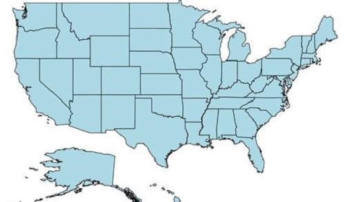
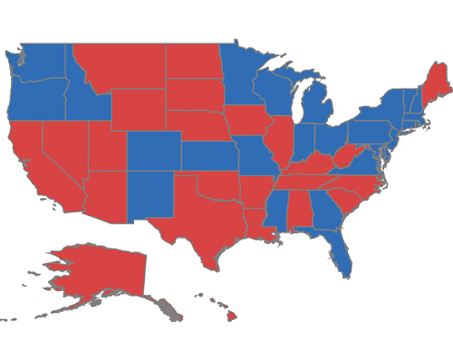
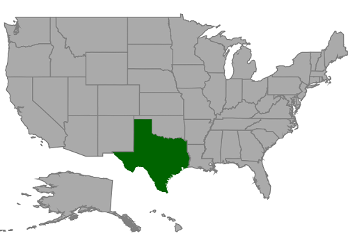
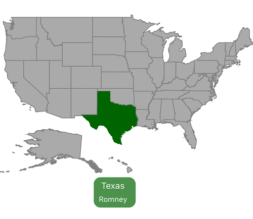

# Shape customization

## Shape settings

The shape settings define the basic customization options for shapes in the map.

A shape’s fill, stroke, and stroke thickness can be customized using the following properties:

[`Fill`](https://help.syncfusion.com/cr/xamarin-ios/Syncfusion.SfMaps.iOS.SFShapeSetting.html#Syncfusion_SfMaps_iOS_SFShapeSetting_Fill): Sets the fill color for the shapes in a map. 

[`StrokeColor`](https://help.syncfusion.com/cr/xamarin-ios/Syncfusion.SfMaps.iOS.SFShapeSetting.html#Syncfusion_SfMaps_iOS_SFShapeSetting_StrokeColor): Sets the border color for the shape in a map.

[`StrokeThickness`](https://help.syncfusion.com/cr/xamarin-ios/Syncfusion.SfMaps.iOS.SFShapeSetting.html#Syncfusion_SfMaps_iOS_SFShapeSetting_StrokeThickness): Sets the border thickness for the shape in a map. 

Refer to the following code snippet.





SFShapeSetting shapeSetting = new SFShapeSetting();

shapeSetting.Fill = UIColor.FromRGB(173, 216, 230);

shapeSetting.StrokeColor = UIColor.Black;

shapeSetting.StrokeThickness = 1;

layer.ShapeSettings = shapeSetting;





To customize the shapes based on the bound values, use the following properties:

[`ValuePath`](https://help.syncfusion.com/cr/xamarin-ios/Syncfusion.SfMaps.iOS.SFShapeSetting.html#Syncfusion_SfMaps_iOS_SFShapeSetting_ValuePath): Field value that has to be bound for each shape.

[`ColorValuePath`](https://help.syncfusion.com/cr/xamarin-ios/Syncfusion.SfMaps.iOS.SFShapeSetting.html#Syncfusion_SfMaps_iOS_SFShapeSetting_ColorValuePath): Field value that has to be bound to determine the color.





SFMap map = new SFMap();

SFShapeFileLayer layer = new SFShapeFileLayer();

layer.Uri = (NSString)NSBundle.MainBundle.PathForResource("usa_state", "shp");

layer.DataSource = GetDataSource();

layer.ShapeIDTableField = (NSString)"STATE_NAME";

layer.ShapeIDPath = (NSString)"State";

SFEqualColorMapping colorMapping = new SFEqualColorMapping();

colorMapping.Color = UIColor.FromRGB(216, 68, 68);

colorMapping.Value = (NSString)"Romney";

SFEqualColorMapping colorMapping1 = new SFEqualColorMapping();

colorMapping1.Color = UIColor.FromRGB(49, 109, 181);

colorMapping1.Value = (NSString)"Obama";

SFShapeSetting shapeSetting = new SFShapeSetting();

shapeSetting.ValuePath = (NSString)"Candidate";

shapeSetting.ColorValuePath = (NSString)"Candidate";

shapeSetting.ColorMappings.Add(colorMapping);

shapeSetting.ColorMappings.Add(colorMapping1);

layer.ShapeSettings = shapeSetting;

map.Layers.Add(layer);

this.View.AddSubview(map);





## Selected shapes settings

Selection can be enabled with the help of [`EnableSelection`](https://help.syncfusion.com/cr/xamarin-ios/Syncfusion.SfMaps.iOS.SFShapeFileLayer.html#Syncfusion_SfMaps_iOS_SFShapeFileLayer_EnableSelection) property in shape file layer. Selected shape can be customized using the [`SelectedShapeColor`](https://help.syncfusion.com/cr/xamarin-ios/Syncfusion.SfMaps.iOS.SFShapeSetting.html#Syncfusion_SfMaps_iOS_SFShapeSetting_SelectedShapeColor) property.





SFMap map = new SFMap();

SFShapeFileLayer layer = new SFShapeFileLayer();

layer.Uri = (NSString)NSBundle.MainBundle.PathForResource("usa_state", "shp");

layer.DataSource = GetDataSource();

layer.ShapeIDTableField = (NSString)"STATE_NAME";

layer.ShapeIDPath = (NSString)"State";

layer.EnableSelection = true;

SFShapeSetting shapeSetting = new SFShapeSetting();

shapeSetting.SelectedShapeColor = UIColor.FromRGB(0, 100, 0);

layer.ShapeSettings = shapeSetting;

map.Layers.Add(layer);

this.View.AddSubview(map);





## Events

`ShapeSelectionChanged` event gets triggered when the map shapes are selected.
Corresponding model data is passed as an argument.





UIView markerView = new UIView();

markerView.Frame = new CGRect(70, 380, 200, 200);

SFMap map = new SFMap();

SFShapeFileLayer layer = new SFShapeFileLayer();

layer.Uri = (NSString)NSBundle.MainBundle.PathForResource("usa_state", "shp");

layer.DataSource = GetDataSource();

layer.ShapeIDTableField = (NSString)"STATE_NAME";

layer.ShapeIDPath = (NSString)"State";

layer.EnableSelection = true;

layer.ShapeSelectionChanged += Layer_ShapeSelectionChanged;

SFShapeSetting shapeSetting = new SFShapeSetting();

shapeSetting.SelectedShapeColor = UIColor.FromRGB(0, 100, 0);

layer.ShapeSettings = shapeSetting;

map.Layers.Add(layer);

this.View.AddSubview(map);

void Layer_ShapeSelectionChanged(object sender, ShapeSelectedEventArgs e)
{
if (e.Data != null)
{

NSDictionary dictionary = (NSDictionary)e.Data;

displayToastWithMessage((NSString)(dictionary["State"] + "\n"), (NSString)dictionary["Candidate"]);
}

}

public void displayToastWithMessage(NSString toastMessage, NSString typeLabel)
{

UIWindow keyWindow = UIApplication.SharedApplication.KeyWindow;

if (toastView != null)
{
toastView.RemoveFromSuperview();
}

UIView toastView = new UIView();

UILabel label1 = new UILabel();

UILabel label2 = new UILabel();

label1.TextColor = label2.TextColor = UIColor.White;

label1.Font = UIFont.SystemFontOfSize(13);

label1.Text = toastMessage;

label2.Text = typeLabel;

label2.Font = UIFont.SystemFontOfSize(11);

label1.TextAlignment = label2.TextAlignment = UITextAlignment.Center;

toastView.AddSubview(label1);

toastView.AddSubview(label2);

toastView.Alpha = 1;

toastView.BackgroundColor = UIColor.FromRGB(0,100,0).ColorWithAlpha(0.7f);

toastView.Layer.CornerRadius = 10;

CGSize expectedLabelSize1 = toastMessage.GetSizeUsingAttributes(new UIStringAttributes() { Font = label1.Font });

CGSize expectedLabelSize2 = typeLabel.GetSizeUsingAttributes(new UIStringAttributes() { Font = label2.Font });

keyWindow.AddSubview(toastView);

toastView.Frame = new CGRect(0.0f, 0.0f, Math.Max(expectedLabelSize1.Width, expectedLabelSize2.Width) + 20, 45.0f);

label1.Frame = new CGRect(0.0f, 5.0f, Math.Max(expectedLabelSize1.Width, expectedLabelSize2.Width) + 15, 15.0f);

label2.Frame = new CGRect(0.0f, 25.0f, Math.Max(expectedLabelSize1.Width, expectedLabelSize2.Width) + 15, 15.0f);

toastView.Center = markerView.Center;
}
 




