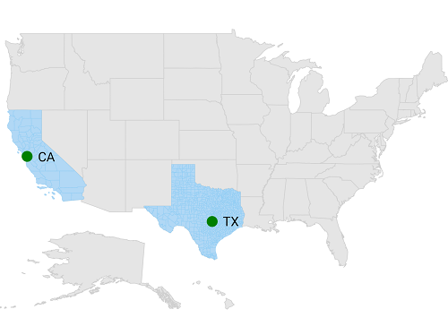
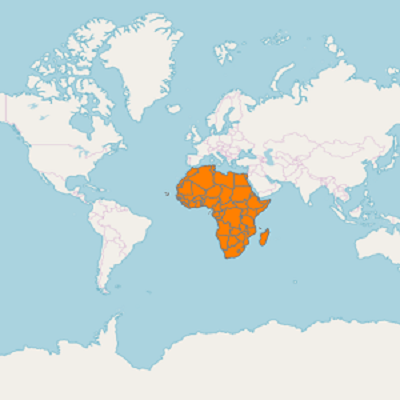

# Sublayer
 
The sublayer in maps allows to load multiple shape files in a single container, enabling maps to display more information. 

## Adding sublayer in ShapeFileLayer

You can add multiple shape files in the [`SFShapeFileLayer`](https://help.syncfusion.com/cr/xamarin-ios/Syncfusion.SfMaps.iOS.SFShapeFileLayer.html) using [`Sublayers`](https://help.syncfusion.com/cr/xamarin-ios/Syncfusion.SfMaps.iOS.SFShapeFileLayer.html) property.





SFMap map = new SFMap();

SFShapeFileLayer layer = new SFShapeFileLayer();

layer.Uri = (NSString)NSBundle.MainBundle.PathForResource("usa_state", "shp");

SFShapeSetting shapeSetting = new SFShapeSetting();

shapeSetting.StrokeColor = UIColor.FromRGB(208, 208, 208);

shapeSetting.StrokeThickness = 2;

shapeSetting.Fill = UIColor.FromRGB(229, 229, 229);

layer.ShapeSettings = shapeSetting;

SFShapeFileLayer subShapeLayer = new SFShapeFileLayer();

subShapeLayer.Uri = (NSString)NSBundle.MainBundle.PathForResource("Texas", "shp");

SFShapeSetting shapeSetting1 = new SFShapeSetting();

shapeSetting1.Fill = UIColor.FromRGB(177, 216, 245);

shapeSetting1.StrokeThickness = 1;

shapeSetting1.StrokeColor = UIColor.FromRGB(141, 204, 244);

subShapeLayer.ShapeSettings = shapeSetting1;

SFMapMarker mapMarker = new SFMapMarker();

mapMarker.Label = (NSString)"TX";

mapMarker.Latitude = 30.267153;

mapMarker.Longitude = -97.7430608;

subShapeLayer.Markers.Add(mapMarker);

layer.Sublayers.Add(subShapeLayer);

SFShapeFileLayer subShapeLayer1 = new SFShapeFileLayer();

subShapeLayer1.Uri = (NSString)NSBundle.MainBundle.PathForResource("California", "shp");

SFShapeSetting shapeSetting2 = new SFShapeSetting();

shapeSetting2.Fill = UIColor.FromRGB(177, 216, 245);

shapeSetting2.StrokeThickness = 1;

shapeSetting2.StrokeColor = UIColor.FromRGB(141, 204, 244);

subShapeLayer1.ShapeSettings = shapeSetting2;

SFMapMarker mapMarker1 = new SFMapMarker();

mapMarker1.Label = (NSString)"CA";

mapMarker1.Latitude = 37.3382082;

mapMarker1.Longitude = -121.8863286;

subShapeLayer1.Markers.Add(mapMarker1);

SFMapMarkerSetting sFMapMarkerSetting = new SFMapMarkerSetting();

sFMapMarkerSetting.IconColor = UIColor.FromRGB(0, 100, 0);

subShapeLayer.MarkerSettings = sFMapMarkerSetting;

SFMapMarkerSetting sFMapMarkerSetting1 = new SFMapMarkerSetting();

sFMapMarkerSetting1.IconColor = UIColor.FromRGB(0, 100, 0);

subShapeLayer1.MarkerSettings = sFMapMarkerSetting1;

layer.Sublayers.Add(subShapeLayer1);

map.Layers.Add(layer);

this.View.AddSubview(map);





## Adding sublayer in ImageryLayer

You can add multiple shape files in the `ImageryLayer` using [`Sublayers`](https://help.syncfusion.com/cr/xamarin-ios/Syncfusion.SfMaps.iOS.SFShapeFileLayer.html) property.





    SFMap map = new SFMap();

    ImageryLayer imageryLayer = new ImageryLayer();

    SFShapeFileLayer shapeFileLayer = new SFShapeFileLayer();
    shapeFileLayer.Uri= (NSString)NSBundle.MainBundle.PathForResource("africa", "shp");

    SFShapeSetting shapeSetting = new SFShapeSetting();
    shapeSetting.StrokeThickness = 1;
    shapeSetting.Fill = UIColor.Orange;
    shapeFileLayer.ShapeSettings = shapeSetting;

    imageryLayer.Sublayers.Add(shapeFileLayer);

    map.Layers.Add(imageryLayer);

    View.AddSubview(map);





### Customizing sublayer

Sublayer is a type of shapefile layer, so you can add all the properties like markers, bubbles, color mapping, legends and data labels in sublayer also. Please refer the below link to add the sublayer properties.

* [`Adding Markers`](https://help.syncfusion.com/xamarin-ios/sfmaps/markers#adding-marker).

* [`Color Mapping`](https://help.syncfusion.com/xamarin-ios/sfmaps/color-mapping).

* [`Adding Legend`](https://help.syncfusion.com/xamarin-ios/sfmaps/legend).

* [`Adding Bubbles`](https://help.syncfusion.com/xamarin-ios/sfmaps/bubble-marker#adding-bubbles).

* [`Adding Data Labels`](https://help.syncfusion.com/xamarin-ios/sfmaps/data-labels#adding-data-labels).
