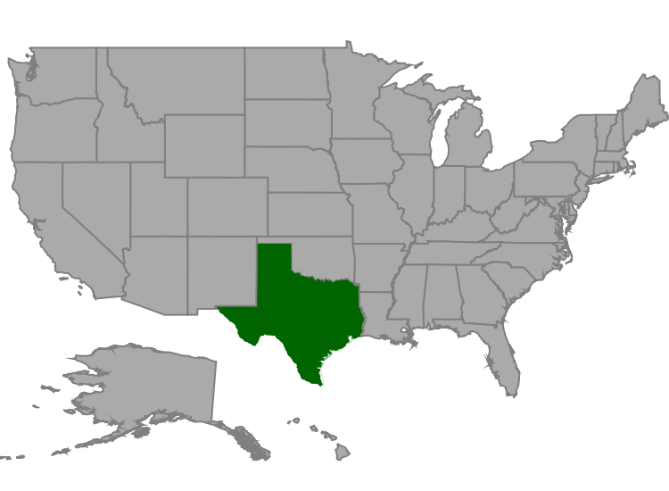

# User interaction

Options such as zooming, panning, and selection enable the effective interaction on map elements.

## Selection

Each shape in a map can be selected or deselected when interacted with shapes. Map shapes can be selected using the following two ways:

* Single Selection
* Multi Selection

The selected map shapes are differentiated by their fill. The [`SelectedShapeColor`](https://help.syncfusion.com/cr/cref_files/xamarin-ios/Syncfusion.SfMaps.iOS~Syncfusion.SfMaps.iOS.SFShapeSetting~SelectedShapeColor.html) of [`SFShapeSetting`](https://help.syncfusion.com/cr/cref_files/xamarin-ios/Syncfusion.SfMaps.iOS~Syncfusion.SfMaps.iOS.SFShapeSetting.html) property gets or sets the selected shape color. 

### Single selection

Single selection allows you to select only one shape at a time. You can select the shape by tapping it. By default, the single selection is enabled when the [`EnableSelection`](https://help.syncfusion.com/cr/cref_files/xamarin-ios/Syncfusion.SfMaps.iOS~Syncfusion.SfMaps.iOS.SFShapeFileLayer~EnableSelection.html) is set to true. You can also enable the single selection by  setting the [`SelectionMode`](https://help.syncfusion.com/cr/cref_files/xamarin-ios/Syncfusion.SfMaps.iOS~Syncfusion.SfMaps.iOS.SFShapeFileLayer~SelectionMode.html) property of ShapeFileLayer to `Single`. When selecting or tapping the rest of the area, the selected shape will be deselected.





SFMap map = new SFMap();

SFShapeFileLayer layer = new SFShapeFileLayer();

layer.Uri = (NSString)NSBundle.MainBundle.PathForResource("usa_state", "shp");

layer.EnableSelection = true;

layer.SelectionMode = SFSelectionMode.SFSelectionModeSingle;

SFShapeSetting shapeSetting = new SFShapeSetting();

shapeSetting.SelectedShapeColor = UIColor.FromRGB(0, 100, 0);

layer.ShapeSettings = shapeSetting;

map.Layers.Add(layer);

this.View.AddSubview(map);
}





### Multi selection

Multi selection allows you to select the multiple shapes at a time. You can select many shapes by tapping them. To enable this feature, set the [`SelectionMode`](https://help.syncfusion.com/cr/cref_files/xamarin-ios/Syncfusion.SfMaps.iOS~Syncfusion.SfMaps.iOS.SFShapeFileLayer~SelectionMode.html) property to “Multiple” along with the [`EnableSelection`](https://help.syncfusion.com/cr/cref_files/xamarin-ios/Syncfusion.SfMaps.iOS~Syncfusion.SfMaps.iOS.SFShapeFileLayer~EnableSelection.html) property. 

I> Shapes cannot be selected when the [`EnableSelection`](https://help.syncfusion.com/cr/cref_files/xamarin-ios/Syncfusion.SfMaps.iOS~Syncfusion.SfMaps.iOS.SFShapeFileLayer~EnableSelection.html) property is set to false.





SFMap map = new SFMap();

SFShapeFileLayer layer = new SFShapeFileLayer();

layer.Uri = (NSString)NSBundle.MainBundle.PathForResource("usa_state", "shp");

layer.DataSource = GetDataSource();

layer.ShapeIDTableField = (NSString)"STATE_NAME";

layer.ShapeIDPath = (NSString)"State";

layer.EnableSelection = true;

layer.SelectionMode = SFSelectionMode.SFSelectionModeMultiple;

SFShapeSetting shapeSetting = new SFShapeSetting();

shapeSetting.SelectedShapeColor = UIColor.FromRGB(0, 100, 0);

layer.ShapeSettings = shapeSetting;

map.Layers.Add(layer);

this.View.AddSubview(map);





### Selected items

The SelectedItems property allows you to select the shapes without tapping or touching them.

To select a shape and deselect it from the same collection without tapping or touching, just add the shape that is to be selected to the selected items collection dynamically.

## Zooming

The zooming feature enables you to zoom in and zoom out the map to show the in-depth information. The following properties are related to the zooming feature of maps control:

[`EnableZooming`](https://help.syncfusion.com/cr/cref_files/xamarin-ios/Syncfusion.SfMaps.iOS~Syncfusion.SfMaps.iOS.SFMap~EnableZooming.html) property is used to control whether to perform zooming or not.

[`MinimumZoom`](https://help.syncfusion.com/cr/cref_files/xamarin-ios/Syncfusion.SfMaps.iOS~Syncfusion.SfMaps.iOS.SFMap~MinimumZoom.html) property sets the minimum level of zooming.

[`MaximumZoom`](https://help.syncfusion.com/cr/cref_files/xamarin-ios/Syncfusion.SfMaps.iOS~Syncfusion.SfMaps.iOS.SFMap~MaximumZoom.html) property sets the maximum level of zooming.





SFMap map = new SFMap();

map.EnableZooming = true;

map.MinimumZoom = 1;

map.MaximumZoom = 10;

this.View.AddSubview(map);





## Panning

Panning feature allows moving the visible area of the map when it is zoomed in. To enable panning, you have to set [`EnablePanning`](https://help.syncfusion.com/cr/cref_files/xamarin-ios/Syncfusion.SfMaps.iOS~Syncfusion.SfMaps.iOS.SFMap~EnablePanning.html) property to true.





SFMap map = new SFMap();

map.EnablePanning = true;

map.EnableZooming = true;

map.MinimumZoom = 1;

map.MaximumZoom = 10;

this.View.AddSubview(map);




