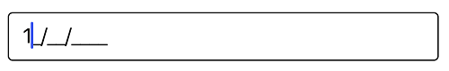

# Getting Started

This section explains you the steps required to configure a SfMaskedEdit control in a real-time scenario and provides a walk-through on some of the customization features available in `SfMaskedEdit` control.

## Reference Essential Studio components in your solution

Syncfusion Xamarin components are available in [nuget.org](https://www.nuget.org/). To add maskededit to your project, open the NuGet package manager in Visual Studio, and search for "[syncfusion.xamarin.sfmaskededit.ios](https://www.nuget.org/packages/Syncfusion.Xamarin.SfMaskedEdit.IOS)", and then install it. 

## Create a Simple SfMaskedEdit

The SfMaskedEdit control is configured entirely in C# code. The following steps explain how to create a SfMaskedEdit and configure its elements:

### Add reference to SfMaskedEdit.



using Syncfusion.iOS.MaskedEdit;



### Create an instance of SfMaskedEdit.



using System;
using UIKit;
using Syncfusion.iOS.MaskedEdit;
using CoreGraphics;

namespace MaskedEdit
{
    public partial class ViewController : UIViewController
    {
        public ViewController(IntPtr handle) : base(handle)
        {
        }

        public override void ViewDidLoad()
        {
            base.ViewDidLoad();

            //Initialize the SfMaskedEdit with required frame.
            SfMaskedEdit maskedEdit = new SfMaskedEdit();
            maskedEdit.Frame = new CGRect(10, 50, 350, 40); 
            View.AddSubview(maskedEdit);
        }

        public override void DidReceiveMemoryWarning()
        {
            base.DidReceiveMemoryWarning();
            // Release any cached data, images, etc that aren't in use.
        }
    }
}



## Masking the input

To mask the input, set the Mask properties as follows:



SfMaskedEdit maskedEdit = new SfMaskedEdit();
maskedEdit.Mask = "00/00/0000";



This mask expression allows only numeric inputs in the places of 0.
Refer to this [link](MaskType) to know more about the Mask characters and Mask Types available in SfMaskedEdit control.
Run the project and check if you get the following output to make sure that you have configured your project properly to add `SfMaskedEdit`.

You can find the complete getting started sample from this [link](http://files2.syncfusion.com/Xamarin.iOS/Samples/MaskedEdit_GettingStarted.zip).
