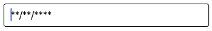

# Basic Features

## Setting Value

The SfMaskedEdit control displays the value that can be set using the `Value` property:



SfMaskedEdit maskedEdit = new SfMaskedEdit();
maskedEdit.Mask = "00/00/0000";
maskedEdit.Value = @"14/11/2014";



## Setting Prompt Character

Displays prompt character for the absence of your input in Mask and its default value is ‘_’. You can set the custom prompt character using `PromptChar` property.



SfMaskedEdit maskedEdit = new SfMaskedEdit();
maskedEdit.Mask = "00/00/0000";
maskedEdit.PromptChar = '*';



## Setting Placeholder

The placeholder will prompt you with instructions or important information when it is not on focus and any valid characters are not entered. 
The placeholder text and its appearance can be modified using `Placeholder` and properties respectively.



SfMaskedEdit maskedEdit = new SfMaskedEdit();
maskedEdit.Mask = "00/00/0000";
maskedEdit.Placeholder = "Type here..";
UIStringAttributes placeholderAttributes = new UIStringAttributes();
//Setting placeholder color.
placeholderAttributes.ForegroundColor = UIColor.LightGray;

//Setting placeholder font size.
placeholderAttributes.Font = UIFont.SystemFontOfSize(20);

//Setting placeholder font descriptor.
UIFontDescriptor fontDescriptor = placeholderAttributes.Font.FontDescriptor;
placeholderAttributes.Font = UIFont.FromDescriptor(fontDescriptor.CreateWithTraits(UIFontDescriptorSymbolicTraits.Bold), 0);

//Setting placeholder font family.
placeholderAttributes.Font = UIFont.FromName("Arial", placeholderAttributes.Font.PointSize);
maskedEdit.AttributedPlaceholder = new NSAttributedString(maskedEdit.Placeholder, placeholderAttributes);



You can find the complete basic features sample from this [link](http://files2.syncfusion.com/Xamarin.iOS/Samples/MaskedEdit_BasicFeatures.zip).
