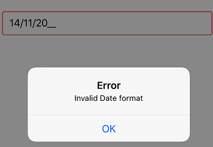
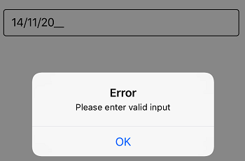

# Events

The SfMaskedEdit exposes the following events:

* `ValueChanged`: Occurs when the value of `Value` property is changed.
* `MaskInputRejected`: Occurs when a character is rejected by the input mask.

## ValueChanged event

Occurs when the value of the `Value` property is changed by either entering the valid input character or setting the value to the `Value` property through C# code. The event arguments are of type ValueChangedEventArgs and expose the following property:

* `Value`: The read only property conatins the updated value of the `Value` property of SfMaskedEdit.

> Your valid input character is updated to `Value` property based on the `ValidationMode` property.
>Refer to this [link](Validation#validation-mode) to know more about the `ValidationMode` property of `SfMaskedEdit` control.



SfMaskedEdit maskedEdit = new SfMaskedEdit();
maskedEdit.MaskType = MaskType.Text;
maskedEdit.Mask = "00/00/0000";
maskedEdit.Watermark = "dd/MM/YYYY";
maskedEdit.ValueChanged += MaskedEdit_OnValueChanged;

private void MaskedEdit_OnValueChanged(object sender, ValueChangedEventArgs e)
        {
            string date = e.Value.ToString();

            if (!string.IsNullOrEmpty(date))
            {
                try
                {
                    DateTime datetime = DateTime.ParseExact(date, CultureInfo.CurrentCulture.DateTimeFormat.ShortDatePattern, CultureInfo.InvariantCulture);
                }
                catch (Exception exception)
                {
                    UIAlertView v = new UIAlertView
                    {
                        Title = "Error",
                        Message = "Invalid Date format"
                    };
                    v.AddButton("OK");
                    v.Show();
                }
            }
        }



## MaskInputRejected event

Occurs when your input or assigned character does not match the corresponding format element of the input mask. The event arguments are type of MaskInputRejectedEventArgs and expose the following properties:

* `Position`: The position in the mask corresponding to the invalid input character.
* `RejectionHint`: The enumerated value that describes why the input character was rejected.

MaskInputRejected is raised in the following situations:

* An input character does not match the corresponding format element. For example, if you enter an alphabetic character when a digit is required. This is probably the most common reason why this event is raised.
* When you try to input extraneous characters beyond the end of the mask.
* A paste operation inserts a character that does not match with its associated format element.



SfMaskedEdit maskedEdit = new SfMaskedEdit();
maskedEdit.MaskType = MaskType.Text;
maskedEdit.Mask = "00/00/0000";
maskedEdit.Watermark = "dd/MM/YYYY";
maskedEdit.MaskInputRejected += MaskedEdit_OnMaskInputRejected;

private void MaskedEdit_MaskInputRejected(object sender, MaskInputRejectedEventArgs e)
        {
            if (e.RejectionHint != MaskedTextResultHint.UnavailableEditPosition)
            {
                UIAlertView v = new UIAlertView
                {
                    Title = "Error",
                    Message = "Please enter valid input"
                };
                v.AddButton("OK");
                v.Show();
            }

        }



This demo can be downloaded from this [link](http://files2.syncfusion.com/Xamarin.iOS/Samples/MaskedEdit_Events.zip).
