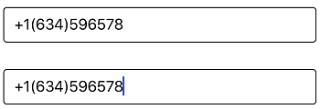

# MaskType

Each MaskType has a different set of mask characters that are combined to form a mask expression. Based on the complexity and usage, mask types are classified as:

* Text
* RegEx

## Text

Expressions generated with letters, digits, and special characters fall under this category. This is primarily used for fixed-length inputs, such as phone numbers, zip codes, and similar data.

### Text Mask characters

<table>
<tr>
<td>
{{'**Characters**'| markdownify }}
</td>
<td>
{{'**Description**'| markdownify }}
</td>
</tr>
<tr>
<td>
A
</td>
<td>
Alphanumeric, required.
</td>
</tr>
<tr>
<td>
a
</td>
<td>
Alphanumeric, optional.
</td>
</tr>
<tr>
<td>
L
</td>
<td>
Letter, required. Restricts input to the ASCII letters a-z and A-Z. 
</td>
</tr>
<tr>
<td>
l
</td>
<td>
Letter, optional. Restricts input to the ASCII letters a-z and A-Z. 
</td>
</tr>
<tr>
<td>
0
</td>
<td>
Digit, required. This character accepts any single digit between 0 and 9.
</td>
</tr>
<tr>
<td>
9
</td>
<td>
Digit or space, optional. 
</td>
</tr>
<tr>
<td>
#
</td>
<td>
Digit or space, optional. Plus (+) and minus (-) signs are allowed.  
</td>
</tr>
<tr>
<td>
C
</td>
<td>
Character, optional. 
</td>
</tr>
<tr>
<td>
\
</td>
<td>
Escapes a mask character, turning it into a literal. "\" is the escape sequence for a backslash. 
</td>
</tr>
<tr>
<td>
Any other characters
</td>
<td>
Treated as literals. Literals always occupy a static position in the mask at run time, and cannot be moved or deleted.
</td>
</tr>
</table>



SfMaskedEdit maskedEdit = new SfMaskedEdit();
maskedEdit.MaskType = MaskType.Text;
maskedEdit.Mask = "+1(000)000000";



This mask expression allows only numeric inputs in positions marked with 0.

## Regex

Expressions generated with regular expressions fall under this category, which is preferable for variable-length inputs and inputs within a specific range. For example: hexadecimal values [0-9A-C]. Regular expressions provide significant advantages when creating masks compared to other mask modes.
**Advantages**

* Allows you to enter values of variable length.
* Restricts input to specific patterns, such as email addresses, passwords, and more.
* Restricts input to a specific range at a specific position.

### Regex Mask Characters

<table>
<tr>
<td>
{{'**Characters**'| markdownify }}
</td>
<td>
{{'**Description**'| markdownify }}
</td>
</tr>
<tr>
<td>
\w
</td>
<td>
Accepts any alphabet, number, including the _(Underscore) character.
</td>
</tr>
<tr>
<td>
\d
</td>
<td>
Accepts any digit.
</td>
</tr>
<tr>
<td>
{n}
</td>
<td>
Accepts the input for 'n' number of times.
</td>
</tr>
<tr>
<td>
{n,m}
</td>
<td>
Accepts the input for 'n' minimum number of times and 'm' maximum number of times.
</td>
</tr>
<tr>
<td>
?
</td>
<td>
Optional input.
</td>
</tr>
<tr>
<td>
+
</td>
<td>
Accepts the input for one or more times.
</td>
</tr>
<tr>
<td>
*
</td>
<td>
Accepts the input for zero or more times.
</td>
</tr>
<tr>
<td>
[aeiou]
</td>
<td>
Accepts any single character included in the specified set of characters.
</td>
</tr>
<tr>
<td>
[0-9a-fA-F]
</td>
<td>
Accepts any character between [A-F]/[a-f] and numbers between [0-9].
</td>
</tr>
</table>



SfMaskedEdit maskedEdit = new SfMaskedEdit();
maskedEdit.MaskType = MaskType.RegEx;
maskedEdit.Mask = @"+1(\d{3})\d{6}";



This mask expression '\d{3}' and '\d{6}' allows only numeric, where {n} is the count that the input should be accepted.

You can find the complete mask type sample from this [link](http://www.syncfusion.com/downloads/support/directtrac/general/ze/MaskType769706503.zip).
