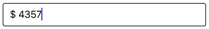

# Using Mask Characters as Literals

To use mask character as a literal, precede the mask character with a backslash (\). For example, to display the dollar sign ($), then set the mask as follows:



SfMaskedEdit maskedEdit = new SfMaskedEdit();
maskedEdit.MaskType = MaskType.Text;
maskedEdit.Mask = @"\$ 0000";



This will produce a mask that displays a dollar sign ($) followed by the prompt characters for entering numbers.

This demo can be downloaded from this [link](http://www.syncfusion.com/downloads/support/directtrac/general/ze/MaskCharactersAsLiterals809955669.zip).
