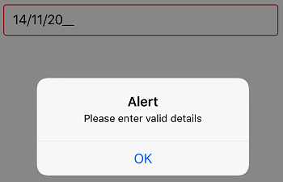

# Validation

## Validation Mode

Input validation happens based on the value of the `ValidationMode` property. The enum values of this property are:

* KeyPress
* LostFocus

The default value for validation mode is `LostFocus`.



SfMaskedEdit maskedEdit = new SfMaskedEdit();
maskedEdit.MaskType = MaskType.Text;
maskedEdit.Mask = "00/00/0000";
maskedEdit.ValidationMode = InputValidationMode.KeyPress;



When the ValidationMode is LostFocus, the validation takes place when the control lost its focus. For KeyPress, the validation triggers for each key press.

## HasError

This read only property is used to check whether the validation succeeds or not. It returns true once validation succeeds or else returns false. The following code example shows the usage of HasError property.



SfMaskedEdit maskedEdit = new SfMaskedEdit();
maskedEdit.MaskType = MaskType.Text;
maskedEdit.Mask = "00/00/0000";
maskedEdit.ValueChanged += MaskedEdit_ValueChanged;

private void MaskedEdit_ValueChanged(object sender, ValueChangedEventArgs e)
       {
            SfMaskedEdit maskedEdit = sender as SfMaskedEdit;
            if (maskedEdit.HasError)
            {
                UIAlertView v = new UIAlertView
                {
                    Title = "Alert",
                    Message = "Please enter valid details"
                };
                v.AddButton("OK");
                v.Show();
            }
        }



Refer this [link](Events#valuechanged-event) to know more about the `ValueChanged` event of SfMaskedEdit control.

This demo can be downloaded from this [link](http://www.syncfusion.com/downloads/support/directtrac/general/ze/Validation1147848053.zip).