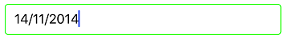
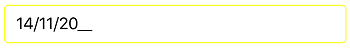

# Visual Customization

The appearance of SfMaskedEdit can be customized using the following properties:

## BorderColor

Sets the custom border color to SfMaskedEdit.



SfMaskedEdit maskedEdit = new SfMaskedEdit();
maskedEdit.MaskType = MaskType.Text;
maskedEdit.Mask = "00/00/0000";
maskedEdit.Layer.BorderColor = UIColor.Green.CGColor;



## ErrorBorderColor

Sets the custom error border color to SfMaskedEdit. Error border color specifies the color to be used when validation fails for input that doesn't match the specified mask.

> Validation triggers based on `ValidationMode` property.
>Refer to this [link](Validation#validation-mode) to learn more about the `ValidationMode` property of `SfMaskedEdit` control.



SfMaskedEdit maskedEdit = new SfMaskedEdit();
maskedEdit.MaskType = MaskType.Text;
maskedEdit.Mask = "00/00/0000";
maskedEdit.ErrorBorderColor = UIColor.Yellow;



## Setting Appearance of Text

You can customize the display text appearance of SfMaskedEdit control using the following properties:

* TextColor: Changes the color of the text.
* HorizontalTextAlignment: Changes the horizontal alignment of the text.
* FontFamily: Changes the font family of the text.
* FontAttributes: Sets font attributes(bold/italic/none) of the text.
* FontSize: Sets font size of the text.



SfMaskedEdit maskedEdit = new SfMaskedEdit();
maskedEdit.MaskType = MaskType.Text;
maskedEdit.Mask = "00/00/0000";
maskedEdit.TextColor = UIColor.Brown;
maskedEdit.TextAlignment = UITextAlignment.Center;
maskedEdit.Font = UIFont.FromName("Arial", 20);
            maskedEdit.Font = UIFont.SystemFontOfSize(20);

            UIFontDescriptor fontDescriptor = maskedEdit.Font.FontDescriptor;
            maskedEdit.Font = UIFont.FromDescriptor(fontDescriptor.CreateWithTraits(UIFontDescriptorSymbolicTraits.Bold), 0);



This demo can be downloaded from this [link](http://files2.syncfusion.com/Xamarin.iOS/Samples/MaskedEdit_VisualCustomize.zip).
